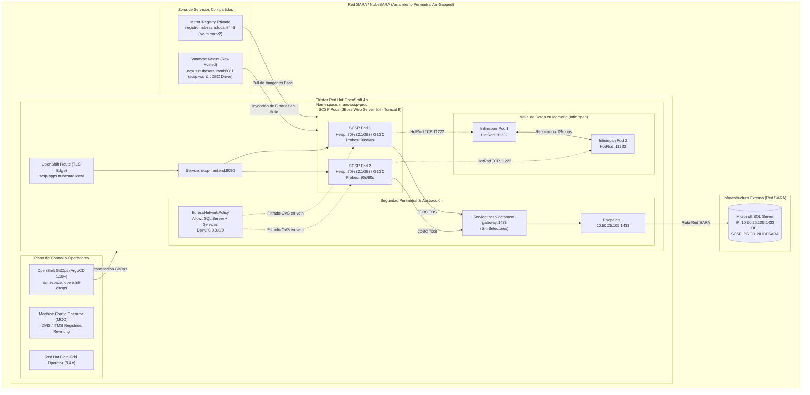

# 🏛️ OpenShift 4.x MAEC SCSP J2EE Lift-and-Shift (2026 Reference Architecture)

> [!WARNING]
> **⚠️ PLANTILLA DIDÁCTICA Y REFERENCIA ARQUITECTÓNICA CONCEPTUAL:**  
> Este repositorio es un diseño de referencia conceptual generado con **Gemini 3.8 Flash**. **NO ha sido probado, validado ni depurado en un clúster OpenShift real en producción dentro de NubeSARA.**  
> Su propósito es servir como acelerador de ingeniería, guía de aprendizaje y plantilla de automatización para la migración estratégica de aplicaciones monolíticas heredadas Java Enterprise Edition (J2EE) hacia plataformas nativas de la nube en entornos aislados perimetralmente (**Air-Gapped**).

---

<!-- ======================================================================= -->
<!-- GITHUB REPOSITORY BADGES                                                -->
<!-- ======================================================================= -->
<p align="center">
  <a href="https://github.com/nubenetes/OpenShift-MAEC-SCSP-J2EE-Lift-and-shift/actions/workflows/ci.yml"></a>
  <a href="https://www.redhat.com/en/technologies/cloud-computing/openshift"></a>
  <a href="https://argo-cd.readthedocs.io"></a>
  <a href="https://infinispan.org"></a>
  <a href="https://kubernetes.io"></a>
</p>

<p align="center">
  
  
  
  
  
  
  
  <a href="LICENSE"></a>
</p>

---

## 📑 Tabla de Contenidos

1. [📌 Contexto Estratégico y Caso de Uso](#-contexto-estratégico-y-caso-de-uso)
2. [🏛️ Diagrama Global de la Arquitectura](#️-diagrama-global-de-la-arquitectura)
3. [⚖️ Comparativa de Soluciones: GitOps vs S2I Binario Directo](#️-comparativa-de-soluciones-gitops-vs-s2i-binario-directo)
4. [🏆 ¿Cuál de las Dos Soluciones es la Más Recomendable?](#-cuál-de-las-dos-soluciones-es-la-más-recomendable)
5. [🌐 Aplicabilidad en Otras Organizaciones e Industrias](#-aplicabilidad-en-otras-organizaciones-e-industrias)
6. [🧩 Retos de Ingeniería y Patrones de Implementación](#-retos-de-ingeniería-y-patrones-de-implementación)
   - [6.1. Espejado Air-Gapped Determinista con `oc-mirror v2`](#61-espejado-air-gapped-determinista-con-oc-mirror-v2)
   - [6.2. Erradicación del Antipatrón Sticky Sessions con Red Hat Data Grid](#62-erradicación-del-antipatrón-sticky-sessions-con-red-hat-data-grid)
   - [6.3. Abstracción Topológica de Base de Datos Externa (Service + Endpoints)](#63-abstracción-topológica-de-base-de-datos-externa-service--endpoints)
   - [6.4. Confinamiento de Red Egress (SUGICYR en OVN-Kubernetes)](#64-confinamiento-de-red-egress-sugicyr-en-ovn-kubernetes)
   - [6.5. Parametrización Porcentual de Memoria JVM Java 8 en cgroups](#65-parametrización-porcentual-de-memoria-jvm-java-8-en-cgroups)
   - [6.6. Calibración de Sondas de Resiliencia (Zero-Downtime Probes)](#66-calibración-de-sondas-de-resiliencia-zero-downtime-probes)
7. [🚀 Guía Rápida de Despliegue](#-guía-rápida-de-despliegue)
   - [Opción A: Despliegue mediante GitOps (ArgoCD + Nexus)](#opción-a-despliegue-mediante-gitops-argocd--nexus)
   - [Opción B: Despliegue mediante S2I Binario Directo por CLI](#opción-b-despliegue-mediante-s2i-binario-directo-por-cli)
8. [📂 Estructura del Repositorio](#-estructura-del-repositorio)
9. [📚 Documentación Detallada de Referencia](#-documentación-detallada-de-referencia)
10. [📄 Licencia y Créditos](#-licencia-y-créditos)

---

<a id="contexto-estrategico"></a>
## 📌 Contexto Estratégico y Caso de Uso

La modernización de los sistemas tecnológicos dentro del **Ministerio de Asuntos Exteriores, Unión Europea y Cooperación (MAEC)** de España responde a los mandatos de la **Ley 39/2015 del Procedimiento Administrativo Común**, que consagra el derecho de los ciudadanos a no aportar documentos ni certificados que ya estén en poder de la Administración Pública.

Para hacer efectivo este derecho, la Secretaría General de Administración Digital (SGAD) articuló el estándar **SCSP (Sustitución de Certificados en Soporte Papel)**. El **Cliente Ligero SCSP** es la pieza de software que permite a las unidades administrativas tramitadoras interrogar los servicios de intermediación del Estado (consultas de identidad, antecedentes penales, títulos oficiales, corrientes de pago en la Agencia Tributaria y Seguridad Social, etc.).

### El Desafío del Software Heredado (Monolito J2EE)
Históricamente, el Cliente Ligero SCSP fue construido como un monolito bajo la especificación **Java Enterprise Edition (J2EE)**:
- **Java 8 (OpenJDK 1.8):** Restricciones de compilación y librerías heredadas no actualizadas a Java 17+.
- **Servidor de Aplicaciones:** Desplegado originalmente en instancias Apache Tomcat / JBoss sobre máquinas virtuales tradicionales. En OpenShift se traslada a la imagen oficial certificada **Red Hat JBoss Web Server 5.4 (Tomcat 9)**.
- **Sesiones HTTP en Memoria RAM:** Fuerte dependencia de la `HttpSession` para mantener el contexto de tramitación del funcionario consular o administrativo (**antipatrón *Sticky Sessions***).
- **Base de Datos Externa en Red SARA:** Registro de auditorías y trazabilidad de intermediaciones persistido en un servidor **Microsoft SQL Server** físico/virtualizado en la intranet ministerial (`10.50.25.105:1433`).
- **Conectores Cerrados de Terceros:** Necesidad de incorporar el controlador JDBC oficial de Microsoft (`mssql-jdbc-8.4.1.jre8.jar`).

### El Escenario de Ejecución: NubeSARA Air-Gapped
El MAEC aloja estas cargas en **NubeSARA**, la infraestructura de nube híbrida de la Administración General del Estado. Por requerimientos del **Esquema Nacional de Seguridad (ENS - Nivel Alto)** y de la **SUGICYR**:
- El clúster opera en **aislamiento perimetral absoluto (Air-Gapped)**, sin conectividad hacia Internet público ni hacia registros comerciales (`registry.redhat.io`, `quay.io`).
- El tráfico saliente de los contenedores está bloqueado por defecto (*Zero-Trust Network Policy*).
- Se prohíbe la gestión manual basada en consolas web (*No ClickOps*), exigiendo trazabilidad auditable de todos los cambios de infraestructura.

---

<a id="diagrama-arquitectura"></a>
## 🏛️ Diagrama Global de la Arquitectura



---

<a id="comparativa-soluciones"></a>
## ⚖️ Comparativa de Soluciones: GitOps vs S2I Binario Directo

Este repositorio incluye con código operativo las dos soluciones técnicas analizadas:

| Criterio Técnico | [Solución A: GitOps (ArgoCD + Nexus)](solution-a-gitops/) | [Solución B: S2I Binario Directo (CLI)](solution-b-s2i-binary/) |
| :--- | :--- | :--- |
| **Paradigma Operativo** | **Declarativo Continuo (GitOps):** Git es la única fuente de la verdad (SSOT). | **Imperativo / Transicional (CLI):** Ejecución secuencial de scripts por un operador bastión. |
| **Gestión de Binarios (.war, .jar)** | **Sonatype Nexus:** Repositorio *raw-hosted* dedicado. Cero binarios en el repo Git. | **Directorio Local:** Archivos depositados manualmente en la carpeta del workspace S2I. |
| **Control de Desviaciones (*Drift*)** | **Automático (Self-Healing):** Si alguien altera el despliegue a mano, ArgoCD lo revierte. | **Manual / Nulo:** OpenShift no detecta desviaciones frente al manifiesto inicial. |
| **Auditoría y Trazabilidad ENS** | **Máxima:** Cada cambio corresponde a un commit/PR firmado en Git con aprobación obligatoria. | **Baja-Media:** Depende del historial de auditoría de la consola y logs temporales del clúster. |
| **Estructuración Multi-Entorno** | **Kustomize Avanzado:** `base/` compartido y `overlays/prod/`, `overlays/dev/`. | **Variables / Ficheros duplicados:** Requiere parametrizar scripts y manifiestos a mano. |
| **Decommissioning (Tear Down)** | **Borrado en Cascada:** `resources-finalizer` garantiza destrucción limpia de todos los CRDs. | **Manual:** Requiere ejecutar `oc delete namespace`, con riesgo de recursos bloqueados. |
| **Curva de Adopción** | Requiere conocimiento de ArgoCD, Kustomize y administración de Nexus. | Inmediata para ingenieros de sistemas con experiencia básica en `oc` CLI. |
| **Dependencia de Componentes** | Requiere el operador OpenShift GitOps y el servidor Sonatype Nexus en NubeSARA. | Cero dependencias adicionales; utiliza únicamente las capacidades nativas de OCP. |

---

<a id="recomendacion-arquitectonica"></a>
## 🏆 ¿Cuál de las Dos Soluciones es la Más Recomendable?

### Veredicto: La Solución A (GitOps + Nexus) es la Más Recomendable

Para cualquier despliegue en **Producción** dentro del MAEC, la Administración General del Estado o entornos corporativos de alta criticidad, **la Solución A es la arquitectura preferente y recomendada**.

#### Justificación Técnica y de Gobierno:
1. **Cumplimiento Estricto del Esquema Nacional de Seguridad (ENS - Categoría Alta):**
   - El principio de *segregación de funciones* se garantiza: ningún administrador ni desarrollador necesita privilegios de administración directa (`cluster-admin` o `edit`) sobre los namespaces de producción.
   - El controlador de ArgoCD (`system:serviceaccount:openshift-gitops:openshift-gitops-argocd-application-controller`) es el único autorizado a sincronizar recursos contra la API de Kubernetes.
2. **Higiene del Repositorio de Código:**
   - Versionar archivos compilados (`scsp.war` de 100+ MB) en repositorios Git degrada el rendimiento de las operaciones `git clone` y corrompe el historial de control de versiones. La delegación de binarios en **Sonatype Nexus** garantiza que Git permanezca ligero y puramente declarativo.
3. **Recuperación Inmediata ante Desastres (Disaster Recovery):**
   - En caso de corrupción o pérdida total del clúster OpenShift, el clúster secundario o de contingencia puede ser restaurado al 100% en cuestión de segundos aplicando únicamente el manifiesto maestro `scsp-application.yaml`.
4. **Destrucción y Limpieza Segura de Recursos (Zero Orphan Waste):**
   - El uso del finalizador `resources-finalizer.argocd.argoproj.io` asegura que, ante la baja de la aplicación, Kubernetes ejecute un borrado en cascada en primer plano (*Foreground Cascading Deletion*), eliminando el clúster de Infinispan, StatefulSets, Services y políticas Egress sin agotar recursos huérfanos de NubeSARA.

#### ¿Cuándo debe utilizarse la Solución B?
La **Solución B (S2I Binario Directo)** es sumamente valiosa como **escalón intermedio o táctico**:
- Para validar en pocas horas la compatibilidad de Tomcat 9 y Java 8 con las consultas JDBC de SQL Server en una Prueba de Concepto (PoC).
- Cuando en los estadios iniciales del proyecto aún no se ha desplegado ni homologado Sonatype Nexus ni el operador de GitOps en el entorno aislado.

---

<a id="aplicabilidad-empresas"></a>
## 🌐 Aplicabilidad en Otras Organizaciones e Industrias

Aunque este diseño se formula sobre el caso de uso del MAEC y el Cliente Ligero SCSP, **la arquitectura es un patrón canónico ("Golden Path") transferible a cualquier entorno empresarial**:

- **Sector Financiero y Banca (PCI-DSS):** Aplicaciones core transaccionales basadas en Java 6/7/8 que conectan con bases de datos Oracle o DB2 en mainframes externos, donde el tráfico saliente debe estar confinado rígidamente y el estado conversacional del usuario no puede perderse.
- **Sector Sanitario y Farmacéutico (HIPAA / GDPR):** Historias clínicas electrónicas y sistemas de citación monolíticos que requieren auditoría criptográfica de cambios y retención de sesiones ante colapsos de infraestructura.
- **Telecomunicaciones e Infraestructuras Críticas:** Portales de autoservicio y provisión de red basados en WebLogic o WebSphere migrados a OpenShift sin reescribir la lógica de negocio.

---

<a id="retos-ingenieria"></a>
## 🧩 Retos de Ingeniería y Patrones de Implementación

### 6.1. Espejado Air-Gapped Determinista con `oc-mirror v2`
En entornos desconectados, el antiguo mecanismo `ImageContentSourcePolicy` (ICSP) ha sido sustituido en OpenShift 4.14+ por **`ImageDigestMirrorSet` (IDMS)** e **`ImageTagMirrorSet` (ITMS)**.
- El manifiesto [`air-gapped/imageset-config.yaml`](air-gapped/imageset-config.yaml) define el conjunto estricto de operadores (Data Grid, JWS, GitOps) y la imagen certificada de JBoss Web Server (`webserver54-openjdk8-tomcat9-openshift-rhel8`).
- El parámetro `archiveSize: 16` fragmenta el espejado en bloques de 16 GB adecuados para diodos de red y medios extraíbles cifrados.
- Al aplicar los recursos generados, el **Machine Config Operator (MCO)** reescribe `/etc/containers/registries.conf` en cada nodo del clúster y ejecuta un reinicio controlado.

### 6.2. Erradicación del Antipatrón Sticky Sessions con Red Hat Data Grid
En lugar de forzar al balanceador de entrada (*OpenShift Ingress*) a recordar a qué pod físico enviar las peticiones:
- Se despliega un clúster de **Infinispan 8.4.x** de 2 réplicas gestionado por el Data Grid Operator ([`datagrid-infinispan.yaml`](solution-a-gitops/kustomize/base/datagrid-infinispan.yaml)).
- El descriptor Tomcat [`context.xml`](solution-a-gitops/kustomize/base/configmap-tomcat-context.yaml) activa la clase nativa `org.wildfly.clustering.tomcat.hotrod.HotRodManager`.
- Cada mutación de sesión se sincroniza de forma asíncrona por protocolo binario HotRod (puerto `11222`). Si un pod es destruido, el siguiente pod atiende la petición sin pérdida de datos para el ciudadano.

### 6.3. Abstracción Topológica de Base de Datos Externa (Service + Endpoints)
Para conectar con el SQL Server en Red SARA (`10.50.25.105:1433`) sin codificar la IP en la aplicación:
- Se declara un `Service` sin selectores emparejado con un objeto `Endpoints` ([`external-db-service.yaml`](solution-a-gitops/kustomize/base/external-db-service.yaml) y [`external-db-endpoints.yaml`](solution-a-gitops/kustomize/base/external-db-endpoints.yaml)).
- El DNS interno resuelve el alias `scsp-database-gateway`. La cadena JDBC en `context.xml` utiliza este nombre lógico; si el servidor físico cambia de IP, solo se actualiza el objeto `Endpoints`.

### 6.4. Confinamiento de Red Egress (SUGICYR en OVN-Kubernetes)
Para cumplir con la política perimetral gubernamental:
- Se despliega una [`EgressNetworkPolicy`](solution-a-gitops/kustomize/base/egress-network-policy.yaml) en OVN-Kubernetes.
- **Permitido:** Exclusivamente la IP `/32` del servidor SQL Server (`10.50.25.105/32`) y la red de servicios internos del clúster (`172.30.0.0/16` para CoreDNS e Infinispan).
- **Denegado:** Todo el tráfico restante (`0.0.0.0/0`), impidiendo fugas de datos o saltos laterales.

### 6.5. Parametrización Porcentual de Memoria JVM Java 8 en cgroups
Para evitar que Java 8 ignore las restricciones de cgroups y sea fulminado por el `OOMKiller`:
- Se configuran límites rígidos en el Deployment: `limits: memory: 3Gi, cpu: 2`.
- Se inyecta la directiva porcentual `JAVA_MAX_MEM_RATIO=70.0` (equivalente a `-XX:MaxRAMPercentage=70.0`).
- La JVM asigna como máximo el 70% (2.1 GB) al Heap, preservando un colchón del 30% (~900 MB) para Metaspace, threads de Tomcat, buffers de HotRod y criptografía de certificados.
- Se fuerza el Garbage Collector de baja latencia con `-XX:+UseG1GC` y la entropía rápida `-Djava.security.egd=file:/dev/./urandom`.

### 6.6. Calibración de Sondas de Resiliencia (Zero-Downtime Probes)
Los monolitos de legado tardan entre 40 y 70 segundos en inicializar descriptores y pools de conexiones.
- **Readiness Probe:** `initialDelaySeconds: 60`, `periodSeconds: 10`. Asegura que ninguna petición se enrute al pod antes de que el contexto esté totalmente activo.
- **Liveness Probe:** `initialDelaySeconds: 90`, `periodSeconds: 15`, `failureThreshold: 4`. Concede margen suficiente de calentamiento antes de aplicar reinicios correctivos automáticos.

---

<a id="guia-despliegue"></a>
## 🚀 Guía Rápida de Despliegue

### Opción A: Despliegue mediante GitOps (ArgoCD + Nexus)

```bash
# 1. Clonar el repositorio
git clone https://github.com/nubenetes/OpenShift-MAEC-SCSP-J2EE-Lift-and-shift.git
cd OpenShift-MAEC-SCSP-J2EE-Lift-and-shift/solution-a-gitops

# 2. Configurar repositorio en Nexus y cargar los binarios
./nexus/setup-nexus-repo.sh
./nexus/upload-artifacts.sh /ruta/al/scsp.war /ruta/al/mssql-jdbc-8.4.1.jre8.jar

# 3. Lanzar la orquestación GitOps
./scripts/deploy-solution-a.sh

# 4. Supervisar en ArgoCD
oc get application scsp-production-sync -n openshift-gitops -w
```

### Opción B: Despliegue mediante S2I Binario Directo por CLI

```bash
cd OpenShift-MAEC-SCSP-J2EE-Lift-and-shift/solution-b-s2i-binary

# 1. Desplegar namespace, operadores, BD externa y políticas egress
./scripts/01-setup-prerequisites.sh

# 2. Copiar los binarios al template del workspace
cp /ruta/al/scsp.war workspace-template/deployments/
cp /ruta/al/mssql-jdbc-8.4.1.jre8.jar workspace-template/lib/

# 3. Ejecutar construcción binaria S2I
./scripts/02-build-s2i-binary.sh

# 4. Desplegar aplicación y exponer ruta pública
./scripts/03-deploy-app.sh
```

---

<a id="estructura-repositorio"></a>
## 📂 Estructura del Repositorio

```text
.
├── README.md                                 # Documentación técnica maestra
├── LICENSE                                   # Licencia Apache 2.0
├── .yamllint.yml                             # Configuración de linter YAML
├── .github/workflows/ci.yml                  # Validación de Kustomize y Bash en CI
├── docs/                                     # Documentación técnica en profundidad
│   ├── 01-contexto-y-caso-de-uso.md          # MAEC, SCSP, NubeSARA y retos J2EE
│   ├── 02-comparativa-soluciones.md          # Matriz comparativa y justificación de recomendación
│   ├── 03-espejado-airgapped-oc-mirror.md    # oc-mirror v2, IDMS e ITMS
│   ├── 04-gestion-sesiones-infinispan.md     # Desacoplamiento de sesiones y HotRod
│   ├── 05-seguridad-red-y-bd-externa.md      # Service sin selectores y EgressNetworkPolicy
│   ├── 06-tuning-jvm-y-probes.md             # Memoria cgroups, G1GC y sondas
│   └── diagrams/                             # Diagramas Mermaid fuente
├── air-gapped/                               # Automatización de espejado desconectado
│   ├── imageset-config.yaml                  # Configuración oc-mirror v2
│   ├── mirror-step1-bastion-download.sh      # Descarga externa
│   ├── mirror-step2-internal-upload.sh       # Inyección a registro privado NubeSARA
│   └── mirror-step3-apply-cluster-config.sh  # Aplicación de IDMS/ITMS
├── solution-a-gitops/                        # SOLUCIÓN A: OpenShift GitOps (ArgoCD) + Nexus
│   ├── argocd/                               # Manifiestos de ArgoCD y suscripción
│   ├── nexus/                                # Scripts de provisión y carga de binarios
│   ├── kustomize/                            # Declaración de recursos Kustomize (base y overlays)
│   │   ├── base/                             # Namespace, BuildConfig, Infinispan, DB, Egress, etc.
│   │   └── overlays/
│   │       ├── dev/                          # Patch de réplicas reducidas
│   │       └── prod/                         # Patch de cuotas de producción
│   └── scripts/                              # Scripts de despliegue, actualización Día 2 y borrado
├── solution-b-s2i-binary/                    # SOLUCIÓN B: S2I Binario Directo por CLI
│   ├── manifests/                            # Manifiestos OpenShift declarativos
│   ├── workspace-template/                   # Directorios deployments/, lib/, configuration/
│   └── scripts/                              # Flujo de ejecución paso a paso 01 a 05
└── mock-assets/                              # Recursos simulados para pruebas locales sin código MAEC
    ├── scsp-sample-war/                      # Proyecto Servlet Java 8 simulando endpoints de SCSP
    └── build-mock-war.sh                     # Script para compilar el WAR de prueba
```

---

<a id="documentacion-referencia"></a>
## 📚 Documentación Detallada de Referencia

- [01. Contexto Estratégico y Caso de Uso (MAEC / SCSP)](docs/01-contexto-y-caso-de-uso.md)
- [02. Análisis Comparativo Profundo y Justificación](docs/02-comparativa-soluciones.md)
- [03. Espejado Air-Gapped con oc-mirror v2 (IDMS/ITMS)](docs/03-espejado-airgapped-oc-mirror.md)
- [04. Gestión Distribuida de Sesiones con Red Hat Data Grid](docs/04-gestion-sesiones-infinispan.md)
- [05. Seguridad Perimetral Egress y Abstracción de Base de Datos Externa](docs/05-seguridad-red-y-bd-externa.md)
- [06. Calibración de Memoria JVM y Sondas de Resiliencia](docs/06-tuning-jvm-y-probes.md)

---

<a id="licencia-creditos"></a>
## 📄 Licencia y Créditos

Este proyecto se distribuye bajo la licencia **Apache 2.0**. Consulta el archivo [LICENSE](LICENSE) para más información.

**Créditos y Mención de Autoría:**  
- **Organización:** [nubenetes](https://github.com/nubenetes)
- **Motor de Generación de Blueprint:** Gemini 3.8 Flash
- **Aviso Legal:** Material didáctico y de ingeniería conceptual. Las marcas comerciales (Red Hat, OpenShift, Infinispan, Microsoft, Java) pertenecen a sus respectivos propietarios.
