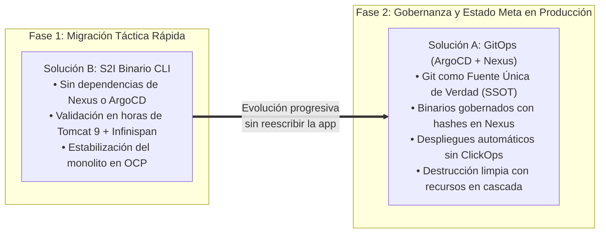
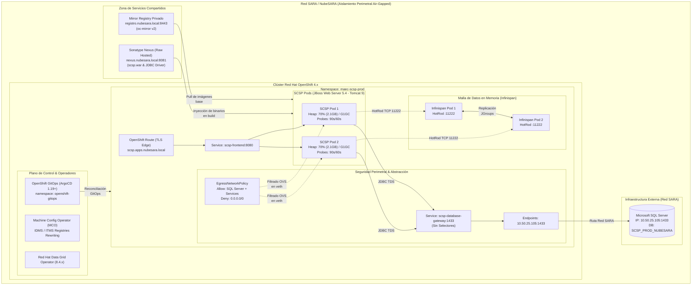

# 🏛️ OpenShift 4.x MAEC SCSP J2EE Lift-and-Shift (2026 Reference Architecture)

> [!WARNING]
> **⚠️ PLANTILLA DIDÁCTICA Y REFERENCIA ARQUITECTÓNICA CONCEPTUAL:**  
> Este repositorio es un diseño de referencia conceptual generado con **Gemini 3.8 Flash**, tomando como base técnica y de arquitectura el artículo publicado en formato newsletter en LinkedIn: [**"Despliegue de SCSP en OpenShift 4.x: Arquitecturas para Entornos Aislados"**](https://www.linkedin.com/pulse/despliegue-de-scsp-en-openshift-4x-arquitecturas-para-i%C3%B1aki-fernandez-hns6e/). **NO ha sido probado, validado ni depurado en un clúster OpenShift real en producción dentro de NubeSARA.**  
> Su propósito es servir como acelerador de ingeniería, guía de aprendizaje y plantilla de automatización para la migración estratégica de aplicaciones monolíticas heredadas Java Enterprise Edition (J2EE) hacia plataformas nativas de la nube en entornos aislados perimetralmente (**Air-Gapped**).

> [!IMPORTANT]
> **🔒 RESTRICCIÓN DE IA EN ENTORNOS ENS / AIR-GAPPED Y METODOLOGÍA "OUTSIDE-IN":**  
> En perímetros altamente protegidos bajo el **Esquema Nacional de Seguridad (ENS - Categoría Alta)** y en aislamiento perimetral estricto (**Air-Gapped**) como **NubeSARA**, **NO está permitido el uso de agentes de Inteligencia Artificial en la nube** (como Gemini, Claude, Copilot o ChatGPT) debido a la ausencia de conectividad a Internet, la estricta confidencialidad de la información pública y las directrices del CCN-CERT.  
> **El patrón metodológico acelerador:** Este repositorio pone en valor un flujo de trabajo pragmático y legítimo: el ingeniero o arquitecto de sistemas puede apoyarse en agentes avanzados de IA generativa desde su **equipo personal o red personal externa** para concebir, diseñar y generar con código toda la arquitectura de referencia, scripts de automatización, Kustomize y manifiestos GitOps. Posteriormente, este repositorio limpio se descarga y transfiere de forma segura al **entorno corporativo desconectado**, donde el equipo de ingeniería puede **evolucionar, validar, iterar, depurar y ajustar** la solución sobre los clústeres OpenShift reales (**QA, PRE y PRO**) sin comprometer la seguridad perimetral.

---

<!-- ======================================================================= -->
<!-- GITHUB REPOSITORY BADGES                                                -->
<!-- ======================================================================= -->
<p align="center">
  <a href="https://github.com/nubenetes/OpenShift-MAEC-SCSP-J2EE-Lift-and-shift/actions/workflows/ci.yml"></a>
  <a href="https://www.redhat.com/en/technologies/cloud-computing/openshift"></a>
  <a href="https://argo-cd.readthedocs.io"></a>
  <a href="https://infinispan.org"></a>
  <a href="https://kubernetes.io"></a>
</p>

<p align="center">
  
  
  
  
  
  
  
  <a href="LICENSE"></a>
</p>

---

## 📑 Tabla de Contenidos

1. [🌐 El Patrón Arquitectónico Universal: Casos de Uso Empresariales para Apps de Legado](#-el-patrón-arquitectónico-universal-casos-de-uso-empresariales-para-apps-de-legado)
   - [1.1. La Realidad del Software de Legado en el Tejido Empresarial](#1-la-realidad-del-software-de-legado-en-el-tejido-empresarial)
   - [1.2. Los 5 Bloqueantes Universales que este Patrón Resuelve](#2-los-5-bloqueantes-universales-que-este-patrón-resuelve-en-cualquier-organización)
   - [1.3. Escenarios de Aplicación Comunes en Grandes Industrias](#3-escenarios-de-aplicación-comunes-en-grandes-industrias)
   - [1.4. La Hoja de Ruta de Transición: De la Migración Rápida al Estado Meta](#4-la-hoja-de-ruta-de-transición-de-la-migración-rápida-al-estado-meta)
   - [1.5. Pragmatismo vs Sobre-Ingeniería: Por Qué Rechazar Pipelines de Microservicios (Tekton)](#pragmatismo-vs-tekton)
2. [📌 Contexto Específico del Proyecto Real: MAEC y Cliente Ligero SCSP](#-contexto-específico-del-proyecto-real-maec-y-cliente-ligero-scsp)
   - [2.1. El Rol de SUGICYR y el Ecosistema Tecnológico del MAEC](#21-el-rol-de-sugicyr-y-el-ecosistema-tecnológico-del-maec)
   - [2.2. El Desafío del Software Heredado (Monolito J2EE)](#22-el-desafío-del-software-heredado-monolito-j2ee)
   - [2.3. El Escenario de Ejecución: NubeSARA Air-Gapped](#23-el-escenario-de-ejecución-nubesara-air-gapped)
   - [2.4. Crónica de una Migración Interrumpida: Rigor Técnico vs. Atajos Cosméticos y Ética en Fondos Públicos (Next-Gen EU)](#gobernanza-fondos-publicos)
3. [🏛️ Diagrama Global de la Arquitectura](#️-diagrama-global-de-la-arquitectura)
4. [⚖️ Comparativa de Soluciones: GitOps vs S2I Binario Directo](#️-comparativa-de-soluciones-gitops-vs-s2i-binario-directo)
5. [🏆 ¿Cuál de las Dos Soluciones es la Más Recomendable?](#-cuál-de-las-dos-soluciones-es-la-más-recomendable)
6. [🧩 Retos de Ingeniería y Patrones de Implementación](#-retos-de-ingeniería-y-patrones-de-implementación)
   - [6.1. Espejado Air-Gapped Determinista con `oc-mirror v2`](#61-espejado-air-gapped-determinista-con-oc-mirror-v2)
   - [6.2. Erradicación del Antipatrón Sticky Sessions con Red Hat Data Grid](#62-erradicación-del-antipatrón-sticky-sessions-con-red-hat-data-grid)
   - [6.3. Abstracción Topológica de Base de Datos Externa (Service + Endpoints)](#63-abstracción-topológica-de-base-de-datos-externa-service--endpoints)
   - [6.4. Confinamiento de Red Egress (SUGICYR en OVN-Kubernetes)](#64-confinamiento-de-red-egress-sugicyr-en-ovn-kubernetes)
   - [6.5. Parametrización Porcentual de Memoria JVM Java 8 en cgroups](#65-parametrización-porcentual-de-memoria-jvm-java-8-en-cgroups)
   - [6.6. Calibración de Sondas de Resiliencia (Zero-Downtime Probes)](#66-calibración-de-sondas-de-resiliencia-zero-downtime-probes)
7. [🚀 Guía Rápida de Despliegue](#-guía-rápida-de-despliegue)
   - [Opción A: Despliegue mediante GitOps (ArgoCD + Nexus)](#opción-a-despliegue-mediante-gitops-argocd--nexus)
   - [Opción B: Despliegue mediante S2I Binario Directo por CLI](#opción-b-despliegue-mediante-s2i-binario-directo-por-cli)
8. [📂 Estructura del Repositorio](#-estructura-del-repositorio)
9. [📚 Documentación Detallada de Referencia](#-documentación-detallada-de-referencia)
10. [📄 Licencia y Créditos](#-licencia-y-créditos)

---

<a id="patron-arquitectonico-universal"></a>
## 🌐 El Patrón Arquitectónico Universal: Casos de Uso Empresariales para Apps de Legado

Más allá de la experiencia de proyecto específica en el **Ministerio de Asuntos Exteriores (MAEC)** con el **Cliente Ligero SCSP**, este repositorio materializa un **patrón de diseño arquitectónico de referencia ("Golden Path Archetype") universalmente aplicable a miles de empresas e instituciones** que enfrentan el desafío de migrar aplicaciones críticas monolíticas de legado hacia **Red Hat OpenShift / Kubernetes**.

### 1. La Realidad del Software de Legado en el Tejido Empresarial

En grandes corporaciones bancarias, aseguradoras, empresas de telecomunicaciones, hospitales y sector público, **más del 70% de las operaciones de negocio nucleares continúan ejecutándose sobre sistemas Java heredados (Java 6, 7 y 8; Spring 2/3/4; Struts 1/2; JSF; Servlets; EJBs)**. 

Estas aplicaciones fueron diseñadas para una era estática de servidores de aplicaciones corporativos:
- **Middleware tradicional:** IBM WebSphere Application Server (WAS), Oracle WebLogic Server, Red Hat JBoss EAP 6.x o instancias físicas de Apache Tomcat.
- **Topología de infraestructura:** Granjas de máquinas virtuales (VMware vSphere, Nutanix, Hyper-V) asociadas a balanceadores de red hardware (F5 BIG-IP, Citrix NetScaler) con reglas estrictas de persistencia de sesión por cookie (*Sticky Sessions*).

#### El Dilema de la Modernización Corporativa
| Estrategia | Ventajas | Inconvenientes en el Mundo Real |
| :--- | :--- | :--- |
| **Reescritura Completa (*Greenfield / Microservicios*)** | Código moderno (Spring Boot 3, Quarkus, Go). | ❌ Coste millonario, plazos de 2 a 5 años, pérdida de lógica de negocio histórica (*knowledge loss*) y **riesgo operacional inasumible** sobre servicios que ya facturan o atienden al cliente. |
| **Abandono / *Status Quo* en Máquinas Virtuales** | Sin esfuerzo de desarrollo inicial. | ❌ Obsolescencia de SO/JVM, fin de soporte de fabricantes, costes desorbitados de licencias de virtualización y nula elasticidad ante picos de demanda. |
| **🏆 *Lift-and-Shift Cloud-Native* (El Patrón de este Repo)** | **Inmediatez, portabilidad, inmutabilidad y orquestación elástica sin tocar una sola línea de código fuente Java.** | 💡 Exige resolver rigurosamente 5 barreras técnicas: sesiones HTTP, BD externa, perímetros aislados, memoria en cgroups y sondas de salud. |

---

### 2. Los 5 Bloqueantes Universales que este Patrón Resuelve en Cualquier Organización

Cualquier arquitecto o ingeniero cloud que intente contenerizar una aplicación Java de legado se topará con los mismos cinco problemas técnicos fundamentales. Esta referencia aporta la solución estándar probada para cada uno:

```text
┌────────────────────────────────────────────────────────────────────────────────────────────────────────┐
│                        ARQUETIPO DE LIFT-AND-SHIFT EMPRESARIAL EN OPENSHIFT                            │
├────────────────────────────────┬───────────────────────────────────────┬───────────────────────────────┤
│ BARRERA EN EL MONOLITO LEGADO  │ COMPORTAMIENTO NATIVO EN K8S / OCP    │ SOLUCIÓN PATRONIZADA EN REPO  │
├────────────────────────────────┼───────────────────────────────────────┼───────────────────────────────┤
│ 1. Estado en HttpSession       │ Pods efímeros destruyen la sesión al  │ Red Hat Data Grid / Infinispan│
│    (Login, wizards, carritos)  │ escalar o reiniciar (Sticky Sessions) │ con protocolo HotRod en Tomcat│
├────────────────────────────────┼───────────────────────────────────────┼───────────────────────────────┤
│ 2. Base de Datos Externa       │ Acoplamiento de IPs físicas en código │ Kubernetes Service sin        │
│    (Oracle, SQL Server, DB2)   │ destruye la inmutabilidad de la imagen│ selector + Endpoints dinámicos│
├────────────────────────────────┼───────────────────────────────────────┼───────────────────────────────┤
│ 3. Perímetro Confinado         │ Ausencia de Internet impide descargar │ oc-mirror v2 (IDMS/ITMS) con  │
│    (Air-Gapped / Red Aislada)  │ imágenes de Docker Hub / Red Hat      │ particionado tar de 16 GB     │
├────────────────────────────────┼───────────────────────────────────────┼───────────────────────────────┤
│ 4. Seguridad de Red Saliente   │ Tráfico abierto por defecto incumple  │ EgressNetworkPolicy en OVN    │
│    (Cero confianza perimetral) │ normativas de exfiltración de datos   │ locking down a IP/32 de la BD │
├────────────────────────────────┼───────────────────────────────────────┼───────────────────────────────┤
│ 5. Gestión de Memoria Java 8   │ La JVM lee la RAM del host físico y   │ JAVA_MAX_MEM_RATIO=70.0 +     │
│    (OOMKiller y arranques)     │ es fulminada por el Linux OOMKiller   │ Probes asimétricas 90s / 60s  │
└────────────────────────────────┴───────────────────────────────────────┴───────────────────────────────┘
```

---

### 3. Escenarios de Aplicación Comunes en Grandes Industrias

Este repositorio sirve como plantilla directa de implementación en sectores altamente regulados y complejos:

#### 🏦 A. Sector Bancario y Servicios Financieros (Fintech & Core Banking)
- **Casos Típicos:** Sistemas de scoring de riesgo crediticio, tramitación de hipotecas, plataformas de prevención de fraude (AML) y terminales transaccionales de oficina bancaria.
- **Por qué encaja este patrón:**
  - **Cumplimiento PCI-DSS y Banco de España / BCE:** Exigen aislamiento de red saliente (*Zero-Trust Egress*) para evitar fugas de números de tarjeta o cuentas bancarias.
  - **Integración con Mainframes y Oracle RAC:** Las bases de datos DB2 u Oracle de alta disponibilidad residen en redes de centros de datos on-premise que no se migran a contenedores. El patrón `Service` + `Endpoints` permite interconectar los pods sin exponer credenciales ni IPs en el código.
  - **Tolerancia a Fallos sin Abandono de Operación:** Si un cliente está autorizando una transferencia o un préstamo de 50.000 €, la muerte repentina de un pod no puede abortar la sesión; Infinispan transfiere el contexto al pod contiguo de forma imperceptible.

#### 🛡️ B. Sector Asegurador (Insurtech)
- **Casos Típicos:** Motores de tarificación de pólizas (autos, salud, hogar, vida) y portales de gestión pericial de siniestros.
- **Por qué encaja este patrón:**
  - **Formularios Multi-Paso Extensos (*Wizards*):** La tarificación de un seguro requiere hasta 8 pantallas consecutivas de datos del conductor y vehículo. Tradicionalmente, este árbol de datos se almacena en memoria de sesión Java. Externalizar a Data Grid permite realizar despliegues continuos (*Rolling Updates*) en mitad de la jornada laboral sin expulsar a un solo cliente o corredor de seguros.

#### 🏥 C. Sector Sanitario y Farmacéutico (HealthTech & Hospitales)
- **Casos Típicos:** Estaciones Clínicas Hospitalarias, Sistemas de Información Hospitalaria (HIS), Admisión de Urgencias, Gestión de Camas y Receta Electrónica.
- **Por qué encaja este patrón:**
  - **Operación Crítica 24/7/365:** Un fallo de servicio en un hospital puede comprometer vidas humanas. La alta disponibilidad de Infinispan con dos o más réplicas y las sondas de *Liveness/Readiness* calibradas garantizan que ningún médico sea redirigido a un pod que aún esté inicializando pools JDBC.
  - **Regulación Estricta de Privacidad (RGPD / HIPAA / ENS):** Redes hospitalarias cerradas donde las imágenes base de OpenShift deben ser auditadas criptográficamente y espejadas mediante `oc-mirror v2`.

#### ⚡ D. Telecomunicaciones y Utilities (Energía, Agua, Gas)
- **Casos Típicos:** Sistemas OSS/BSS de provisión de líneas fijas/móviles, plataformas de atención a agentes de call center (CRM heredado) y sistemas de facturación periódica.
- **Por qué encaja este patrón:**
  - **Picos Estacionales Masivos:** Campañas de *Black Friday* o lanzamientos comerciales multiplican el tráfico por diez. Desacoplar la sesión de los pods permite que el Autoescalador Horizontal de Pods (HPA) multiplique los contenedores de Tomcat sin desbalancear las sesiones pegajosas de los usuarios.

#### 🏛️ E. Administraciones Públicas Generales (CCAA, Ayuntamientos, Diputaciones, Ministerios)
- **Casos Típicos:** Sedes electrónicas ciudadanas, registro telemático de entrada/salida, tramitación de subvenciones y portales tributarios.
- **Por qué encaja este patrón:**
  - **Reutilización de Middleware Homologado:** Muchas administraciones ya disponen de licencias de Red Hat OpenShift en sus Centros de Proceso de Datos o en la Nube Corporativa. Este patrón proporciona una receta replicable que reduce los tiempos de consultoría de meses a días.

---

### 4. La Hoja de Ruta de Transición: De la Migración Rápida al Estado Meta

Este repositorio no impone una única forma de operar, sino que ofrece a los equipos de arquitectura corporativa un **itinerario evolutivo maduro**:

<details>
<summary><b>🗺️ Ver Diagrama de Transición: De la Migración Rápida al Estado Meta</b> (clic para desplegar)</summary>



</details>

---

<a id="pragmatismo-vs-tekton"></a>
### 5. Pragmatismo vs Sobre-Ingeniería: Por Qué Rechazar Pipelines Hipercomplejos de Microservicios (Tekton + ArgoCD) para Monolitos J2EE

En muchas grandes empresas y organismos de la Administración Pública (como ocurrió en la experiencia real del MAEC), las plataformas OpenShift ya disponen de complejas tuberías corporativas de CI/CD sustentadas sobre **Red Hat OpenShift Pipelines (Tekton) + ArgoCD**, concebidas para el desarrollo continuo de microservicios nativos modernos (*cloud-native in-house* en Spring Boot 3, Node.js, Angular o Go).

Un ejemplo paradigmático en el propio MAEC es el **"DOPE framework"** desarrollado por **Minsait**: una plataforma interna con una elevada personalización (*customization*), concebida específicamente para gobernar grandes ecosistemas de microservicios como **SINAVI (Sistema de Información Nacional de Visados)** —la aplicación crítica utilizada por la red de consulados en todo el mundo—, que llega a orquestar del orden de **100 microservicios** independientes.

Intentar embutir a la fuerza una aplicación monolítica heredada como el Cliente Ligero SCSP dentro de ese entramado hiper-personalizado de microservicios (concebido para 100 componentes distribuidos) representa un **grave error de arquitectura y un antipatrón de sobre-ingeniería que paraliza los proyectos durante meses**.

```text
┌────────────────────────────────────────────────────────────────────────────────────────────────────────┐
│               SOBRE-INGENIERÍA (TEKTON MICROSERVICIOS) vs PRAGMATISMO (ESTE REPOSITORIO)               │
├────────────────────────────────┬───────────────────────────────────────┬───────────────────────────────┤
│ DIMENSIÓN EVALUADA             │ PIPELINE MICROSERVICIOS (TEKTON)      │ SOLUCIONES DE ESTE REPOSITORIO│
├────────────────────────────────┼───────────────────────────────────────┼───────────────────────────────┤
│ Naturaleza de la Entrega       │ Código fuente compilado commit a      │ Paquete binario (.war)        │
│                                │ commit (Maven, npm, Gradle).          │ homologado por adjudicatarias │
├────────────────────────────────┼───────────────────────────────────────┼───────────────────────────────┤
│ Complejidad de Infraestructura │ 10-20 CRDs (Tasks, Pipelines,         │ 1 recurso nativo (BuildConfig │
│                                │ PipelineRuns, Workspaces, PVC RWX).   │ o S2I) sin dependencias extra │
├────────────────────────────────┼───────────────────────────────────────┼───────────────────────────────┤
│ Carga en Entornos Air-Gapped   │ Espejar decenas de imágenes base de   │ Solo la imagen oficial de     │
│                                │ utilidades Tekton (git, maven, etc.). │ JBoss Web Server (Tomcat 9)   │
├────────────────────────────────┼───────────────────────────────────────┼───────────────────────────────┤
│ Operatividad con Acceso CLI    │ Depurar pods efímeros fallidos de     │ Logs deterministas en un solo │
│ Restringido (Bastiones SARA)   │ TaskRun sin CLI directo es caótico.   │ stream (oc logs / ArgoCD UI)  │
├────────────────────────────────┼───────────────────────────────────────┼───────────────────────────────┤
│ Curva de Adopción de Sistemas  │ Curva empinada; exige dominar la      │ Inmediata; respeta la lógica  │
│                                │ sintaxis de Kubernetes Pipelines.     │ tradicional de Tomcat (J2EE)  │
├────────────────────────────────┼───────────────────────────────────────┼───────────────────────────────┤
│ Tiempo hasta Producción        │ Meses de diseño y ajustes de pipeline │ Días: Lift-and-Shift directo  │
└────────────────────────────────┴───────────────────────────────────────┴───────────────────────────────┘
```

#### ¿Por qué estas soluciones aceleran la migración frente a Tekton y frameworks como DOPE?

1. **La realidad del artefacto (Código vs Binario Homologado):**
   Los monolitos heredados de la Administración no son desarrollados internamente línea a línea en el día a día bajo marcos como *DOPE*. Son suministrados por empresas adjudicatarias e integradoras (como **INDRA, MINSAIT o ALTEN**) en forma de entregables binarios cerrados (`.war` de Java 8 y librerías `.jar`), tras superar fases previas de homologación técnica y pruebas de aceptación en laboratorios externos. Construir un pipeline con decenas de *Tasks* de Tekton para clonar repositorios de código inexistentes o compilar dependencias Maven obsoletas de hace una década carece de sentido.

2. **La pesadilla operativa de Tekton en entornos Air-Gapped sin acceso CLI directo:**
   En perímetros cerrados (**NubeSARA**), la política de seguridad impone que los ingenieros y administradores operen a través de bastiones de salto fuertemente aislados, con permisos de terminal y acceso interactivo prácticamente inexistentes o muy acotados. 
   - Con Tekton, un fallo en el montaje de un volumen persistente (`Workspace PVC`) o un error en un paso intermedio genera un pod efímero de diagnóstico inalcanzable.
   - Con el **S2I Binario de la Solución B (`oc start-build --from-dir`)**, el empaquetado es una llamada atómica directa que vuelca las trazas en un único flujo continuo.
   - Con el **BuildConfig declarativo de la Solución A**, OpenShift extrae el binario directamente de **Sonatype Nexus** en tiempo de ensamblado sin intermediación humana ni necesidad de ejecutar comandos en bastiones.

3. **Aproximación a la cultura de administración tradicional:**
   Los equipos de soporte, explotación e infraestructuras ministeriales conocen a la perfección el funcionamiento de los servidores de aplicaciones: saben dónde reside el descriptor (`context.xml`), dónde se sitúan las librerías compartidas (`lib/`) y cómo se despliega un contexto web (`webapps/`). Al preservar esta disposición física dentro de la imagen de **Red Hat JBoss Web Server**, la resistencia al cambio desaparece y la capacitación de los equipos es inmediata.

4. **Principio de Simplicidad (*KISS - Cada herramienta para su contexto*):**
   Adoptar la herramienta adecuada para cada problema es el principio fundacional de la buena ingeniería. El *DOPE framework* y Tekton son excelentes para orquestar la suite de 100 microservicios de SINAVI con despliegues continuos. Para el traslado de aplicaciones monolíticas J2EE con ciclos de liberación semestrales o anuales suministradas por terceros, **la combinación de S2I Binario para validaciones y GitOps declarativo con Nexus para producción es drásticamente más rápida, económica y segura**.

---

<a id="contexto-especifico-maec"></a>
## 📌 Contexto Específico del Proyecto Real: MAEC y Cliente Ligero SCSP

Como materialización práctica y prueba de concepto avanzada de este arquetipo, el repositorio implementa con código operativo la arquitectura técnica expuesta originalmente en la publicación de LinkedIn: [**Despliegue de SCSP en OpenShift 4.x: Arquitecturas para Entornos Aislados**](https://www.linkedin.com/pulse/despliegue-de-scsp-en-openshift-4x-arquitecturas-para-i%C3%B1aki-fernandez-hns6e/), orientada a la modernización del sistema tecnológico del **Ministerio de Asuntos Exteriores, Unión Europea y Cooperación (MAEC)** de España.

El proyecto responde a los mandatos de la **Ley 39/2015 del Procedimiento Administrativo Común**, que consagra en su artículo 28 el derecho de la ciudadanía a no aportar documentos ni certificados que ya obren en poder de la Administración Pública. Para hacer efectivo este derecho, la Secretaría General de Administración Digital (SGAD) articuló el estándar **SCSP (Sustitución de Certificados en Soporte Papel)**.

#### Marco Temporal y Contexto Organizativo: La Transición Contractual en el MAEC (Segunda Mitad de 2026)

Esta experiencia técnica de ingeniería y caso de uso real se sitúa cronológicamente en la **segunda mitad del año 2026**, en un momento de singular trascendencia organizativa, tecnológica y contractual dentro del Ministerio de Asuntos Exteriores, Unión Europea y Cooperación.

El entorno tecnológico ministerial se encontraba inmerso en un proceso de **relevo y transición global de proveedores de servicios TI**, tras la culminación de un ciclo plurianual de largo recorrido compuesto por **4 años de pliego licitado más 2 años adicionales de implantación y consolidación continuada**:

- **La Consultora Saliente y la Construcción del Ecosistema:**  
  Durante ese periodo acumulado de seis años, la consultora adjudicataria principal saliente (**Minsait**, con la participación coordinada de otras firmas de referencia como **Telefónica** y **Altia**) había sido la responsable directa de diseñar, desplegar y administrar tanto las **infraestructuras** de sistemas (CPDs, virtualización, redes y clústeres Red Hat OpenShift en NubeSARA) como el **parque aplicativo** nuclear del ministerio (desarrollo in-house, el framework *DOPE* y la arquitectura de microservicios de *SINAVI*).
- **Las Consultoras Entrantes y el Reto de la Transferencia de Conocimiento:**  
  Con la adjudicación del nuevo acuerdo marco y la redistribución de los lotes de servicio, desembarcó un nuevo consorcio de empresas integradoras que debían asumir las diferentes áreas de responsabilidad técnica:
  - **Alten:** adjudicataria responsable del lote especializado de **DevOps, automatización de despliegues y aseguramiento de la calidad (QA)**.
  - **NTT Data:** asumiendo responsabilidades en la administración especializada de bases de datos corporativas (DBAs) y soporte a sistemas.
  - **Teknei:** asumiendo servicios de desarrollo, soporte e integración adicionales, entre otras firmas del sector.
- **El Complejo Proceso de Traspaso (*Handover*):**  
  Este escenario de relevo implicaba un reto técnico, metodológico y de gestión de primer orden: los equipos de las consultoras entrantes tenían la difícil misión de **hacerse con el conocimiento y el gobierno operativo (*know-how*)** acumulado a lo largo de más de un lustro por la adjudicataria (en principio) saliente. En este contexto de transición concurrente —caracterizado por la convivencia de múltiples proveedores, la asimilación acelerada de procesos en infraestructuras altamente restringidas (NubeSARA Air-Gapped) y la necesidad imperativa de garantizar la continuidad de servicios consulares críticos— se abordó la modernización hacia OpenShift de aplicaciones clave como el Cliente Ligero SCSP.

##### Inventario Público de Contratación TIC en el MAEC: Mapa de Empresas Consultoras, Pliegos y Asignación de Lotes

De conformidad con los principios de publicidad y transparencia activa consagrados en la **Ley 9/2017 de Contratos del Sector Público (LCSP)** y las exigencias de auditoría de los **Fondos Europeos Next-Generation EU**, a continuación se detalla la matriz ampliada de expedientes públicos, empresas consultoras y su asignación de lotes:

| Ámbito / Rol Tecnológico | Entidad / Adjudicataria | Expediente / Instrumento Público | Periodo / Hitos | Asignación de Lote / Alcance Funcional | Fuentes y Registros Oficiales |
| :--- | :--- | :--- | :--- | :--- | :--- |
| **Infraestructura, Cloud & Plataforma Base (Saliente)** | **Minsait (Indra Sistemas)** *(en coordinación con Telefónica y Altia)* | Pliego marco de servicios de infraestructura, CPD y cloud ministerial | 4 años pliego + 2 de implantación (hasta 2026) | **Lote de Infraestructura & Lote de Aplicaciones:** Operación de CPDs, clústeres OpenShift en NubeSARA y framework *DOPE* | [PLACSP](https://contrataciondelestado.es/) / [Perfil Contratante MAEC](https://www.exteriores.gob.es/) |
| **Infraestructura TIC y Puestos de Digitalización Consular** | **Telefónica Soluciones de Informática y Comunicaciones, S.A.U.** | Expediente **2024000071** | Formalizado feb. 2025 (BOE-B-2025-5778/5779) | **Lote 1 (5,51 M€):** Hardware, virtualización, seguridad y licencias.<br/>**Lote 2 (2,85 M€):** Puestos de trabajo consular y equipamiento | [BOE-B-2025-5778](https://www.boe.es/diario_boe/xml.php?id=BOE-B-2025-5778) / [BOE-B-2025-5779](https://www.boe.es/diario_boe/xml.php?id=BOE-B-2025-5779) |
| **Infraestructura de Servidores, Almacenamiento & CPD** | **Inetum España, S.A.** *(antigua GFI Informática)* | Licitaciones de renovación de servidores y licencias | Contratos plurianuales (Consolidación hasta 2026) | **Lote Único (art. 99.3 LCSP):** Suministro, soporte y renovación de infraestructura de cómputo, almacenamiento masivo y licencias SUGICYR | [PLACSP](https://contrataciondelestado.es/) / [Portal Transparencia AGE](https://transparencia.gob.es/) |
| **Oficina Técnica y Gestión de Proyectos TIC (Entrante)** | **Teknei Information Technology, S.L.** | Expediente **2024000090** | Formalizado junio 2025 (Ejecución 2025–2026+) | **Lote 1:** Oficina de apoyo, gobernanza y gestión de servicios y proyectos TIC del ministerio | [BOE Formalización](https://www.boe.es/) / [Portal Transparencia AGE](https://transparencia.gob.es/) |
| **Ingeniería DevOps, Automatización & QA (Entrante)** | **Alten Soluciones Productos Auditoría e Ingeniería, S.A.U.** | Expediente **2024000090** | Formalizado junio 2025 (Ejecución 2025–2026+) | **Lote 2:** Control de calidad (QA), aseguramiento metodológico, testing y soporte a ingeniería DevOps | [BOE Formalización](https://www.boe.es/) / [Portal Transparencia AGE](https://transparencia.gob.es/) |
| **Bases de Datos Corporativas (DBAs) & Soporte** | **NTT Data Spain, S.L.U.** | Licitaciones de soporte especializado a sistemas | Periodo 2025–2026 (Transición activa) | **Lote Especializado DBAs / Derivado AM:** Administración de bases de datos corporativas (MS SQL Server en Red SARA) | [PLACSP](https://contrataciondelestado.es/) / [Registro DGRCC](https://www.hacienda.gob.es/) |
| **Evolución y Acompañamiento Aplicativo Consular** | **Indra Soluciones TI (Minsait)** | Expediente **CEA3422/2026** / Exp. Mayo 2026 | Adjudicado mayo y agosto 2026 (799.252 € + 102.300 €) | **Lote Único (art. 99.3 LCSP):** Implantación de la nueva versión de SINAVI y desarrollo de mejoras del aplicativo consular (fondos UE) | [PLACSP Licitaciones](https://contrataciondelestado.es/) / [Junta de Contratación](https://www.hacienda.gob.es/) |
| **Desarrollo y Mejoras de Software Consular** | **Capgemini España, S.L.** | Expedientes de desarrollo aplicativo / SINAVI (ej. CE03573/2023) | Contratos de desarrollo y mejoras (2023–2026) | **Lote de Desarrollo de Sistemas (Acuerdo Marco AGE):** Evolución de módulos del sistema consular SINAVI | [PLACSP](https://contrataciondelestado.es/) / [Hacienda DGRCC](https://www.hacienda.gob.es/) |
| **Digitalización Consular y Entornos de Pruebas** | **Ayesa Advanced Technologies, S.A.** | Licitaciones del Plan de Digitalización Consular | Periodo de implantación 2024–2026 | **Lote de Calidad y Pruebas:** Desarrollo de componentes y adecuación de entornos de validación consular | [PLACSP](https://contrataciondelestado.es/) / [Portal MAEC](https://www.exteriores.gob.es/) |
| **Servicios de Migración e Integración Aplicativa** | **Sopra Steria España, S.A.** | Licitaciones de migración de sistemas (ej. CEA377/2026) | Periodo 2025–2026 | **Lote Único (art. 99.3 LCSP):** Servicios especializados de migración tecnológica e integración entre aplicativos | [PLACSP](https://contrataciondelestado.es/) / [Transparencia AGE](https://transparencia.gob.es/) |
| **Desarrollo y Soporte bajo Acuerdos Marco Centralizados** | **Viewnext / Babel Sistemas de Información** | Contratos derivados de Acuerdos Marco DGRCC (Hacienda) | Periodo 2024–2026+ | **Lotes 1 y 2 del Acuerdo Marco 26/2021 DGRCC:** Desarrollo de sistemas y mantenimiento correctivo/evolutivo | [DGRCC Hacienda](https://www.hacienda.gob.es/) / [PLACSP](https://contrataciondelestado.es/) |

> [!NOTE]
> **¿Por qué no todos los contratos tienen un número de lote propio asignado?**  
> En el marco del Derecho de la Contratación Pública en España (Ley 9/2017 - LCSP), coexisten tres modelos jurídicos de licitación:  
> 1. **Licitaciones con División Formal en Lotes (Regla General, art. 99.1 LCSP):** Contratos diseñados específicamente para abrir la competencia a diferentes proveedores especializados (por ejemplo, el expediente **2024000090**, estructurado en **Lote 1** para Teknei y **Lote 2** para Alten; o el **2024000071**, con **Lote 1** y **Lote 2** adjudicados a Telefónica).  
> 2. **Licitaciones de Lote Único (Excepción Justificada, art. 99.3 LCSP):** Contratos de objeto indivisible donde una fragmentación técnica o funcional pondría en riesgo la continuidad del servicio o la compatibilidad de una solución propietaria (por ejemplo, el contrato **CEA3422/2026** para la implantación de la nueva versión de SINAVI con Minsait, o suministros específicos de CPD con Inetum).  
> 3. **Contratos Derivados de Acuerdos Marco Centralizados (DGRCC - Ministerio de Hacienda):** Instrumentos de compra agregada donde la división en lotes reside en el **Acuerdo Marco matriz** a nivel estatal (por ejemplo, el **Acuerdo Marco 26/2021** para Desarrollo de Sistemas de Información, que cuenta con sus propios lotes de desarrollo, mantenimiento o pruebas). Las órdenes de servicio que activa el MAEC para consultoras homologadas (como NTT Data, Capgemini, Viewnext o Babel) se rigen por los lotes del acuerdo marco central.


#### ¿Por qué este monolito de 20 años era tan crítico para el Ministerio?
El **Cliente Ligero SCSP** es una aplicación con aproximadamente **dos décadas de vida operativa**, concebida en los orígenes de la administración electrónica española. Lejos de ser un sistema prescindible, constituye una **pieza neurálgica, crítica e insustituible** para el funcionamiento diario del MAEC y su red de Embajadas y Consulados en los cinco continentes:
- **Pasarela Única de Intermediación Estatal:** Es el software que permite a las unidades consulares y diplomáticas interrogar telemáticamente a los organismos emisores del Estado:
  - **Identidad y Filiación:** Consultas en tiempo real a la Dirección General de la Policía (DGP) y Registro Civil.
  - **Antecedentes Penales y Delitos Sexuales:** Consultas al Ministerio de Justicia, un requisito legal indispensable para la concesión de visados de trabajo, residencia y estudios, expedientes de nacionalidad por residencia o carta de naturaleza, y contrataciones consulares en el extranjero.
  - **Titulaciones Académicas:** Verificación de títulos universitarios y no universitarios ante el Ministerio de Educación.
  - **Obligaciones Económicas:** Comprobación telemática del estado de pagos ante la Agencia Tributaria (AEAT) y la Tesorería General de la Seguridad Social (TGSS).
- **Impacto de una Caída en Producción:** La indisponibilidad del Cliente Ligero SCSP paralizaría de forma instantánea la tramitación de miles de visados, expedientes de extranjería, pasaportes y notarías consulares en todo el mundo. Obligaría a exigir a los ciudadanos que aportasen certificados físicos expedidos en España, provocando un colapso administrativo y vulnerando flagrantemente la legislación de procedimiento administrativo común.

#### La Paradoja de la Migración a OpenShift y la Gestión del Riesgo (El "Plan B")
El mandato estratégico del MAEC era migrar esta aplicación hacia los clústeres corporativos de **Red Hat OpenShift en NubeSARA**, en el marco del plan ministerial de consolidación cloud. Sin embargo, esta exigencia encerraba una paradoja de alto riesgo técnico y contractual:
- **Cero Soporte y Vacío Documental del Proveedor para Contenedores:** La empresa adjudicataria responsable del desarrollo y mantenimiento del software **no ofrecía soporte alguno para entornos basados en contenedores, Kubernetes u OpenShift**. Su documentación técnica, matrices de compatibilidad y guías de homologación estaban concebidas única y exclusivamente para entornos tradicionales no contenerizados (máquinas virtuales o servidores físicos con Apache Tomcat tradicional).
- **La Prudencia Técnica de un DevOps Senior (La Propuesta del "Plan B"):** Ante semejante brecha documental y el riesgo de paralizar un servicio crítico de Estado, el autor de esta arquitectura —desde la experiencia de un perfil **DevOps Senior** acostumbrado a gobernar riesgos en infraestructuras críticas— **sugirió formalmente un "Plan B"**: no descartar y preparar en paralelo una vía de despliegue sobre infraestructura tradicional (máquinas virtuales con Tomcat dedicado) como red de seguridad institucional amparada por el soporte del fabricante. Dicha recomendación preventiva no llegó a implementarse por parte de la gestión, a pesar de que meses atrás otro profesional de **NTT Data** había intentado infructuosamente durante varios meses hacer funcionar el despliegue sin conseguirlo.
- **La Validación Exitosa de la Fase 1 en OpenShift:** Pese a no contar finalmente con ese respaldo preventivo en paralelo y tras el precedente de meses de intentos fallidos de terceros, la solución de ingeniería de **Fase 1 (S2I Binario CLI con configuración desacoplada)** desarrollada por el autor demostró que la migración a OpenShift era perfectamente factible: el Cliente Ligero SCSP comenzó a funcionar de forma estable y satisfactoria en el primer clúster de pruebas de OpenShift en NubeSARA, desacoplando la configuración y la base de datos externa de Red SARA sin alterar una sola línea del binario entregado por el fabricante.

### 2.1. El Rol de SUGICYR y el Ecosistema Tecnológico del MAEC

La **SUGICYR (Subdirección General de Informática, Comunicaciones y Redes)** es el órgano directivo del MAEC responsable de la gobernanza de las infraestructuras de telecomunicaciones, centros de proceso de datos, plataformas cloud y ciberseguridad, tanto para los Servicios Centrales como para la red de Embajadas y Consulados de España en el exterior.

Bajo la supervisión de la SUGICYR en los clústeres de **Red Hat OpenShift en NubeSARA**, conviven distintas realidades funcionales y arquitectónicas:

1. **SINAVI (Sistema de Información Nacional de Visados):**  
   Plataforma crítica distribuida utilizada por las oficinas consulares en todo el mundo para la gestión, tramitación y resolución de visados nacionales y del espacio Schengen, integrada con el **VIS (Visa Information System)** a nivel europeo y con el portal público ciudadano **SuTRAMITE Consular** (`sutramiteconsular.maec.es`). Su ciclo de vida continuo se gestiona mediante el **"DOPE framework"** desarrollado por **Minsait**, orquestando cerca de **100 microservicios** independientes con **Tekton + ArgoCD**.
2. **e-LINCE:**  
   Sistema de información centralizado para la gestión económica, presupuestaria, contractual y control de las **Cajas Pagadoras** de las Representaciones de España en el exterior (Embajadas y Consulados).
3. **Cliente Ligero SCSP:**  
   La aplicación monolítica J2EE objeto de este repositorio, destinada a la intermediación automatizada de certificados con la Administración General del Estado. A diferencia de SINAVI o e-LINCE, no es una aplicación de microservicios in-house sujeta a compilaciones diarias commit a commit, sino un producto paquetizado entregado por adjudicatarias como un artefacto binario cerrado.

### 2.2. El Desafío del Software Heredado (Monolito J2EE)
Históricamente, el Cliente Ligero SCSP fue construido como un monolito bajo la especificación **Java Enterprise Edition (J2EE)**:
- **Java 8 (OpenJDK 1.8):** Restricciones estrictas de compilación y librerías heredadas no actualizadas a runtimes modernos (Java 17/21).
- **Servidor de Aplicaciones:** Diseñado originalmente para Apache Tomcat 7/8 sobre máquinas virtuales dedicadas. En OpenShift se traslada a la imagen oficial certificada **Red Hat JBoss Web Server 5.4 (Tomcat 9 sobre RHEL 8)**.
- **Sesiones HTTP en Memoria RAM:** Fuerte dependencia de la `HttpSession` para almacenar el árbol de navegación y tramitación del funcionario consular (**antipatrón *Sticky Sessions***).
- **Base de Datos Externa en Red SARA:** Registro de auditorías, firmas y trazabilidad de intermediaciones persistido en una instancia **Microsoft SQL Server** física/virtualizada en la intranet ministerial (`10.50.25.105:1433`).
- **Conectores Propietarios Cerrados:** Exige incorporar el controlador JDBC oficial de Microsoft (`mssql-jdbc-8.4.1.jre8.jar`).

### 2.3. El Escenario de Ejecución: NubeSARA Air-Gapped
El MAEC aloja estas cargas en **NubeSARA**, la infraestructura de nube híbrida gubernamental. Por directrices del **CCN-CERT**, el **Esquema Nacional de Seguridad (ENS - Categoría Alta)** y la **SUGICYR**:
- **Topología Multi-Clúster por Entorno (QA, PRE, PRO):** En NubeSARA, la segregación entre fases no es meramente lógica (namespaces en un mismo clúster), sino que existen **clústeres OpenShift físicos independientes para cada entorno**:
  - **Clúster OCP QA:** Entorno de pruebas de calidad y validaciones técnicas tempranas. Al no disponerse aún de un clúster dedicado de desarrollo (`dev`), el clúster de QA asumía las funciones de banco de pruebas inicial para contrastar los empaquetados.
  - **Clúster OCP PRE:** Entorno de preproducción para pruebas de integración con el SCSP de pruebas en Red SARA, validación de certificados y pruebas de carga.
  - **Clúster OCP PRO:** Entorno de producción con réplicas de alta disponibilidad, cuotas garantizadas, operadores en confinamiento y auditoría ENS Alta.
  Esta segregación multi-clúster se gestiona con Kustomize mediante `overlays/qa/`, `overlays/pre/` y `overlays/prod/`, sincronizados centralizadamente desde ArgoCD (individualmente o mediante `ApplicationSet`).
- **Gobernanza de Flota con OpenShift ACM (RHACM):** Existía un clúster Hub central con **Red Hat Advanced Cluster Management (ACM)** para la supervisión y control de la flota multiclúster (QA, PRE, PRO). Si bien su integración operativa con los pipelines de entrega continua estaba en proceso de maduración progresiva ("no totalmente integrada aún"), sentaba las bases para la gobernanza de políticas GRC (*Governance, Risk, Compliance* bajo ENS Nivel Alto) y la selección dinámica de clústeres (`Placement`).
- **Espejado Certificado con `oc-mirror v2`:** Ingesta de catálogos y operadores mediante particionado en bloques TAR de 16 GB (`archiveSize: 16`), inyectando recursos `ImageDigestMirrorSet` (IDMS) e `ImageTagMirrorSet` (ITMS) que el **Machine Config Operator (MCO)** sincroniza en `/etc/containers/registries.conf` con reinicio secuencial de nodos.
- **Segregación de Binarios en Sonatype Nexus:** Los artefactos `.war` y `.jar` se gobiernan en un repositorio *raw-hosted* interno (`nexus.nubesara.local:8081/repository/scsp-raw/`), preservando la limpieza del repositorio Git.
- **Cero Confianza Saliente (Zero-Trust Egress):** Bloqueo total del tráfico saliente en OVN-Kubernetes (`EgressNetworkPolicy`), confinando los pods exclusivamente al puerto TDS 1433 de la base de datos SQL Server (`10.50.25.105/32`).
- **Prohibición de ClickOps:** Todos los cambios en producción se aplican declarativamente mediante **OpenShift GitOps (ArgoCD 1.19+)** con finalizadores en cascada (`resources-finalizer.argocd.argoproj.io`) para una gestión limpia del ciclo de vida sin recursos huérfanos.

<a id="gobernanza-fondos-publicos"></a>
### 2.4. Crónica de una Migración Interrumpida: Rigor Técnico vs. Atajos Cosméticos y Ética en Fondos Públicos (Next-Generation EU)

Este repositorio trasciende el ámbito estrictamente técnico: es también un testimonio documentado de una realidad recurrente en la consultoría tecnológica aplicada al sector público y un alegato ético en favor de la transparencia, la honestidad profesional y la buena gobernanza.

#### 1. La Interrupción de la Fase 1: Arquitectura Real vs. Falsa Apariencia de Entrega
Durante la fase de análisis e implantación técnica inicial en el primer clúster de pruebas de **NubeSARA** —enmarcada en la **segunda mitad del año 2026** y en pleno proceso de traspaso de conocimiento entre la adjudicataria saliente (**Minsait**, junto a socios como **Telefónica** y **Altia**) y las nuevas firmas entrantes (**Alten** para DevOps/QA, **NTT Data**, **Teknei**)—, la solución táctica de **Fase 1 (S2I Binario CLI)** estaba siendo desarrollada de forma plenamente satisfactoria y rigurosa por el autor de esta arquitectura. Tras un análisis minucioso de las dependencias heredadas, el comportamiento de las sesiones J2EE en Tomcat y las restricciones de red perimetrales hacia la base de datos corporativa Microsoft SQL Server (`10.50.25.105:1433`), y habiendo superado el precedente de varios meses de intentos infructuosos por parte de otro profesional de **NTT Data** que no había conseguido hacer funcionar el despliegue, la solución avanzaba con paso firme hacia una migración estable y sin fricciones.

Sin embargo, en el contexto de la presión habitual en los relevos de contratas por evidenciar avances rápidos e inmediatos ante los gestores ministeriales, dinámicas políticas internas, luchas de poder y una deficiente gestión de proyecto truncaron su culminación:
- **La Priorización del Atajo Inviable y la Proliferación de Antipatrones:** Bajo la premisa de "mostrar un entregable rápido a toda costa para cubrir el expediente", se impulsó en paralelo una vía alternativa desarrollada por otro compañero de la misma consultora entrante reasignado desde otro proyecto anterior. Dicho perfil intentó posicionarse y venderse como presunto experto mediante el uso recurrente de vocabulario técnico y jerga especializada que, sin embargo, resultaba carente de corrección técnica elemental; para cualquiera que conociese de verdad la tecnología, quedaba en evidencia de forma inmediata la ausencia total de experiencia práctica y conocimiento real en la materia. Esta carencia condujo a graves antipatrones de diseño:
  - **Recompilación Forzada de Artefactos Homologados vs. Inmutabilidad Nativa en Kubernetes:**  
    El software del Cliente Ligero SCSP suministrado al MAEC era un artefacto binario (`.war`) cerrado, desarrollado y entregado bajo contrato por una empresa adjudicataria externa. Dicho binario constituía el único entregable formalmente validado en bancos de prueba y amparado por la garantía contractual y el soporte técnico del proveedor, quien únicamente ofrecía soporte y documentación para entornos tradicionales no contenerizados (máquinas virtuales o servidores físicos con Apache Tomcat), sin cobertura alguna para plataformas de contenedores ni OpenShift.  
    A pesar de ello, la solución alternativa recurrió al grave error de modificar y recompilar todo el código fuente Java cada vez que se requería ajustar un parámetro de configuración (URLs, credenciales o flags de entorno):
    - *Por qué recompilar el artefacto es un antipatrón crítico:* Recompilar un binario entregado por terceros anula de inmediato la garantía y el soporte técnico contractual del fabricante original; además, introduce una fuente impredecible de regresiones al depender de versiones de compilador, dependencias transitivas de librerías obsoletas y opciones de build no certificadas por el proveedor, imposibilitando auditar criptográficamente (mediante hashes SHA-256) el artefacto en producción bajo las exigencias del ENS.
    - *La brecha entre la experiencia DevOps Senior y el desarrollo web:* Para un ingeniero de sistemas o **DevOps Senior**, curtido en el despliegue de infraestructuras críticas a través de sucesivas generaciones tecnológicas (desde hierro físico y servidores de aplicaciones corporativos J2EE hasta la orquestación cloud), es una regla de oro innegociable que **el artefacto binario homologado es inmutable y la configuración debe externalizarse por completo**. Por el contrario, para un perfil con trayectoria centrada en el desarrollo web en lenguajes interpretados (como PHP) y alejado de las complejidades de la infraestructura de sistemas empresariales, resulta más difícil dimensionar el impacto de alterar el ciclo de vida del software, cayendo en la inercia de editar y recompilar el proyecto como si se tratase de un script local en desarrollo.
    - *La flexibilidad arquitectónica de OpenShift/Kubernetes aplicada en este repo:* Lejos de requerir recompilaciones, la arquitectura de Kubernetes y OpenShift ofrece una flexibilidad extraordinaria concebida precisamente para resolver este desafío de manera limpia: el `.war` original se despliega íntegro e inalterado en la imagen certificada de JBoss Web Server (Tomcat 9), mientras que la configuración ambiental (`context.xml`, `hotrod-client.properties`) se inyecta dinámicamente en el arranque mediante volúmenes de *ConfigMaps* y *Secrets*, desacoplando la topología mediante *Services* y *Endpoints*. Es exactamente este patrón riguroso, que respeta la garantía del fabricante y la inmutabilidad de la carga de trabajo, el que se implementa y defiende en este repositorio.
  - **Base de Datos Efímera en Pod vs. Base de Datos Corporativa:** La directriz del cliente ministerial era nítida e incontestable desde el inicio: el requisito arquitectónico mandatorio era **conectar a la base de datos externa Microsoft SQL Server asociada a cada entorno** en la intranet de Red SARA. Para cumplir con esta exigencia real de producción, el autor de esta arquitectura tuvo que investigar a fondo y conseguir, no sin esfuerzo, perseverancia técnica y gestiones de interlocución, los parámetros de red, credenciales y rutas de conectividad hacia dicha base de datos (labor que contó además con la valiosa y profesional colaboración de otras empresas adjudicatarias como **NTT Data**, que ejercían el rol de DBAs corporativos). Frente a esta realidad ineludible, la solución paralela optó por el atajo cosmético de levantar un entorno autocontenido con una base de datos efímera dentro del propio pod en local. Esta vía carecía por completo de sentido: ¿qué justificación técnica tenía malgastar tiempo y recursos en simular una base de datos de juguete en un pod aislado cuando ya se estaba desbrozando y resolviendo la conectividad con el SQL Server real del ministerio? Toda esta dinámica irracional de actuar a espaldas del equipo dinamitó lo que debería haber sido una práctica elemental de ingeniería: sentarse a debatir abiertamente, compartir la información obtenida y alinearse en un diseño conjunto, funcional y homologable.
- **La Simulación como Maniobra de Conveniencia:** En lugar de evaluar ambas alternativas bajo criterios objetivos de ingeniería de sistemas, esa falsa apariencia de rapidez se utilizó como pretexto para propiciar la salida forzada del profesional con mayor preparación y experiencia técnica contrastada en estas tecnologías (mientras otros perfiles partían de cero). En organizaciones donde la gestión premia la complacencia burocrática por encima de la excelencia, quien defiende un criterio técnico independiente, advierte de los riesgos de diseño y no se presta a simulaciones cosméticas es percibido como un obstáculo ("hacer sombra"), orquestándose su salida mediante maniobras de conveniencia.

#### 2. Rechazo Frontal al Antipatrón del Enfrentamiento entre Profesionales y el Despilfarro de Recursos
Un aspecto medular de esta reflexión es la crítica a un modelo de gestión destructivo e ineficiente:
- **El Despropósito de los Silos Paralelos y la Falta de Alineación:** Supone una grave falta de profesionalidad y un despilfarro flagrante de recursos públicos y humanos que dos o más personas de un mismo equipo trabajen en paralelo sobre la misma tarea en absoluto aislamiento y sin comunicarse entre sí, compitiendo en una carrera artificial por ver "quién llega antes". En lugar de debatir técnicamente, coordinar esfuerzos y alinear al equipo sobre la información ya recabada (como los accesos a bases de datos y requisitos de red de SARA), esta dinámica viciada premia la primera maqueta que aparenta funcionar en local, aunque sea técnicamente inviable y desaconsejable para producción, aprovechándose de que el interlocutor ministerial suele tener un perfil gestor y administrativo, no técnico de infraestructura.
- **Cultura de Cooperación y Diálogo Bidireccional:** La verdadera ingeniería de software y la arquitectura cloud crecen sobre la base del aprendizaje mutuo, la mentoría honesta y la puesta en común de conocimiento. Quien suscribe este proyecto se opone frontalmente a competir con sus compañeros; el valor profesional se demuestra colaborando, compartiendo hallazgos y remando juntos hacia el éxito del proyecto. Fomentar rivalidades internas para dirimir cuotas de influencia o tapar carencias formativas degrada el talento y condena a las organizaciones a decisiones técnicas erráticas que tarde o temprano colapsan en producción.

#### 3. Honestidad Técnica vs. Retórica Comercial: La Cultura de los Hechos frente a la Apariencia
- **La Sobre-Venta de Perfiles y la Erosión de la Confianza:** En la consultoría tecnológica es comprensible una actitud de seguridad y proactividad comercial, pero cuando esta actitud se exagera hasta desfigurar la realidad técnica, resulta profundamente incómoda y destructiva. Intentar vender una falsa maestría mediante palabrería técnica conduce con frecuencia a falsear la realidad de lo que realmente se entrega, sembrando desconfianza en el equipo y comprometiendo la viabilidad de la infraestructura.
- **Humildad Intelectual y Predisposición para Aprender:** Nadie tiene por qué saberlo todo. La solvencia técnica legítima se apoya en la honestidad de reconocer los límites del conocimiento propio, la predisposición constante a aprender y la madurez de dejarse guiar por los profesionales que acreditan mayor experiencia en una tecnología determinada. Resulta profundamente frustrante e injusto que ciertas dinámicas corporativas prioricen perfiles que basan su avance en la fachada comercial, postergando a los profesionales que actúan con rigor y transparencia.
- **Ingeniería Basada en Hechos, no en Palabrería:** Quien suscribe esta obra cree firmemente en una forma de trabajar: esforzarse al máximo para que la tecnología funcione de la manera más robusta, eficiente y elegante posible, demostrando las soluciones con hechos contrastables, código limpio y sistemas en funcionamiento, y no con artificios retóricos o promesas vacías.

#### 4. La Responsabilidad Ineludible con los Fondos Públicos (Next-Generation EU)
Las iniciativas de modernización y transformación digital en los Ministerios de la Administración General del Estado —en gran medida impulsadas y financiadas por los **Fondos Europeos Next-Generation EU (Plan de Recuperación, Transformación y Resiliencia)**— exigen una responsabilidad social y ética mayúscula:
- **Exigencia de Máxima Transparencia y Honestidad:** Cada euro público invertido procede del esfuerzo de los ciudadanos europeos y españoles. Resulta inaceptable que proyectos estratégicos se gestionen bajo dinámicas oscuras que anteponen intereses particulares y apariencias de conveniencia a la calidad, la seguridad y la durabilidad de las infraestructuras de Estado.
- **Mérito, Competencia e Implicación:** La gestión de fondos públicos debe guiarse rigurosamente por el mérito, la capacidad técnica y el compromiso ético, erradicando situaciones donde se favorece a unos pocos con independencia de su preparación o solvencia, a expensas del interés general.

#### 5. El Sentido y Legitimidad de este Repositorio
Ante la imposibilidad de concluir la implantación en el entorno ministerial por las circunstancias descritas, este repositorio abierto nace como un **acto de restitución profesional, transparencia y aportación comunitaria**: rescatar íntegramente el análisis técnico, implementar con código operativo completo tanto la Fase 1 como la Fase 2, y poner a disposición pública una referencia contrastada y libre de atajos para que cualquier profesional o institución pueda acometer la modernización de monolitos J2EE con honestidad, seguridad y rigor.

---

<a id="diagrama-arquitectura"></a>
## 🏛️ Diagrama Global de la Arquitectura

<details>
<summary><b>🏛️ Ver Diagrama Global de la Arquitectura (NubeSARA Air-Gapped)</b> (clic para desplegar)</summary>



</details>

---

<a id="comparativa-soluciones"></a>
## ⚖️ Comparativa de Soluciones: GitOps vs S2I Binario Directo

Este repositorio incluye con código operativo las dos soluciones técnicas analizadas:

| Criterio Técnico | [Solución A: GitOps (ArgoCD + Nexus)](solution-a-gitops/) | [Solución B: S2I Binario Directo (CLI)](solution-b-s2i-binary/) |
| :--- | :--- | :--- |
| **Paradigma Operativo** | **Declarativo Continuo (GitOps):** Git es la única fuente de la verdad (SSOT). | **Imperativo / Transicional (CLI):** Ejecución secuencial de scripts por un operador bastión. |
| **Gestión de Binarios (.war, .jar)** | **Sonatype Nexus:** Repositorio *raw-hosted* dedicado. Cero binarios en el repo Git. | **Directorio Local:** Archivos depositados manualmente en la carpeta del workspace S2I. |
| **Control de Desviaciones (*Drift*)** | **Automático (Self-Healing):** Si alguien altera el despliegue a mano, ArgoCD lo revierte. | **Manual / Nulo:** OpenShift no detecta desviaciones frente al manifiesto inicial. |
| **Auditoría y Trazabilidad ENS** | **Máxima:** Cada cambio corresponde a un commit/PR firmado en Git con aprobación obligatoria. | **Baja-Media:** Depende del historial de auditoría de la consola y logs temporales del clúster. |
| **Estructuración Multi-Entorno** | **Kustomize Multi-Clúster:** `base/` compartido y `overlays/qa/`, `overlays/pre/`, `overlays/prod/` para cada clúster OCP independiente. | **Variables / Ficheros duplicados:** Requiere parametrizar scripts y manifiestos a mano. |
| **Decommissioning (Tear Down)** | **Borrado en Cascada:** `resources-finalizer` garantiza destrucción limpia de todos los CRDs. | **Manual:** Requiere ejecutar `oc delete namespace`, con riesgo de recursos bloqueados. |
| **Curva de Adopción** | Requiere conocimiento de ArgoCD, Kustomize y administración de Nexus. | Inmediata para ingenieros de sistemas con experiencia básica en `oc` CLI. |
| **Dependencia de Componentes** | Requiere el operador OpenShift GitOps y el servidor Sonatype Nexus en NubeSARA. | Cero dependencias adicionales; utiliza únicamente las capacidades nativas de OCP. |

---

<a id="recomendacion-arquitectonica"></a>
## 🏆 ¿Cuál de las Dos Soluciones es la Más Recomendable?

### Veredicto: La Solución A (GitOps + Nexus) es la Más Recomendable

Para cualquier despliegue en **Producción** dentro del MAEC, la Administración General del Estado o entornos corporativos de alta criticidad, **la Solución A es la arquitectura preferente y recomendada**.

#### Justificación Técnica y de Gobierno:
1. **Cumplimiento Estricto del Esquema Nacional de Seguridad (ENS - Categoría Alta):**
   - El principio de *segregación de funciones* se garantiza: ningún administrador ni desarrollador necesita privilegios de administración directa (`cluster-admin` o `edit`) sobre los namespaces de producción.
   - El controlador de ArgoCD (`system:serviceaccount:openshift-gitops:openshift-gitops-argocd-application-controller`) es el único autorizado a sincronizar recursos contra la API de Kubernetes.
2. **Higiene del Repositorio de Código:**
   - Versionar archivos compilados (`scsp.war` de 100+ MB) en repositorios Git degrada el rendimiento de las operaciones `git clone` y corrompe el historial de control de versiones. La delegación de binarios en **Sonatype Nexus** garantiza que Git permanezca ligero y puramente declarativo.
3. **Recuperación Inmediata ante Desastres (Disaster Recovery):**
   - En caso de corrupción o pérdida total del clúster OpenShift, el clúster secundario o de contingencia puede ser restaurado al 100% en cuestión de segundos aplicando únicamente el manifiesto maestro `scsp-application.yaml`.
4. **Destrucción y Limpieza Segura de Recursos (Zero Orphan Waste):**
   - El uso del finalizador `resources-finalizer.argocd.argoproj.io` asegura que, ante la baja de la aplicación, Kubernetes ejecute un borrado en cascada en primer plano (*Foreground Cascading Deletion*), eliminando el clúster de Infinispan, StatefulSets, Services y políticas Egress sin agotar recursos huérfanos de NubeSARA.

#### ¿Cuándo debe utilizarse la Solución B?
La **Solución B (S2I Binario Directo)** es sumamente valiosa como **escalón intermedio o táctico**:
- Para validar en pocas horas la compatibilidad de Tomcat 9 y Java 8 con las consultas JDBC de SQL Server en una Prueba de Concepto (PoC).
- Cuando en los estadios iniciales del proyecto aún no se ha desplegado ni homologado Sonatype Nexus ni el operador de GitOps en el entorno aislado.

---

<a id="aplicabilidad-empresas"></a>
## 🌐 Síntesis de Aplicabilidad Empresarial

Para un análisis pormenorizado de los casos de uso arquetípicos en Banca (PCI-DSS), Seguros, Sanidad (HIPAA/RGPD), Telco y Sector Público, consulta la sección inicial:  
👉 [1. El Patrón Arquitectónico Universal: Casos de Uso Empresariales para Apps de Legado](#-el-patrón-arquitectónico-universal-casos-de-uso-empresariales-para-apps-de-legado).

---

<a id="retos-ingenieria"></a>
## 🧩 Retos de Ingeniería y Patrones de Implementación

### 6.1. Espejado Air-Gapped Determinista con `oc-mirror v2`
En entornos desconectados, el antiguo mecanismo `ImageContentSourcePolicy` (ICSP) ha sido sustituido en OpenShift 4.14+ por **`ImageDigestMirrorSet` (IDMS)** e **`ImageTagMirrorSet` (ITMS)**.
- El manifiesto [`air-gapped/imageset-config.yaml`](air-gapped/imageset-config.yaml) define el conjunto estricto de operadores (Data Grid, JWS, GitOps) y la imagen certificada de JBoss Web Server (`webserver54-openjdk8-tomcat9-openshift-rhel8`).
- El parámetro `archiveSize: 16` fragmenta el espejado en bloques de 16 GB adecuados para diodos de red y medios extraíbles cifrados.
- Al aplicar los recursos generados, el **Machine Config Operator (MCO)** reescribe `/etc/containers/registries.conf` en cada nodo del clúster y ejecuta un reinicio controlado.

### 6.2. Erradicación del Antipatrón Sticky Sessions con Red Hat Data Grid
En lugar de forzar al balanceador de entrada (*OpenShift Ingress*) a recordar a qué pod físico enviar las peticiones:
- Se despliega un clúster de **Infinispan 8.4.x** de 2 réplicas gestionado por el Data Grid Operator ([`datagrid-infinispan.yaml`](solution-a-gitops/kustomize/base/datagrid-infinispan.yaml)).
- El descriptor Tomcat [`context.xml`](solution-a-gitops/kustomize/base/configmap-tomcat-context.yaml) activa la clase nativa `org.wildfly.clustering.tomcat.hotrod.HotRodManager`.
- Cada mutación de sesión se sincroniza de forma asíncrona por protocolo binario HotRod (puerto `11222`). Si un pod es destruido, el siguiente pod atiende la petición sin pérdida de datos para el ciudadano.

### 6.3. Abstracción Topológica de Base de Datos Externa (Service + Endpoints)
Para conectar con el SQL Server en Red SARA (`10.50.25.105:1433`) sin codificar la IP en la aplicación:
- Se declara un `Service` sin selectores emparejado con un objeto `Endpoints` ([`external-db-service.yaml`](solution-a-gitops/kustomize/base/external-db-service.yaml) y [`external-db-endpoints.yaml`](solution-a-gitops/kustomize/base/external-db-endpoints.yaml)).
- El DNS interno resuelve el alias `scsp-database-gateway`. La cadena JDBC en `context.xml` utiliza este nombre lógico; si el servidor físico cambia de IP, solo se actualiza el objeto `Endpoints`.

### 6.4. Confinamiento de Red Egress (SUGICYR en OVN-Kubernetes)
Para cumplir con la política perimetral gubernamental:
- Se despliega una [`EgressNetworkPolicy`](solution-a-gitops/kustomize/base/egress-network-policy.yaml) en OVN-Kubernetes.
- **Permitido:** Exclusivamente la IP `/32` del servidor SQL Server (`10.50.25.105/32`) y la red de servicios internos del clúster (`172.30.0.0/16` para CoreDNS e Infinispan).
- **Denegado:** Todo el tráfico restante (`0.0.0.0/0`), impidiendo fugas de datos o saltos laterales.

### 6.5. Parametrización Porcentual de Memoria JVM Java 8 en cgroups
Para evitar que Java 8 ignore las restricciones de cgroups y sea fulminado por el `OOMKiller`:
- Se configuran límites rígidos en el Deployment: `limits: memory: 3Gi, cpu: 2`.
- Se inyecta la directiva porcentual `JAVA_MAX_MEM_RATIO=70.0` (equivalente a `-XX:MaxRAMPercentage=70.0`).
- La JVM asigna como máximo el 70% (2.1 GB) al Heap, preservando un colchón del 30% (~900 MB) para Metaspace, threads de Tomcat, buffers de HotRod y criptografía de certificados.
- Se fuerza el Garbage Collector de baja latencia con `-XX:+UseG1GC` y la entropía rápida `-Djava.security.egd=file:/dev/./urandom`.

### 6.6. Calibración de Sondas de Resiliencia (Zero-Downtime Probes)
Los monolitos de legado tardan entre 40 y 70 segundos en inicializar descriptores y pools de conexiones.
- **Readiness Probe:** `initialDelaySeconds: 60`, `periodSeconds: 10`. Asegura que ninguna petición se enrute al pod antes de que el contexto esté totalmente activo.
- **Liveness Probe:** `initialDelaySeconds: 90`, `periodSeconds: 15`, `failureThreshold: 4`. Concede margen suficiente de calentamiento antes de aplicar reinicios correctivos automáticos.

---

<a id="guia-despliegue"></a>
## 🚀 Guía Rápida de Despliegue

### Opción A: Despliegue mediante GitOps (ArgoCD + Nexus)

```bash
# 1. Clonar el repositorio
git clone https://github.com/nubenetes/OpenShift-MAEC-SCSP-J2EE-Lift-and-shift.git
cd OpenShift-MAEC-SCSP-J2EE-Lift-and-shift/solution-a-gitops

# 2. Configurar repositorio en Nexus y cargar los binarios
./nexus/setup-nexus-repo.sh
./nexus/upload-artifacts.sh /ruta/al/scsp.war /ruta/al/mssql-jdbc-8.4.1.jre8.jar

# 3. Lanzar la orquestación GitOps
./scripts/deploy-solution-a.sh

# 4. Supervisar en ArgoCD
oc get application scsp-production-sync -n openshift-gitops -w
```

### Opción B: Despliegue mediante S2I Binario Directo por CLI

```bash
cd OpenShift-MAEC-SCSP-J2EE-Lift-and-shift/solution-b-s2i-binary

# 1. Desplegar namespace, operadores, BD externa y políticas egress
./scripts/01-setup-prerequisites.sh

# 2. Copiar los binarios al template del workspace
cp /ruta/al/scsp.war workspace-template/deployments/
cp /ruta/al/mssql-jdbc-8.4.1.jre8.jar workspace-template/lib/

# 3. Ejecutar construcción binaria S2I
./scripts/02-build-s2i-binary.sh

# 4. Desplegar aplicación y exponer ruta pública
./scripts/03-deploy-app.sh
```

---

<a id="estructura-repositorio"></a>
## 📂 Estructura del Repositorio

```text
.
├── README.md                                 # Documentación técnica maestra
├── LICENSE                                   # Licencia Apache 2.0
├── .yamllint.yml                             # Configuración de linter YAML
├── .github/workflows/ci.yml                  # Validación de Kustomize y Bash en CI
├── docs/                                     # Documentación técnica en profundidad
│   ├── 01-contexto-y-caso-de-uso.md          # MAEC, SCSP, NubeSARA y retos J2EE
│   ├── 02-comparativa-soluciones.md          # Matriz comparativa y justificación de recomendación
│   ├── 03-espejado-airgapped-oc-mirror.md    # oc-mirror v2, IDMS e ITMS
│   ├── 04-gestion-sesiones-infinispan.md     # Desacoplamiento de sesiones y HotRod
│   ├── 05-seguridad-red-y-bd-externa.md      # Service sin selectores y EgressNetworkPolicy
│   ├── 06-tuning-jvm-y-probes.md             # Memoria cgroups, G1GC y sondas
│   └── diagrams/                             # Diagramas Mermaid fuente
├── air-gapped/                               # Automatización de espejado desconectado
│   ├── imageset-config.yaml                  # Configuración oc-mirror v2
│   ├── mirror-step1-bastion-download.sh      # Descarga externa
│   ├── mirror-step2-internal-upload.sh       # Inyección a registro privado NubeSARA
│   └── mirror-step3-apply-cluster-config.sh  # Aplicación de IDMS/ITMS
├── solution-a-gitops/                        # SOLUCIÓN A: OpenShift GitOps (ArgoCD) + Nexus
│   ├── acm/                                  # Gobernanza de flota con OpenShift ACM (RHACM)
│   │   ├── README.md                         # Guía de integración progresiva
│   │   ├── managed-clusters-placement.yaml   # Placement dinámico (QA, PRE, PRO)
│   │   ├── gitopscluster-binding.yaml        # Binding GitOpsCluster ArgoCD-ACM
│   │   └── policy-ens-egress.yaml            # ACM Policy para auditar Egress ENS
│   ├── argocd/                               # Manifiestos de ArgoCD, ApplicationSet y suscripción
│   ├── nexus/                                # Scripts de provisión y carga de binarios
│   ├── kustomize/                            # Declaración de recursos Kustomize (base y overlays)
│   │   ├── base/                             # Namespace, BuildConfig, Infinispan, DB, Egress, etc.
│   │   └── overlays/
│   │       ├── qa/                           # Patch para clúster OCP QA (pruebas / validación inicial)
│   │       ├── pre/                          # Patch para clúster OCP PRE (staging / homologación)
│   │       └── prod/                         # Patch para clúster OCP PRO (producción ENS Alta)
│   └── scripts/                              # Scripts de despliegue, actualización Día 2 y borrado
├── solution-b-s2i-binary/                    # SOLUCIÓN B: S2I Binario Directo por CLI
│   ├── manifests/                            # Manifiestos OpenShift declarativos
│   ├── workspace-template/                   # Directorios deployments/, lib/, configuration/
│   └── scripts/                              # Flujo de ejecución paso a paso 01 a 05
└── mock-assets/                              # Recursos simulados para pruebas locales sin código MAEC
    ├── scsp-sample-war/                      # Proyecto Servlet Java 8 simulando endpoints de SCSP
    └── build-mock-war.sh                     # Script para compilar el WAR de prueba
```

---

<a id="documentacion-referencia"></a>
## 📚 Documentación Detallada de Referencia

### 📰 Publicación Técnica Original de Referencia
- [**Despliegue de SCSP en OpenShift 4.x: Arquitecturas para Entornos Aislados (LinkedIn Newsletter)**](https://www.linkedin.com/pulse/despliegue-de-scsp-en-openshift-4x-arquitecturas-para-i%C3%B1aki-fernandez-hns6e/)  
  *Artículo de análisis técnico y divulgación que sirvió como referencia arquitectónica primaria empleada por Gemini para concebir, estructurar y generar este repositorio de código.*

### 📑 Documentos Monográficos de Arquitectura
- [01. Contexto Estratégico y Caso de Uso (MAEC / SCSP)](docs/01-contexto-y-caso-de-uso.md)
- [02. Análisis Comparativo Profundo y Justificación](docs/02-comparativa-soluciones.md)
- [03. Espejado Air-Gapped con oc-mirror v2 (IDMS/ITMS)](docs/03-espejado-airgapped-oc-mirror.md)
- [04. Gestión Distribuida de Sesiones con Red Hat Data Grid](docs/04-gestion-sesiones-infinispan.md)
- [05. Seguridad Perimetral Egress y Abstracción de Base de Datos Externa](docs/05-seguridad-red-y-bd-externa.md)
- [06. Calibración de Memoria JVM y Sondas de Resiliencia](docs/06-tuning-jvm-y-probes.md)

---

<a id="licencia-creditos"></a>
## 📄 Licencia y Créditos

Este proyecto se distribuye bajo la licencia **Apache 2.0**. Consulta el archivo [LICENSE](LICENSE) para más información.

**Créditos y Mención de Autoría:**  
- **Referencia Arquitectónica Original:** [Despliegue de SCSP en OpenShift 4.x: Arquitecturas para Entornos Aislados (LinkedIn Newsletter)](https://www.linkedin.com/pulse/despliegue-de-scsp-en-openshift-4x-arquitecturas-para-i%C3%B1aki-fernandez-hns6e/)
- **Organización:** [nubenetes](https://github.com/nubenetes)
- **Motor de Generación de Blueprint:** Gemini 3.8 Flash
- **Aviso Legal:** Material didáctico y de ingeniería conceptual. Las marcas comerciales (Red Hat, OpenShift, Infinispan, Microsoft, Java) pertenecen a sus respectivos propietarios.
