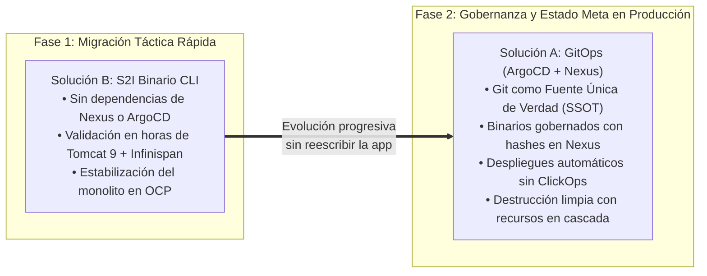
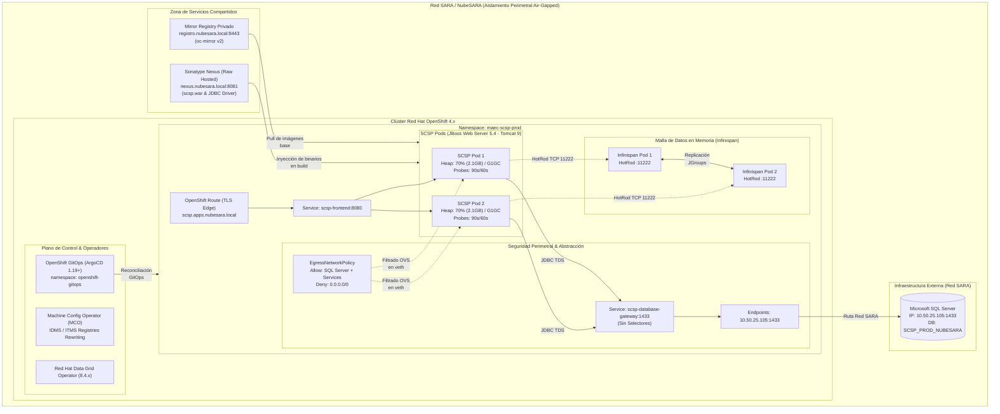
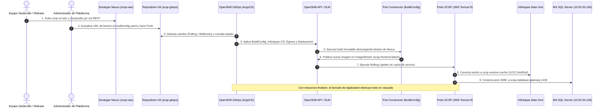
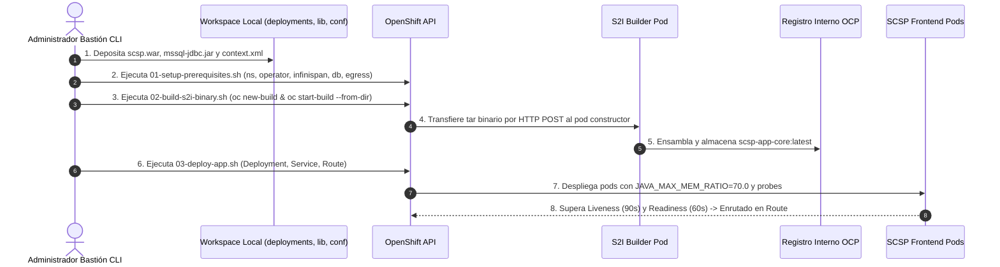

# 🏛️ OpenShift 4.x MAEC SCSP J2EE Lift-and-Shift (2026 Reference Architecture)

> [!WARNING]
> **⚠️ PLANTILLA DIDÁCTICA Y REFERENCIA ARQUITECTÓNICA CONCEPTUAL:**  
> Este repositorio es un diseño de referencia conceptual generado con **Gemini 3.8 Flash**, tomando como base técnica y de arquitectura mi artículo publicado en formato newsletter en LinkedIn: [**"Despliegue de SCSP en OpenShift 4.x: Arquitecturas para Entornos Aislados"**](https://www.linkedin.com/pulse/despliegue-de-scsp-en-openshift-4x-arquitecturas-para-i%C3%B1aki-fernandez-hns6e/). **NO ha sido probado, validado ni depurado en un clúster OpenShift real en producción dentro de NubeSARA.**  
> Su propósito es servir como acelerador de ingeniería, guía de aprendizaje y plantilla de automatización para la migración estratégica de aplicaciones monolíticas heredadas Java Enterprise Edition (J2EE) hacia plataformas nativas de la nube en entornos aislados perimetralmente (**Air-Gapped**).

> [!IMPORTANT]
> **🔒 RESTRICCIÓN DE IA EN ENTORNOS ENS / AIR-GAPPED Y METODOLOGÍA "OUTSIDE-IN":**  
> En perímetros altamente protegidos bajo el **Esquema Nacional de Seguridad (ENS - Categoría Alta)** y en aislamiento perimetral estricto (**Air-Gapped**) como **NubeSARA**, **NO está permitido el uso de agentes de Inteligencia Artificial en la nube** (como Gemini, Claude, Copilot o ChatGPT) debido a la ausencia de conectividad a Internet, la estricta confidencialidad de la información pública y las directrices del CCN-CERT.  
> **El patrón metodológico acelerador:** Este repositorio pone en valor un flujo de trabajo pragmático y legítimo: el ingeniero o arquitecto de sistemas puede apoyarse en agentes avanzados de IA generativa desde su **equipo personal o red personal externa** para concebir, diseñar y generar con código toda la arquitectura de referencia, scripts de automatización, Kustomize y manifiestos GitOps. Posteriormente, este repositorio limpio se descarga y transfiere de forma segura al **entorno corporativo desconectado**, donde el equipo de ingeniería puede **evolucionar, validar, iterar, depurar y ajustar** la solución sobre los clústeres OpenShift reales (**QA, PRE y PRO**) sin comprometer la seguridad perimetral.

---

<!-- ======================================================================= -->
<!-- GITHUB REPOSITORY BADGES                                                -->
<!-- ======================================================================= -->
<p align="center">
  <a href="https://github.com/nubenetes/OpenShift-MAEC-SCSP-J2EE-Lift-and-shift/actions/workflows/ci.yml"></a>
  <a href="https://www.redhat.com/en/technologies/cloud-computing/openshift"></a>
  <a href="https://argo-cd.readthedocs.io"></a>
  <a href="https://infinispan.org"></a>
  <a href="https://kubernetes.io"></a>
</p>

<p align="center">
  
  
  
  
  
  
  
  <a href="LICENSE"></a>
</p>

---

## 📑 Tabla de Contenidos

0. [🗺️ Mapa de Navegación Rápida (Quick Navigation Map)](#mapa-navegacion-rapida)
   - [Estructura Funcional y Rutas del Repositorio](#resumen-estructura-funcional)
   - [Guía Rápida de Decisión: Solución A vs Solución B](#guia-rapida-decision)
   - [Aceleradores de Automatización y Pruebas](#aceleradores-automatizacion)
0.1. [🤖 Serie Multimedia y Videos Técnicos en YouTube (NotebookLM & Deep Dives)](#serie-multimedia-youtube)
   - [Episodios Largos de Análisis Arquitectónico](#videos-largos-youtube)
   - [Shorts Técnicos Monográficos](#shorts-tecnicos-youtube)
1. [🌐 El Patrón Arquitectónico Universal: Casos de Uso Empresariales para Apps de Legado](#patron-arquitectonico-universal)
   - [1.1. La Realidad del Software de Legado en el Tejido Empresarial](#realidad-software-legado)
     - [El Dilema de la Modernización Corporativa](#dilema-modernizacion-corporativa)
   - [1.2. Los 5 Bloqueantes Universales que este Patrón Resuelve en Cualquier Organización](#bloqueantes-universales-legado)
   - [1.3. Escenarios de Aplicación Comunes en Grandes Industrias](#escenarios-industrias)
     - [A. Sector Bancario y Servicios Financieros (Fintech & Core Banking)](#sector-bancario)
     - [B. Sector Asegurador (Insurtech)](#sector-asegurador)
     - [C. Sector Sanitario y Farmacéutico (HealthTech & Hospitales)](#sector-sanitario)
     - [D. Telecomunicaciones y Utilities (Energía, Agua, Gas)](#sector-telecomunicaciones)
     - [E. Administraciones Públicas Generales (CCAA, Ayuntamientos, Ministerios)](#sector-administraciones-publicas)
   - [1.4. La Hoja de Ruta de Transición: De la Migración Rápida al Estado Meta](#hoja-de-ruta-transicion)
   - [1.5. Pragmatismo vs Sobre-Ingeniería: Rechazo de Pipelines Complejos (Tekton)](#pragmatismo-vs-tekton)
     - [Anatomía y Desglose del Stack Tecnológico del Framework DOPE (Minsait)](#dope-framework-minsait)
     - [¿Por qué estas soluciones aceleran la migración frente a Tekton y DOPE?](#aceleracion-migracion-vs-dope)
2. [📌 Contexto Específico del Proyecto Real: MAEC y Cliente Ligero SCSP](#contexto-especifico-maec)
   - [2.1. El Caso de Uso Ministerial: MAEC y Cliente Ligero SCSP](#caso-uso-ministerial-scsp)
   - [2.2. La Paradoja de la Migración, Prudencia Técnica (Plan B) y Éxito de Fase 1](#paradoja-plan-b-fase1)
   - [2.3. Lecciones de Gobernanza, Gestión de Proveedores y Ética Pública](#lecciones-gobernanza-etica)
   - [📖 Monográfico Completo y Especializado (`docs/01-contexto-y-caso-de-uso.md`)](docs/01-contexto-y-caso-de-uso.md)
3. [🏛️ Diagrama Global de la Arquitectura](#diagrama-arquitectura)
4. [⚖️ Comparativa de Soluciones: GitOps vs S2I Binario Directo](#comparativa-soluciones)
5. [🏆 ¿Cuál de las Dos Soluciones es la Más Recomendable?](#recomendacion-arquitectonica)
   - [Veredicto: La Solución A (GitOps + Nexus) es la Más Recomendable](#veredicto-solucion-a)
     - [Justificación Técnica y de Gobierno](#justificacion-tecnica-gobierno)
     - [¿Cuándo debe utilizarse la Solución B?](#cuando-utilizar-solucion-b)
   - [Síntesis de Aplicabilidad Empresarial](#aplicabilidad-empresas)
6. [🧩 Retos de Ingeniería y Patrones de Implementación](#retos-ingenieria)
   - [6.1. Espejado Air-Gapped Determinista con `oc-mirror v2`](#espejado-airgapped-oc-mirror)
   - [6.2. Erradicación del Antipatrón Sticky Sessions con Red Hat Data Grid](#erradicacion-sticky-sessions)
   - [6.3. Abstracción Topológica de Base de Datos Externa (Service + Endpoints)](#abstraccion-bd-externa)
   - [6.4. Confinamiento de Red Egress (SUGICYR en OVN-Kubernetes)](#confinamiento-red-egress)
   - [6.5. Parametrización Porcentual de Memoria JVM Java 8 en cgroups](#parametrizacion-jvm-cgroups)
   - [6.6. Calibración de Sondas de Resiliencia (Zero-Downtime Probes)](#calibracion-sondas-resiliencia)
7. [🚀 Guía Rápida de Despliegue](#guia-despliegue)
   - [Opción A: Despliegue mediante GitOps (ArgoCD + Nexus)](#despliegue-opcion-a-gitops)
   - [Opción B: Despliegue mediante S2I Binario Directo por CLI](#despliegue-opcion-b-s2i)
8. [📂 Estructura del Repositorio](#estructura-repositorio)
9. [📚 Documentación Detallada de Referencia](#documentacion-referencia)
   - [Publicación Técnica Original de Referencia (LinkedIn Newsletter)](#publicacion-referencia-linkedin)
   - [Documentos Monográficos de Arquitectura (01 al 06)](#documentos-monograficos-arquitectura)
10. [🎬 Guías Técnicas en Video y Desglose Detallado (YouTube)](#guias-video-youtube)
    - [10.1. Episodios Largos de Análisis Arquitectónico](#desglose-videos-largos)
    - [10.2. Shorts Técnicos Monográficos](#desglose-shorts)
11. [📄 Licencia y Créditos](#licencia-creditos)

---

<a id="mapa-navegacion-rapida"></a>
## 🗺️ Mapa de Navegación Rápida (Quick Navigation Map)

Este repositorio materializa una arquitectura de referencia completa, reproducible y de grado producción para migrar aplicaciones empresariales monolíticas Java heredadas (**J2EE / Java 8 / Tomcat 9 / JBoss Web Server**) hacia **Red Hat OpenShift 4.14 - 4.17+** en centros de datos con aislamiento perimetral estricto (**Air-Gapped / NubeSARA / ENS Categoría Alta**).

<a id="resumen-estructura-funcional"></a>
### 🗺️ Estructura Funcional y Rutas del Repositorio

```text
OpenShift-MAEC-SCSP-J2EE-Lift-and-shift/
├── 📁 solution-a-gitops/                # ⭐️ RECOMENDADA PARA PRODUCCIÓN: Paradigma Declarativo Puro
│   ├── 📁 acm/                          # Gobernanza de flota multiclúster con Red Hat Advanced Cluster Management (RHACM)
│   ├── 📁 argocd/                       # Suscripción ArgoCD, ApplicationSet y Application con finalizadores en cascada
│   ├── 📁 nexus/                        # Automatización de Sonatype Nexus OSS (repositorio raw para binarios WAR/JAR)
│   ├── 📁 kustomize/                    # Manifiestos Kustomize con base común y parches por entorno
│   │   ├── 📁 base/                     # Namespace, BuildConfig inmutable, Infinispan, Service BD, Egress, Deployment
│   │   └── 📁 overlays/                 # Parches específicos para QA, PRE (homologación) y PROD (ENS Alta)
│   └── 📁 scripts/                      # Scripts para provisión, Día 2 (actualización sin downtime) y teardown
│
├── 📁 solution-b-s2i-binary/            # ⚡ ACELERADOR TÁCTICO: Ensamblaje Binario Directo por CLI
│   ├── 📁 manifests/                    # Definiciones YAML desacopladas (namespace, operator, db-service, egress)
│   ├── 📁 workspace-template/           # Estructura local de artefactos (deployments/scsp.war, lib/mssql.jar, conf/context.xml)
│   └── 📁 scripts/                      # Pipeline Bash secuencial automatizado (01-prereqs a 05-cleanup)
│
├── 📁 air-gapped/                       # 🔒 INGENIERÍA DE ESPEJADO DESCONECTADO (oc-mirror v2)
│   ├── 📄 imageset-config.yaml          # ImageSetConfiguration (OCP 4.17, Data Grid 8.4, JWS 5.4, GitOps 1.19)
│   ├── 📜 mirror-step1-bastion-download.sh # Descarga externa con particionado tar en bloques de 16 GB
│   ├── 📜 mirror-step2-internal-upload.sh  # Inyección hacia registro interno corporativo (registro.nubesara.local)
│   └── 📜 mirror-step3-apply-cluster-config.sh # Despliegue de IDMS, ITMS y reescritura criptográfica CoreOS (MCO)
│
├── 📁 mock-assets/                      # 🧪 ENTORNO DE PRUEBAS DIDÁCTICO Y AUTOCONTENIDO
│   ├── 📁 scsp-sample-war/              # Código fuente Servlet Java 8 simulando endpoints SCSP (/health, /ready, /consulta)
│   └── 📜 build-mock-war.sh             # Script de compilación sin dependencias externas para generar scsp-mock.war
│
└── 📁 docs/                             # 📚 ANÁLISIS TÉCNICO, CASO DE USO Y MONOGRÁFICOS DE ARQUITECTURA
    ├── 📄 01-contexto-y-caso-de-uso.md  # Marco normativo SGAD/SCSP, MAEC, NubeSARA y auditoría contractual
    ├── 📄 02-comparativa-soluciones.md  # Comparativa exhaustiva: GitOps vs S2I Binario Directo
    ├── 📄 03-espejado-airgapped-oc-mirror.md # oc-mirror v2, IDMS, ITMS y caché SQLite local
    ├── 📄 04-gestion-sesiones-infinispan.md  # Erradicación de Sticky Sessions vía HotRod en Tomcat 9
    ├── 📄 05-seguridad-red-y-bd-externa.md   # Service sin selector + Endpoints y EgressNetworkPolicy OVN
    └── 📄 06-tuning-jvm-y-probes.md     # JAVA_MAX_MEM_RATIO=70.0, G1GC y sondas asimétricas de resiliencia
```

<a id="guia-rapida-decision"></a>
### ⚖️ Guía Rápida de Decisión: ¿Qué Enfoque Adoptar?

| Dimensión Técnica | Solución A: GitOps Declarativo (ArgoCD + Nexus) | Solución B: S2I Binario Directo (CLI + Scripts) |
| :--- | :--- | :--- |
| **Público Objetivo** | Equipos de Plataforma, SRE y Entornos Productivos | Ingenieros Cloud en fases iniciales, Labs y PoCs |
| **Madurez Requerida** | Alta (operadores ArgoCD y Sonatype Nexus desplegados) | Mínima (únicamente acceso CLI `oc` al clúster) |
| **Control de Versiones** | Git como Única Fuente de Verdad (SSOT) | Gestión manual de binarios en workspace local |
| **Multi-Entorno** | Kustomize overlays estandarizados (`qa`, `pre`, `prod`) | Re-ejecución de scripts con variables de entorno |
| **Tiempo de Validación** | ~1 - 2 días de configuración inicial | **< 2 horas para obtener un pod operativo** |
| **Recomendación** | ⭐️ **Estándar definitivo para QA, PRE y PROD** | 💡 **Acelerador táctico para validar viabilidad técnica** |

<a id="aceleradores-automatizacion"></a>
### 🚀 Aceleradores de Automatización y Pruebas Inmediatas

1. **¿Deseas probar la solución sin binarios del MAEC?**  
   Ejecuta [`mock-assets/build-mock-war.sh`](mock-assets/build-mock-war.sh) para generar un artefacto WAR Java 8 funcional con endpoints `/scsp/management/health` y `/scsp/management/ready`.
2. **¿Necesitas validar el despliegue binario rápido?**  
   Sigue el flujo de 5 pasos en [`solution-b-s2i-binary/scripts/`](solution-b-s2i-binary/scripts/) (`01-setup-prerequisites.sh` a `05-cleanup.sh`).
3. **¿Preparando la migración a producción desconectada?**  
   Revisa los manifiestos GitOps en [`solution-a-gitops/`](solution-a-gitops/) y la guía de espejado en [`air-gapped/`](air-gapped/).

---

<a id="serie-multimedia-youtube"></a>
## 🤖 Serie Multimedia y Videos Técnicos en YouTube (NotebookLM & Deep Dives)

Este repositorio cuenta con una serie didáctica y formativa integral generada con **Gemini NotebookLM** basada íntegramente en las especificaciones de arquitectura, comparativas técnicas, manifiestos GitOps y lecciones aprendidas de este proyecto. Todo el contenido está disponible en abierto en el canal de YouTube [**@nubenetes**](https://youtube.com/@nubenetes).

> [!NOTE]
> **Experiencia de Aprendizaje Multilingüe**:  
> El audio original de las sesiones ha sido sintetizado en **Inglés 🇺🇸**, incorporando subtítulos automáticos en **Español 🇪🇸 y más de 20 idiomas** (francés, alemán, italiano, portugués, japonés, etc.) para facilitar la transferencia técnica global.

<a id="videos-largos-youtube"></a>
### 🎬 Episodios Largos de Análisis Arquitectónico (Videos y Masterclasses)

| # | Formato | Título del Video / Masterclass | Enfoque Técnico y Temas Clave | Idioma Original | Duración | Enlace Directo |
|---|:---:|---|---|:---:|:---:|---|
| 1 | 📽️ Video Guía | [**OpenShift 4 Air Gapped**](https://www.youtube.com/watch?v=QT-a2Fm8GH4) | Arquitectura bare metal UPI, espejado con oc-mirror v2, IDMS/ITMS y NubeSARA | 🇺🇸 English *(CC 20+)* | `8:17` | [▶️ Ver Video](https://www.youtube.com/watch?v=QT-a2Fm8GH4) |
| 2 | 📽️ Video Guía | [**Air Gapped OpenShift Lift**](https://www.youtube.com/watch?v=hmbNFCgjjvk) | Caso real MAEC/SCSP, reescritura vs lift-and-shift y lecciones de gobernanza | 🇺🇸 English *(CC 20+)* | `9:04` | [▶️ Ver Video](https://www.youtube.com/watch?v=hmbNFCgjjvk) |
| 3 | 📽️ Video Guía | [**J2EE Lift and Shift**](https://www.youtube.com/watch?v=gcrlFQJN4zA) | Resolución de los 5 bloqueantes universales: sesiones, BD, egress, JVM y air-gap | 🇺🇸 English *(CC 20+)* | `7:16` | [▶️ Ver Video](https://www.youtube.com/watch?v=gcrlFQJN4zA) |
| 4 | 📽️ Video Guía | [**OpenShift Lift and Shift**](https://www.youtube.com/watch?v=l2j1Mdw03XI) | Comparativa GitOps (ArgoCD + Nexus) vs S2I Binario CLI y despliegue sin caída | 🇺🇸 English *(CC 20+)* | `8:04` | [▶️ Ver Video](https://www.youtube.com/watch?v=l2j1Mdw03XI) |

<a id="shorts-tecnicos-youtube"></a>
### ⚡ Shorts Técnicos Monográficos (Píldoras de Ingeniería Rápida)

| # | Formato | Título del Short | Dominio Técnico y Solución Cloud-Native | Idioma Original | Duración | Enlace Directo |
|---|:---:|---|---|:---:|:---:|---|
| 1 | ⚡ Short | [**How Microservices Scale Without Forgetting**](https://www.youtube.com/shorts/h6XG8sowTEk) | Erradicación de Sticky Sessions con Red Hat Data Grid / Infinispan HotRod | 🇺🇸 English *(CC 20+)* | `1:13` | [▶️ Ver Short](https://www.youtube.com/shorts/h6XG8sowTEk) |
| 2 | ⚡ Short | [**Zero Trust Database Routing in OpenShift**](https://www.youtube.com/shorts/h5RH8g-th1k) | Service sin selector + Endpoints y firewall perimetral Egress en OVN | 🇺🇸 English *(CC 20+)* | `1:07` | [▶️ Ver Short](https://www.youtube.com/shorts/h5RH8g-th1k) |
| 3 | ⚡ Short | [**How Kubernetes Saves Legacy Java Apps**](https://www.youtube.com/shorts/op9aKgs9fC8) | JVM en cgroups (JAVA_MAX_MEM_RATIO=70.0) y sondas asimétricas de resiliencia | 🇺🇸 English *(CC 20+)* | `1:23` | [▶️ Ver Short](https://www.youtube.com/shorts/op9aKgs9fC8) |
| 4 | ⚡ Short | [**Migrating Legacy Java in Air Gapped Kubernetes**](https://www.youtube.com/shorts/fIhcmirvxmY) | S2I Binario Directo como acelerador táctico para validar PoCs en horas | 🇺🇸 English *(CC 20+)* | `1:12` | [▶️ Ver Short](https://www.youtube.com/shorts/fIhcmirvxmY) |

*Para consultar los desgloses temáticos detallados y enlaces de referencia, consulta la [Sección 10: Guías Técnicas en Video y Desglose Detallado](#guias-video-youtube).*

---

<a id="patron-arquitectonico-universal"></a>
## 🌐 El Patrón Arquitectónico Universal: Casos de Uso Empresariales para Apps de Legado

Más allá de la experiencia de proyecto específica en el **Ministerio de Asuntos Exteriores (MAEC)** con el **Cliente Ligero SCSP**, este repositorio materializa un **patrón de diseño arquitectónico de referencia ("Golden Path Archetype") universalmente aplicable a miles de empresas e instituciones** que enfrentan el desafío de migrar aplicaciones críticas monolíticas de legado hacia **Red Hat OpenShift / Kubernetes**.

<a id="realidad-software-legado"></a>
### 1. La Realidad del Software de Legado en el Tejido Empresarial

En grandes corporaciones bancarias, aseguradoras, empresas de telecomunicaciones, hospitales y sector público, **más del 70% de las operaciones de negocio nucleares continúan ejecutándose sobre sistemas Java heredados (Java 6, 7 y 8; Spring 2/3/4; Struts 1/2; JSF; Servlets; EJBs)**. 

Estas aplicaciones fueron diseñadas para una era estática de servidores de aplicaciones corporativos:
- **Middleware tradicional:** IBM WebSphere Application Server (WAS), Oracle WebLogic Server, Red Hat JBoss EAP 6.x o instancias físicas de Apache Tomcat.
- **Topología de infraestructura:** Granjas de máquinas virtuales (VMware vSphere, Nutanix, Hyper-V) asociadas a balanceadores de red hardware (F5 BIG-IP, Citrix NetScaler) con reglas estrictas de persistencia de sesión por cookie (*Sticky Sessions*).

<a id="dilema-modernizacion-corporativa"></a>
#### El Dilema de la Modernización Corporativa
| Estrategia | Ventajas | Inconvenientes en el Mundo Real |
| :--- | :--- | :--- |
| **Reescritura Completa (*Greenfield / Microservicios*)** | Código moderno (Spring Boot 3, Quarkus, Go). | ❌ Coste millonario, plazos de 2 a 5 años, pérdida de lógica de negocio histórica (*knowledge loss*) y **riesgo operacional inasumible** sobre servicios que ya facturan o atienden al cliente. |
| **Abandono / *Status Quo* en Máquinas Virtuales** | Sin esfuerzo de desarrollo inicial. | ❌ Obsolescencia de SO/JVM, fin de soporte de fabricantes, costes desorbitados de licencias de virtualización y nula elasticidad ante picos de demanda. |
| **🏆 *Lift-and-Shift Cloud-Native* (El Patrón de este Repo)** | **Inmediatez, portabilidad, inmutabilidad y orquestación elástica sin tocar una sola línea de código fuente Java.** | 💡 Exige resolver rigurosamente 5 barreras técnicas: sesiones HTTP, BD externa, perímetros aislados, memoria en cgroups y sondas de salud. |

---

<a id="bloqueantes-universales-legado"></a>
### 2. Los 5 Bloqueantes Universales que este Patrón Resuelve en Cualquier Organización

Cualquier arquitecto o ingeniero cloud que intente contenerizar una aplicación Java de legado se topará con los mismos cinco problemas técnicos fundamentales. Esta referencia aporta la solución estándar probada para cada uno:

```text
┌────────────────────────────────────────────────────────────────────────────────────────────────────────┐
│                        ARQUETIPO DE LIFT-AND-SHIFT EMPRESARIAL EN OPENSHIFT                            │
├────────────────────────────────┬───────────────────────────────────────┬───────────────────────────────┤
│ BARRERA EN EL MONOLITO LEGADO  │ COMPORTAMIENTO NATIVO EN K8S / OCP    │ SOLUCIÓN PATRONIZADA EN REPO  │
├────────────────────────────────┼───────────────────────────────────────┼───────────────────────────────┤
│ 1. Estado en HttpSession       │ Pods efímeros destruyen la sesión al  │ Red Hat Data Grid / Infinispan│
│    (Login, wizards, carritos)  │ escalar o reiniciar (Sticky Sessions) │ con protocolo HotRod en Tomcat│
├────────────────────────────────┼───────────────────────────────────────┼───────────────────────────────┤
│ 2. Base de Datos Externa       │ Acoplamiento de IPs físicas en código │ Kubernetes Service sin        │
│    (Oracle, SQL Server, DB2)   │ destruye la inmutabilidad de la imagen│ selector + Endpoints dinámicos│
├────────────────────────────────┼───────────────────────────────────────┼───────────────────────────────┤
│ 3. Perímetro Confinado         │ Ausencia de Internet impide descargar │ oc-mirror v2 (IDMS/ITMS) con  │
│    (Air-Gapped / Red Aislada)  │ imágenes de Docker Hub / Red Hat      │ particionado tar de 16 GB     │
├────────────────────────────────┼───────────────────────────────────────┼───────────────────────────────┤
│ 4. Seguridad de Red Saliente   │ Tráfico abierto por defecto incumple  │ EgressNetworkPolicy en OVN    │
│    (Cero confianza perimetral) │ normativas de exfiltración de datos   │ locking down a IP/32 de la BD │
├────────────────────────────────┼───────────────────────────────────────┼───────────────────────────────┤
│ 5. Gestión de Memoria Java 8   │ La JVM lee la RAM del host físico y   │ JAVA_MAX_MEM_RATIO=70.0 +     │
│    (OOMKiller y arranques)     │ es fulminada por el Linux OOMKiller   │ Probes asimétricas 90s / 60s  │
└────────────────────────────────┴───────────────────────────────────────┴───────────────────────────────┘
```

---

<a id="escenarios-industrias"></a>
### 3. Escenarios de Aplicación Comunes en Grandes Industrias

Este repositorio sirve como plantilla directa de implementación en sectores altamente regulados y complejos:

<a id="sector-bancario"></a>
#### 🏦 A. Sector Bancario y Servicios Financieros (Fintech & Core Banking)
- **Casos Típicos:** Sistemas de scoring de riesgo crediticio, tramitación de hipotecas, plataformas de prevención de fraude (AML) y terminales transaccionales de oficina bancaria.
- **Por qué encaja este patrón:**
  - **Cumplimiento PCI-DSS y Banco de España / BCE:** Exigen aislamiento de red saliente (*Zero-Trust Egress*) para evitar fugas de números de tarjeta o cuentas bancarias.
  - **Integración con Mainframes y Oracle RAC:** Las bases de datos DB2 u Oracle de alta disponibilidad residen en redes de centros de datos on-premise que no se migran a contenedores. El patrón `Service` + `Endpoints` permite interconectar los pods sin exponer credenciales ni IPs en el código.
  - **Tolerancia a Fallos sin Abandono de Operación:** Si un cliente está autorizando una transferencia o un préstamo de 50.000 €, la muerte repentina de un pod no puede abortar la sesión; Infinispan transfiere el contexto al pod contiguo de forma imperceptible.

<a id="sector-asegurador"></a>
#### 🛡️ B. Sector Asegurador (Insurtech)
- **Casos Típicos:** Motores de tarificación de pólizas (autos, salud, hogar, vida) y portales de gestión pericial de siniestros.
- **Por qué encaja este patrón:**
  - **Formularios Multi-Paso Extensos (*Wizards*):** La tarificación de un seguro requiere hasta 8 pantallas consecutivas de datos del conductor y vehículo. Tradicionalmente, este árbol de datos se almacena en memoria de sesión Java. Externalizar a Data Grid permite realizar despliegues continuos (*Rolling Updates*) en mitad de la jornada laboral sin expulsar a un solo cliente o corredor de seguros.

<a id="sector-sanitario"></a>
#### 🏥 C. Sector Sanitario y Farmacéutico (HealthTech & Hospitales)
- **Casos Típicos:** Estaciones Clínicas Hospitalarias, Sistemas de Información Hospitalaria (HIS), Admisión de Urgencias, Gestión de Camas y Receta Electrónica.
- **Por qué encaja este patrón:**
  - **Operación Crítica 24/7/365:** Un fallo de servicio en un hospital puede comprometer vidas humanas. La alta disponibilidad de Infinispan con dos o más réplicas y las sondas de *Liveness/Readiness* calibradas garantizan que ningún médico sea redirigido a un pod que aún esté inicializando pools JDBC.
  - **Regulación Estricta de Privacidad (RGPD / HIPAA / ENS):** Redes hospitalarias cerradas donde las imágenes base de OpenShift deben ser auditadas criptográficamente y espejadas mediante `oc-mirror v2`.

<a id="sector-telecomunicaciones"></a>
#### ⚡ D. Telecomunicaciones y Utilities (Energía, Agua, Gas)
- **Casos Típicos:** Sistemas OSS/BSS de provisión de líneas fijas/móviles, plataformas de atención a agentes de call center (CRM heredado) y sistemas de facturación periódica.
- **Por qué encaja este patrón:**
  - **Picos Estacionales Masivos:** Campañas de *Black Friday* o lanzamientos comerciales multiplican el tráfico por diez. Desacoplar la sesión de los pods permite que el Autoescalador Horizontal de Pods (HPA) multiplique los contenedores de Tomcat sin desbalancear las sesiones pegajosas de los usuarios.

<a id="sector-administraciones-publicas"></a>
#### 🏛️ E. Administraciones Públicas Generales (CCAA, Ayuntamientos, Diputaciones, Ministerios)
- **Casos Típicos:** Sedes electrónicas ciudadanas, registro telemático de entrada/salida, tramitación de subvenciones y portales tributarios.
- **Por qué encaja este patrón:**
  - **Reutilización de Middleware Homologado:** Muchas administraciones ya disponen de licencias de Red Hat OpenShift en sus Centros de Proceso de Datos o en la Nube Corporativa. Este patrón proporciona una receta replicable que reduce los tiempos de consultoría de meses a días.

---

<a id="hoja-de-ruta-transicion"></a>
### 4. La Hoja de Ruta de Transición: De la Migración Rápida al Estado Meta

Este repositorio no impone una única forma de operar, sino que ofrece a los equipos de arquitectura corporativa un **itinerario evolutivo maduro**:

<details>
<summary><b>🗺️ Ver Diagrama de Transición: De la Migración Rápida al Estado Meta</b> (clic para desplegar)</summary>


```mermaid
flowchart LR
    subgraph Fase1["Fase 1: Migración Táctica Rápida"]
        SolB["Solución B: S2I Binario CLI<br/>• Sin dependencias de Nexus o ArgoCD<br/>• Validación en horas de Tomcat 9 + Infinispan<br/>• Estabilización del monolito en OCP"]
    end

    subgraph Fase2["Fase 2: Gobernanza y Estado Meta en Producción"]
        SolA["Solución A: GitOps (ArgoCD + Nexus)<br/>• Git como Fuente Única de Verdad (SSOT)<br/>• Binarios gobernados con hashes en Nexus<br/>• Despliegues automáticos sin ClickOps<br/>• Destrucción limpia con recursos en cascada"]
    end

    SolB ===>|Evolución progresiva<br/>sin reescribir la app| SolA
```

</details>

---

<a id="pragmatismo-vs-tekton"></a>
### 5. Pragmatismo vs Sobre-Ingeniería: Por Qué Rechazar Pipelines Hipercomplejos de Microservicios (Tekton + ArgoCD) para Monolitos J2EE

En muchas grandes empresas y organismos de la Administración Pública (como ocurrió en la experiencia real del MAEC), las plataformas OpenShift ya disponen de complejas tuberías corporativas de CI/CD sustentadas sobre **Red Hat OpenShift Pipelines (Tekton) + ArgoCD**, concebidas para el desarrollo continuo de microservicios nativos modernos (*cloud-native in-house* en Spring Boot 3, Node.js, Angular o Go).

Un ejemplo paradigmático en el propio MAEC es el **"DOPE framework"** desarrollado por **Minsait**: una plataforma interna con una elevada personalización (*customization*), concebida específicamente para gobernar grandes ecosistemas de microservicios como **SINAVI (Sistema de Información Nacional de Visados)** —la aplicación crítica utilizada por la red de consulados en todo el mundo—, que llega a orquestar del orden de **100 microservicios** independientes.

<a id="dope-framework-minsait"></a>
#### Anatomía y Desglose del Stack Tecnológico del Framework DOPE (Minsait)

El **"DOPE framework"** (acrónimo interno de *DevOps Platform Ecosystem* desarrollado e implantado por **Minsait**) fue concebido como una plataforma integral de CI/CD altamente automatizada para cubrir todo el ciclo de vida del software ministerial moderno (*cloud-native*). Su arquitectura desacopla y articula dos grandes capas de orquestación sobre Kubernetes:

```text
┌──────────────────────────────────────────────────────────────────────────────────────────────────────────────────┐
│                             ARQUITECTURA DEL FRAMEWORK DOPE (TEKTON + ARGOCD)                                    │
├──────────────────────────────────────────────────────────────────────────────────────────────────────────────────┤
│                                                                                                                  │
│  [ Desarrollador ]                                                                                               │
│         │ git push                                                                                               │
│         ▼                                                                                                        │
│  ┌────────────────────────────────────────────────────────────────────────────────────────────────────────────┐  │
│  │ 1. CAPA CI: RED HAT OPENSHIFT PIPELINES (TEKTON ENGINE)                                                    │  │
│  │                                                                                                            │  │
│  │   • EventListeners & TriggerBindings: Captura de webhooks desde el Git corporativo interno (SARA)          │  │
│  │   • PipelineRuns & TaskRuns (CRDs): Orquestación de grafos acíclicos dirigidos (DAG) en pods efímeros      │  │
│  │   • Pipeline Tasks Secuenciales:                                                                           │  │
│  │       ├── Task git-clone        -> Descarga segura de código fuente en workspace compartido                │  │
│  │       ├── Task maven/npm-build  -> Compilación multi-módulo y ejecución de pruebas unitarias               │  │
│  │       ├── Task sonarqube-scan   -> Análisis estático de código, deuda técnica y quality gates              │  │
│  │       ├── Task dependency-check -> Análisis SCA de librerías y componentes vulnerables                     │  │
│  │       ├── Task buildah-bud      -> Construcción de imágenes OCI rootless sin demonio Docker                │  │
│  │       ├── Task image-scan       -> Escaneo de vulnerabilidades CVE en registros locales                    │  │
│  │       └── Task push-registry    -> Publicación en Quay / Nexus interno y actualización de tag GitOps       │  │
│  │   • Workspaces & Almacenamiento: Volúmenes persistentes ReadWriteMany (PVC RWX) para caché y artefactos    │  │
│  └─────────────────────────────────────────────────────┬──────────────────────────────────────────────────────┘  │
│                                                        │ commit automático con nuevo tag de imagen               │
│                                                        ▼                                                         │
│  ┌────────────────────────────────────────────────────────────────────────────────────────────────────────────┐  │
│  │ 2. REPOSITORIO GITOPS (MANIFIESTOS DECLARATIVOS)                                                           │  │
│  │    Repositorio centralizado con definición Kustomize / Helm de los ~100 microservicios de SINAVI / e-LINCE │  │
│  └─────────────────────────────────────────────────────┬──────────────────────────────────────────────────────┘  │
│                                                        │ reconciliación continua                                 │
│                                                        ▼                                                         │
│  ┌────────────────────────────────────────────────────────────────────────────────────────────────────────────┐  │
│  │ 3. CAPA CD: RED HAT OPENSHIFT GITOPS (ARGOCD ENGINE)                                                       │  │
│  │                                                                                                            │  │
│  │   • ApplicationSet / App-of-Apps: Gobernanza y dependencias entre la suite de ~100 microservicios          │  │
│  │   • Reconciliación Declarativa: Detección de drift entre Git y el clúster con auto-sanación (selfHeal)     │  │
│  │   • Despliegues Multi-Clúster: Despliegue progresivo automatizado en clústeres NubeSARA (QA -> PRE -> PRO) │  │
│  │   • Sincronización Zero-Touch: Despliegue sin intervención manual ni comandos interactivos por bastión     │  │
│  └────────────────────────────────────────────────────────────────────────────────────────────────────────────┘  │
└──────────────────────────────────────────────────────────────────────────────────────────────────────────────────┘
```

- **Capa CI (Integración Continua) con Red Hat OpenShift Pipelines (Tekton):**  
  Construida íntegramente sobre Custom Resource Definitions (CRDs) nativos de Kubernetes (`Tasks`, `ClusterTasks`, `Pipelines`, `PipelineRuns`). Permite que cada fase de compilación y empaquetado se ejecute en pods efímeros aislados (contenedores Maven, Node.js, SonarQube Scanner y Buildah). Los artefactos intermedios y las cachés de librerías se transfieren entre tareas mediante `Workspaces` montados sobre volúmenes persistentes multi-escritura (`PVC RWX`). En la última fase del pipeline, Tekton genera la imagen de contenedor OCI, la publica en el registro interno seguro (Quay / Nexus) y actualiza automáticamente el tag de imagen en el repositorio de manifiestos GitOps.

- **Capa CD (Entrega Continua Declarativa) con Red Hat OpenShift GitOps (ArgoCD):**  
  Implementa el paradigma GitOps como única fuente de verdad (*Single Source of Truth*). Para gobernar la complejidad de los cerca de 100 microservicios independientes de SINAVI y e-LINCE, utiliza generadores avanzados de **ApplicationSet** o el patrón **App-of-Apps**. ArgoCD monitoriza continuamente el estado real de los clústeres independientes de NubeSARA (**QA**, **PRE** y **PRO**) frente a la especificación declarada en Git, aplicando sincronizaciones automáticas desatendidas (`automated: prune: true`) y autorrecuperación inmediata ante desvíos de configuración (`selfHeal: true`).

Intentar embutir a la fuerza una aplicación monolítica heredada como el Cliente Ligero SCSP dentro de ese entramado hiper-personalizado de microservicios (concebido para 100 componentes distribuidos) representa un **grave error de arquitectura y un antipatrón de sobre-ingeniería que paraliza los proyectos durante meses**.

```text
┌────────────────────────────────────────────────────────────────────────────────────────────────────────┐
│               SOBRE-INGENIERÍA (TEKTON MICROSERVICIOS) vs PRAGMATISMO (ESTE REPOSITORIO)               │
├────────────────────────────────┬───────────────────────────────────────┬───────────────────────────────┤
│ DIMENSIÓN EVALUADA             │ PIPELINE MICROSERVICIOS (TEKTON)      │ SOLUCIONES DE ESTE REPOSITORIO│
├────────────────────────────────┼───────────────────────────────────────┼───────────────────────────────┤
│ Naturaleza de la Entrega       │ Código fuente compilado commit a      │ Paquete binario (.war)        │
│                                │ commit (Maven, npm, Gradle).          │ homologado por adjudicatarias │
├────────────────────────────────┼───────────────────────────────────────┼───────────────────────────────┤
│ Complejidad de Infraestructura │ 10-20 CRDs (Tasks, Pipelines,         │ 1 recurso nativo (BuildConfig │
│                                │ PipelineRuns, Workspaces, PVC RWX).   │ o S2I) sin dependencias extra │
├────────────────────────────────┼───────────────────────────────────────┼───────────────────────────────┤
│ Carga en Entornos Air-Gapped   │ Espejar decenas de imágenes base de   │ Solo la imagen oficial de     │
│                                │ utilidades Tekton (git, maven, etc.). │ JBoss Web Server (Tomcat 9)   │
├────────────────────────────────┼───────────────────────────────────────┼───────────────────────────────┤
│ Operatividad con Acceso CLI    │ Depurar pods efímeros fallidos de     │ Logs deterministas en un solo │
│ Restringido (Bastiones SARA)   │ TaskRun sin CLI directo es caótico.   │ stream (oc logs / ArgoCD UI)  │
├────────────────────────────────┼───────────────────────────────────────┼───────────────────────────────┤
│ Curva de Adopción de Sistemas  │ Curva empinada; exige dominar la      │ Inmediata; respeta la lógica  │
│                                │ sintaxis de Kubernetes Pipelines.     │ tradicional de Tomcat (J2EE)  │
├────────────────────────────────┼───────────────────────────────────────┼───────────────────────────────┤
│ Tiempo hasta Producción        │ Meses de diseño y ajustes de pipeline │ Días: Lift-and-Shift directo  │
└────────────────────────────────┴───────────────────────────────────────┴───────────────────────────────┘
```

<a id="aceleracion-migracion-vs-dope"></a>
#### ¿Por qué estas soluciones aceleran la migración frente a Tekton y frameworks como DOPE?

1. **La realidad del artefacto (Código vs Binario Homologado):**
   Los monolitos heredados de la Administración no son desarrollados internamente línea a línea en el día a día bajo marcos como *DOPE*. Son suministrados por empresas adjudicatarias e integradoras (como **INDRA, MINSAIT o ALTEN**) en forma de entregables binarios cerrados (`.war` de Java 8 y librerías `.jar`), tras superar fases previas de homologación técnica y pruebas de aceptación en laboratorios externos. Construir un pipeline con decenas de *Tasks* de Tekton para clonar repositorios de código inexistentes o compilar dependencias Maven obsoletas de hace una década carece de sentido.

2. **La pesadilla operativa de Tekton en entornos Air-Gapped sin acceso CLI directo:**
   En perímetros cerrados (**NubeSARA**), la política de seguridad impone que los ingenieros y administradores operen a través de bastiones de salto fuertemente aislados, con permisos de terminal y acceso interactivo prácticamente inexistentes o muy acotados. 
   - Con Tekton, un fallo en el montaje de un volumen persistente (`Workspace PVC`) o un error en un paso intermedio genera un pod efímero de diagnóstico inalcanzable.
   - Con el **S2I Binario de la Solución B (`oc start-build --from-dir`)**, el empaquetado es una llamada atómica directa que vuelca las trazas en un único flujo continuo.
   - Con el **BuildConfig declarativo de la Solución A**, OpenShift extrae el binario directamente de **Sonatype Nexus** en tiempo de ensamblado sin intermediación humana ni necesidad de ejecutar comandos en bastiones.

3. **Aproximación a la cultura de administración tradicional:**
   Los equipos de soporte, explotación e infraestructuras ministeriales conocen a la perfección el funcionamiento de los servidores de aplicaciones: saben dónde reside el descriptor (`context.xml`), dónde se sitúan las librerías compartidas (`lib/`) y cómo se despliega un contexto web (`webapps/`). Al preservar esta disposición física dentro de la imagen de **Red Hat JBoss Web Server**, la resistencia al cambio desaparece y la capacitación de los equipos es inmediata.

4. **Principio de Simplicidad (*KISS - Cada herramienta para su contexto*):**
   Adoptar la herramienta adecuada para cada problema es el principio fundacional de la buena ingeniería. El *DOPE framework* y Tekton son excelentes para orquestar la suite de 100 microservicios de SINAVI con despliegues continuos. Para el traslado de aplicaciones monolíticas J2EE con ciclos de liberación semestrales o anuales suministradas por terceros, **la combinación de S2I Binario para validaciones y GitOps declarativo con Nexus para producción es drásticamente más rápida, económica y segura**.

---

<a id="contexto-especifico-maec"></a>
## 📌 Contexto Específico del Proyecto Real: MAEC y Cliente Ligero SCSP

> [!IMPORTANT]
> **Monográfico Completo y Especializado de Referencia:**  
> Este apartado ofrece un resumen ejecutivo de la experiencia técnica y organizativa en el **Ministerio de Asuntos Exteriores, Unión Europea y Cooperación (MAEC)**.  
> Para consultar el monográfico completo y exhaustivo —con las especificaciones del protocolo WS-SCSP/SOAP/XML-DSig, la matriz íntegra de contratación pública y adjudicatarias, la arquitectura del framework DOPE, la gobernanza CI/CD y escalado a Red Hat, la crónica detallada de la migración, el análisis socioeconómico del modelo *Time & Materials* y el caso de estudio de IndraMind—, consulta el documento monográfico:  
> 📖 [**`docs/01-contexto-y-caso-de-uso.md` — Contexto Institucional, Caso de Uso y Marco Contractual**](docs/01-contexto-y-caso-de-uso.md).

Como materialización práctica y prueba de concepto avanzada de este arquetipo, este repositorio implementa con código operativo la arquitectura técnica expuesta originalmente en mi publicación de LinkedIn: [**Despliegue de SCSP en OpenShift 4.x: Arquitecturas para Entornos Aislados**](https://www.linkedin.com/pulse/despliegue-de-scsp-en-openshift-4x-arquitecturas-para-i%C3%B1aki-fernandez-hns6e/), orientada a la modernización del sistema tecnológico del **Ministerio de Asuntos Exteriores, Unión Europea y Cooperación (MAEC)** de España.

<a id="caso-uso-ministerial-scsp"></a>
### 2.1. El Caso de Uso Ministerial: MAEC y Cliente Ligero SCSP

El proyecto responde al mandato del artículo 28 de la **Ley 39/2015 del Procedimiento Administrativo Común**, que reconoce el derecho de la ciudadanía a no aportar certificados o documentos que ya obren en poder de la Administración Pública. Para instrumentarlo, la Secretaría General de Administración Digital (SGAD) articuló el estándar **SCSP (Sustitución de Certificados en Soporte Papel)**.

En el MAEC, el **Cliente Ligero SCSP** es una pieza neurálgica y crítica con dos décadas de servicio que actúa como pasarela telemática de intermediación para toda la red de **Embajadas y Consulados en el exterior**:
- **Intermediación en Tiempo Real:** Verificación telemática de identidad (DGP), titulaciones académicas (Ministerio de Educación), obligaciones tributarias y de seguridad social (AEAT/TGSS), y antecedentes penales y delitos sexuales (Ministerio de Justicia) —requisito legal imperativo para la expedición de visados de residencia, estudios y trabajo, así como expedientes de nacionalidad y notarías consulares—.
- **Impacto de Caída:** Una indisponibilidad paralizaría de forma inmediata los consulados de España a nivel mundial, colapsando los trámites en el extranjero al exigir documentación física en papel expedida en territorio nacional.
- **Entorno Altamente Restringido (NubeSARA Air-Gapped):** Las cargas se ejecutan en clústeres OpenShift independientes por entorno (QA, PRE, PRO) en **NubeSARA**, bajo aislamiento estricto sin acceso a Internet, con conformidad con el **Esquema Nacional de Seguridad (ENS - Categoría Alta)** y directrices del **CCN-CERT**.
- **Complejidad del Tejido Contractual:** La plataforma ministerial se sustenta en una multiplicidad de pliegos y adjudicatarias concurrentes (expedientes con división en lotes como 2024000071 o 2024000090, licitaciones de lote único como CEA3422/2026, y contratos derivados de Acuerdos Marco Centralizados de la DGRCC), implicando a consultoras como Minsait, Telefónica, Altia, Alten, NTT Data, Teknei, Inetum, Capgemini, Sopra Steria, Viewnext y Babel. *(Ver matriz contractual completa y presupuestos en [`docs/01-contexto-y-caso-de-uso.md`](docs/01-contexto-y-caso-de-uso.md#3-inventario-publico-de-contratacion-tic-en-el-maec-empresas-pliegos-lotes-y-presupuestos))*.

<a id="paradoja-plan-b-fase1"></a>
### 2.2. La Paradoja de la Migración, Prudencia Técnica (Plan B) y Éxito de Fase 1

La modernización del Cliente Ligero SCSP hacia **Red Hat OpenShift en NubeSARA** encerraba un desafío de alto riesgo técnico y contractual:
1. **Ausencia de Soporte de Contenedores del Proveedor:** La empresa adjudicataria responsable del software no contemplaba ni soportaba arquitecturas de contenedores; su soporte y homologación se circunscribían con exclusividad a entornos tradicionales no contenerizados (máquinas virtuales con Apache Tomcat).
2. **Mi Propuesta Preventiva ("Plan B"):** Ante ese vacío y el riesgo que entrañaba para un servicio consular crítico, desde mi experiencia como ingeniero DevOps Senior propuse formalmente mantener y preparar en paralelo una vía de despliegue sobre máquinas virtuales dedicadas como red de seguridad institucional amparada por el soporte del fabricante. Dicha recomendación preventiva no fue activada por la gestión, a pesar de que meses atrás otro profesional de NTT Data había intentado infructuosamente durante varios meses hacer funcionar el despliegue en OpenShift sin lograrlo.
3. **Validación Exitosa de Fase 1 en 4–5 Semanas Multitarea:** Pese a no contar con ese respaldo preventivo y tras el precedente de intentos fallidos previos, en una **estricta ventana temporal de 4 a 5 semanas** concebí e implementé la solución táctica de **Fase 1 (S2I Binario CLI)**. Logré que el Cliente Ligero SCSP funcionase de manera estable en el primer clúster de pruebas de OpenShift en NubeSARA, desacoplando la configuración y conectando con la base de datos corporativa Microsoft SQL Server en Red SARA, sin alterar una sola línea del binario entregado por el fabricante. Todo ello compatibilizado simultáneamente con cometidos ministeriales de máxima exigencia:
   - **Gobernanza CI/CD sin CLI:** Análisis y auditoría del complejo ecosistema de integración continua (SINAVI con ~100 microservicios bajo el framework DOPE, e-LINCE) operando exclusivamente a través de interfaces gráficas web y consolas con permisos restringidos.
   - **Alerta Temprana de Obsolescencia en OpenShift:** Detección formal y advertencia a la dirección técnica sobre el desfase de versiones de los clústeres al borde de la pérdida de soporte EUS del fabricante, con acoplamientos directos en los pipelines Tekton.
   - **Escalado Proactivo a Red Hat en Entorno Air-Gapped:** Superación de las restricciones de aislamiento para extraer métricas y diagnósticos (*must-gather*), gestionando la concesión de soporte extraordinario oficial de Red Hat para salvaguardar la resiliencia ministerial.

<a id="lecciones-gobernanza-etica"></a>
### 2.3. Lecciones de Gobernanza, Gestión de Proveedores y Ética Pública

La experiencia acumulada en este proyecto y contrastada un año después en otras plataformas críticas nacionales aporta lecciones de fondo sobre la ingeniería de sistemas en el sector público:
- **Inmutabilidad Cloud-Native vs. Antipatrón de Recompilación:** Frente a intentos apresurados de modificar y recompilar código fuente ajeno para sortear parámetros ambientales —práctica que invalida la garantía del fabricante, destruye la trazabilidad criptográfica SHA-256 e introduce regresiones impredecibles—, la buena ingeniería exige tratar los artefactos `.war` homologados como inmutables, inyectando la configuración en runtime mediante *ConfigMaps*, *Secrets* y topologías desacopladas (*Services + Endpoints*).
- **Entornos Reales vs. Maquetas Efímeras:** Descartar atajos cosméticos consistentes en levantar bases de datos efímeras en pods aislados cuando el requerimiento ministerial mandatorio es la persistencia corporativa en Red SARA (`10.50.25.105:1433`), requiriendo diálogo técnico y colaboración abierta entre empresas integradoras (como el soporte brindado por los DBAs de NTT Data).
- **El Modelo *Time & Materials* y la Inmaterialidad Lógica:** A diferencia de la obra civil física, la arquitectura cloud opera sobre constructos lógicos inmateriales. En contratos públicos de asistencia técnica basados en facturación por horas (*Time & Materials* o bolsas horarias), existe el riesgo intrínseco de generar asimetrías donde se retribuye el volumen de horas consumidas y la docilidad organizativa por encima de la excelencia resolutiva o la solidez del diseño.
- **Soberanía Técnica y Software Libre:** Cuando los circuitos corporativos operan bajo dinámicas relacionales o de conveniencia que postergan el criterio técnico independiente —como constaté tanto en NubeSARA como durante mi posterior paso fugaz por la iniciativa IndraMind (donde acometí la auditoría técnica y estabilización de routing en Traefik Ingress North-South/East-West)—, la publicación de este repositorio en código abierto constituye el espacio legítimo de transparencia y rigor: código funcional, reproducible y verificable que demuestra que la solvencia profesional se fundamenta en los hechos y en el servicio al bien común.

---

<a id="diagrama-arquitectura"></a>
## 🏛️ Diagrama Global de la Arquitectura

<details>
<summary><b>🏛️ Ver Diagrama Global de la Arquitectura (NubeSARA Air-Gapped)</b> (clic para desplegar)</summary>


```mermaid
graph TB
    subgraph RedSARA["Red SARA / NubeSARA (Aislamiento Perimetral Air-Gapped)"]
        subgraph BastionZone["Zona de Servicios Compartidos"]
            Quay["Mirror Registry Privado<br/>registro.nubesara.local:8443<br/>(oc-mirror v2)"]
            Nexus["Sonatype Nexus (Raw Hosted)<br/>nexus.nubesara.local:8081<br/>(scsp.war & JDBC Driver)"]
        end

        subgraph OCPCluster["Clúster Red Hat OpenShift 4.x"]
            subgraph ControlPlane["Plano de Control & Operadores"]
                ArgoCD["OpenShift GitOps (ArgoCD 1.19+)<br/>namespace: openshift-gitops"]
                MCO["Machine Config Operator (MCO)<br/>IDMS / ITMS Registries Rewriting"]
                DataGridOp["Red Hat Data Grid Operator (8.4.x)"]
            end

            subgraph WorkloadNS["Namespace: maec-scsp-prod"]
                Route["OpenShift Route (TLS Edge)<br/>scsp.apps.nubesara.local"]
                Service["Service: scsp-frontend:8080"]
                
                subgraph AppPods["SCSP Pods (JBoss Web Server 5.4 - Tomcat 9)"]
                    Pod1["SCSP Pod 1<br/>Heap: 70% (2.1GB) / G1GC<br/>Probes: 90s/60s"]
                    Pod2["SCSP Pod 2<br/>Heap: 70% (2.1GB) / G1GC<br/>Probes: 90s/60s"]
                end

                subgraph CacheTier["Malla de Datos en Memoria (Infinispan)"]
                    Infinispan1["Infinispan Pod 1<br/>HotRod :11222"]
                    Infinispan2["Infinispan Pod 2<br/>HotRod :11222"]
                end

                subgraph NetworkSecurity["Seguridad Perimetral & Abstracción"]
                    Egress["EgressNetworkPolicy<br/>Allow: SQL Server + Services<br/>Deny: 0.0.0.0/0"]
                    DBService["Service: scsp-database-gateway:1433<br/>(Sin Selectores)"]
                    DBEndpoints["Endpoints: 10.50.25.105:1433"]
                end
            end
        end

        subgraph ExternalSARA["Infraestructura Externa (Red SARA)"]
            SQLServer[("Microsoft SQL Server<br/>IP: 10.50.25.105:1433<br/>DB: SCSP_PROD_NUBESARA")]
        end
    end

    Route --> Service
    Service --> Pod1
    Service --> Pod2
    Pod1 -.->|HotRod TCP 11222| Infinispan1
    Pod2 -.->|HotRod TCP 11222| Infinispan2
    Infinispan1 <-->|Replicación<br/>JGroups| Infinispan2
    Pod1 -->|JDBC TDS| DBService
    Pod2 -->|JDBC TDS| DBService
    DBService --> DBEndpoints
    DBEndpoints -->|Ruta Red SARA| SQLServer
    Egress -.->|Filtrado OVS<br/>en veth| Pod1
    Egress -.->|Filtrado OVS<br/>en veth| Pod2
    ArgoCD --->|Reconciliación<br/>GitOps| WorkloadNS
    Quay --->|Pull de imágenes<br/>base| AppPods
    Nexus --->|Inyección de binarios<br/>en build| AppPods
```

</details>

---

<a id="comparativa-soluciones"></a>
## ⚖️ Comparativa de Soluciones: GitOps vs S2I Binario Directo

Este repositorio incluye con código operativo las dos soluciones técnicas analizadas:

| Criterio Técnico | [Solución A: GitOps (ArgoCD + Nexus)](solution-a-gitops/) | [Solución B: S2I Binario Directo (CLI)](solution-b-s2i-binary/) |
| :--- | :--- | :--- |
| **Paradigma Operativo** | **Declarativo Continuo (GitOps):** Git es la única fuente de la verdad (SSOT). | **Imperativo / Transicional (CLI):** Ejecución secuencial de scripts por un operador bastión. |
| **Gestión de Binarios (.war, .jar)** | **Sonatype Nexus:** Repositorio *raw-hosted* dedicado. Cero binarios en el repo Git. | **Directorio Local:** Archivos depositados manualmente en la carpeta del workspace S2I. |
| **Control de Desviaciones (*Drift*)** | **Automático (Self-Healing):** Si alguien altera el despliegue a mano, ArgoCD lo revierte. | **Manual / Nulo:** OpenShift no detecta desviaciones frente al manifiesto inicial. |
| **Auditoría y Trazabilidad ENS** | **Máxima:** Cada cambio corresponde a un commit/PR firmado en Git con aprobación obligatoria. | **Baja-Media:** Depende del historial de auditoría de la consola y logs temporales del clúster. |
| **Estructuración Multi-Entorno** | **Kustomize Multi-Clúster:** `base/` compartido y `overlays/qa/`, `overlays/pre/`, `overlays/prod/` para cada clúster OCP independiente. | **Variables / Ficheros duplicados:** Requiere parametrizar scripts y manifiestos a mano. |
| **Decommissioning (Tear Down)** | **Borrado en Cascada:** `resources-finalizer` garantiza destrucción limpia de todos los CRDs. | **Manual:** Requiere ejecutar `oc delete namespace`, con riesgo de recursos bloqueados. |
| **Curva de Adopción** | Requiere conocimiento de ArgoCD, Kustomize y administración de Nexus. | Inmediata para ingenieros de sistemas con experiencia básica en `oc` CLI. |
| **Dependencia de Componentes** | Requiere el operador OpenShift GitOps y el servidor Sonatype Nexus en NubeSARA. | Cero dependencias adicionales; utiliza únicamente las capacidades nativas de OCP. |

<details>
<summary><b>☸️ Ver Diagrama de Secuencia: Despliegue Declarativo GitOps (ArgoCD + Nexus)</b> (clic para desplegar)</summary>


```mermaid
sequenceDiagram
    autonumber
    actor Dev as Equipo Desarrollo / Release
    actor Admin as Administrador de Plataforma
    participant Nexus as Sonatype Nexus (scsp-raw)
    participant Git as Repositorio Git (scsp-gitops)
    participant ArgoCD as OpenShift GitOps (ArgoCD)
    participant OCP as OpenShift API / OLM
    participant Build as Pod Constructor (BuildConfig)
    participant Pods as Pods SCSP (JWS Tomcat 9)
    participant DG as Infinispan Data Grid
    participant DB as MS SQL Server (10.50.25.105)

    Dev->>Nexus: 1. Sube scsp-v2.war y mssql-jdbc.jar vía REST
    Admin->>Git: 2. Actualiza URL de binario en buildconfig.yaml y hace Push
    ArgoCD->>Git: 3. Detecta cambio (Polling / Webhook) y concilia estado
    ArgoCD->>OCP: 4. Aplica BuildConfig, Infinispan CR, Egress y Deployment
    OCP->>Build: 5. Ejecuta build inmutable descargando binario de Nexus
    Build->>OCP: 6. Publica nueva imagen en ImageStream (scsp-frontend:latest)
    OCP->>Pods: 7. Ejecuta Rolling Update sin caída de servicio
    Pods->>DG: 8. Conecta sesión a scsp-session-cache:11222 (HotRod)
    Pods->>DB: 9. Conecta pool JDBC a scsp-database-gateway:1433
    Note over ArgoCD,Pods: Con resources-finalizer, el borrado de Application destruye todo en cascada
```

</details>

<details>
<summary><b>🚀 Ver Diagrama de Secuencia: Despliegue Imperativo S2I Binario CLI</b> (clic para desplegar)</summary>


```mermaid
sequenceDiagram
    autonumber
    actor Admin as Administrador Bastión CLI
    participant Workspace as Workspace Local (deployments, lib, conf)
    participant OCP as OpenShift API
    participant S2I as S2I Builder Pod
    participant Registry as Registro Interno OCP
    participant Pods as SCSP Frontend Pods

    Admin->>Workspace: 1. Deposita scsp.war, mssql-jdbc.jar y context.xml
    Admin->>OCP: 2. Ejecuta 01-setup-prerequisites.sh (ns, operator, infinispan, db, egress)
    Admin->>OCP: 3. Ejecuta 02-build-s2i-binary.sh (oc new-build & oc start-build --from-dir)
    OCP->>S2I: 4. Transfiere tar binario por HTTP POST al pod constructor
    S2I->>Registry: 5. Ensambla y almacena scsp-app-core:latest
    Admin->>OCP: 6. Ejecuta 03-deploy-app.sh (Deployment, Service, Route)
    OCP->>Pods: 7. Despliega pods con JAVA_MAX_MEM_RATIO=70.0 y probes
    Pods-->>OCP: 8. Supera Liveness (90s) y Readiness (60s) -> Enrutado en Route
```

</details>

---

<a id="recomendacion-arquitectonica"></a>
## 🏆 ¿Cuál de las Dos Soluciones es la Más Recomendable?

<a id="veredicto-solucion-a"></a>
### Veredicto: La Solución A (GitOps + Nexus) es la Más Recomendable

Para cualquier despliegue en **Producción** dentro del MAEC, la Administración General del Estado o entornos corporativos de alta criticidad, **la Solución A es la arquitectura preferente y recomendada**.

<a id="justificacion-tecnica-gobierno"></a>
#### Justificación Técnica y de Gobierno:
1. **Cumplimiento Estricto del Esquema Nacional de Seguridad (ENS - Categoría Alta):**
   - El principio de *segregación de funciones* se garantiza: ningún administrador ni desarrollador necesita privilegios de administración directa (`cluster-admin` o `edit`) sobre los namespaces de producción.
   - El controlador de ArgoCD (`system:serviceaccount:openshift-gitops:openshift-gitops-argocd-application-controller`) es el único autorizado a sincronizar recursos contra la API de Kubernetes.
2. **Higiene del Repositorio de Código:**
   - Versionar archivos compilados (`scsp.war` de 100+ MB) en repositorios Git degrada el rendimiento de las operaciones `git clone` y corrompe el historial de control de versiones. La delegación de binarios en **Sonatype Nexus** garantiza que Git permanezca ligero y puramente declarativo.
3. **Recuperación Inmediata ante Desastres (Disaster Recovery):**
   - En caso de corrupción o pérdida total del clúster OpenShift, el clúster secundario o de contingencia puede ser restaurado al 100% en cuestión de segundos aplicando únicamente el manifiesto maestro `scsp-application.yaml`.
4. **Destrucción y Limpieza Segura de Recursos (Zero Orphan Waste):**
   - El uso del finalizador `resources-finalizer.argocd.argoproj.io` asegura que, ante la baja de la aplicación, Kubernetes ejecute un borrado en cascada en primer plano (*Foreground Cascading Deletion*), eliminando el clúster de Infinispan, StatefulSets, Services y políticas Egress sin agotar recursos huérfanos de NubeSARA.

<a id="cuando-utilizar-solucion-b"></a>
#### ¿Cuándo debe utilizarse la Solución B?
La **Solución B (S2I Binario Directo)** es sumamente valiosa como **escalón intermedio o táctico**:
- Para validar en pocas horas la compatibilidad de Tomcat 9 y Java 8 con las consultas JDBC de SQL Server en una Prueba de Concepto (PoC).
- Cuando en los estadios iniciales del proyecto aún no se ha desplegado ni homologado Sonatype Nexus ni el operador de GitOps en el entorno aislado.

---

<a id="aplicabilidad-empresas"></a>
## 🌐 Síntesis de Aplicabilidad Empresarial

Para un análisis pormenorizado de los casos de uso arquetípicos en Banca (PCI-DSS), Seguros, Sanidad (HIPAA/RGPD), Telco y Sector Público, consulta la sección inicial:  
👉 [1. El Patrón Arquitectónico Universal: Casos de Uso Empresariales para Apps de Legado](#patron-arquitectonico-universal).

---

<a id="retos-ingenieria"></a>
## 🧩 Retos de Ingeniería y Patrones de Implementación

<a id="espejado-airgapped-oc-mirror"></a>
### 6.1. Espejado Air-Gapped Determinista con `oc-mirror v2`
En entornos desconectados, el antiguo mecanismo `ImageContentSourcePolicy` (ICSP) ha sido sustituido en OpenShift 4.14+ por **`ImageDigestMirrorSet` (IDMS)** e **`ImageTagMirrorSet` (ITMS)**.
- El manifiesto [`air-gapped/imageset-config.yaml`](air-gapped/imageset-config.yaml) define el conjunto estricto de operadores (Data Grid, JWS, GitOps) y la imagen certificada de JBoss Web Server (`webserver54-openjdk8-tomcat9-openshift-rhel8`).
- El parámetro `archiveSize: 16` fragmenta el espejado en bloques de 16 GB adecuados para diodos de red y medios extraíbles cifrados.
- Al aplicar los recursos generados, el **Machine Config Operator (MCO)** reescribe `/etc/containers/registries.conf` en cada nodo del clúster y ejecuta un reinicio controlado.

<a id="erradicacion-sticky-sessions"></a>
### 6.2. Erradicación del Antipatrón Sticky Sessions con Red Hat Data Grid
En lugar de forzar al balanceador de entrada (*OpenShift Ingress*) a recordar a qué pod físico enviar las peticiones:
- Se despliega un clúster de **Infinispan 8.4.x** de 2 réplicas gestionado por el Data Grid Operator ([`datagrid-infinispan.yaml`](solution-a-gitops/kustomize/base/datagrid-infinispan.yaml)).
- El descriptor Tomcat [`context.xml`](solution-a-gitops/kustomize/base/configmap-tomcat-context.yaml) activa la clase nativa `org.wildfly.clustering.tomcat.hotrod.HotRodManager`.
- Cada mutación de sesión se sincroniza de forma asíncrona por protocolo binario HotRod (puerto `11222`). Si un pod es destruido, el siguiente pod atiende la petición sin pérdida de datos para el ciudadano.

<a id="abstraccion-bd-externa"></a>
### 6.3. Abstracción Topológica de Base de Datos Externa (Service + Endpoints)
Para conectar con el SQL Server en Red SARA (`10.50.25.105:1433`) sin codificar la IP en la aplicación:
- Se declara un `Service` sin selectores emparejado con un objeto `Endpoints` ([`external-db-service.yaml`](solution-a-gitops/kustomize/base/external-db-service.yaml) y [`external-db-endpoints.yaml`](solution-a-gitops/kustomize/base/external-db-endpoints.yaml)).
- El DNS interno resuelve el alias `scsp-database-gateway`. La cadena JDBC en `context.xml` utiliza este nombre lógico; si el servidor físico cambia de IP, solo se actualiza el objeto `Endpoints`.

<a id="confinamiento-red-egress"></a>
### 6.4. Confinamiento de Red Egress (SUGICYR en OVN-Kubernetes)
Para cumplir con la política perimetral gubernamental:
- Se despliega una [`EgressNetworkPolicy`](solution-a-gitops/kustomize/base/egress-network-policy.yaml) en OVN-Kubernetes.
- **Permitido:** Exclusivamente la IP `/32` del servidor SQL Server (`10.50.25.105/32`) y la red de servicios internos del clúster (`172.30.0.0/16` para CoreDNS e Infinispan).
- **Denegado:** Todo el tráfico restante (`0.0.0.0/0`), impidiendo fugas de datos o saltos laterales.

<a id="parametrizacion-jvm-cgroups"></a>
### 6.5. Parametrización Porcentual de Memoria JVM Java 8 en cgroups
Para evitar que Java 8 ignore las restricciones de cgroups y sea fulminado por el `OOMKiller`:
- Se configuran límites rígidos en el Deployment: `limits: memory: 3Gi, cpu: 2`.
- Se inyecta la directiva porcentual `JAVA_MAX_MEM_RATIO=70.0` (equivalente a `-XX:MaxRAMPercentage=70.0`).
- La JVM asigna como máximo el 70% (2.1 GB) al Heap, preservando un colchón del 30% (~900 MB) para Metaspace, threads de Tomcat, buffers de HotRod y criptografía de certificados.
- Se fuerza el Garbage Collector de baja latencia con `-XX:+UseG1GC` y la entropía rápida `-Djava.security.egd=file:/dev/./urandom`.

<a id="calibracion-sondas-resiliencia"></a>
### 6.6. Calibración de Sondas de Resiliencia (Zero-Downtime Probes)
Los monolitos de legado tardan entre 40 y 70 segundos en inicializar descriptores y pools de conexiones.
- **Readiness Probe:** `initialDelaySeconds: 60`, `periodSeconds: 10`. Asegura que ninguna petición se enrute al pod antes de que el contexto esté totalmente activo.
- **Liveness Probe:** `initialDelaySeconds: 90`, `periodSeconds: 15`, `failureThreshold: 4`. Concede margen suficiente de calentamiento antes de aplicar reinicios correctivos automáticos.

---

<a id="guia-despliegue"></a>
## 🚀 Guía Rápida de Despliegue

<a id="despliegue-opcion-a-gitops"></a>
### Opción A: Despliegue mediante GitOps (ArgoCD + Nexus)

```bash
# 1. Clonar el repositorio
git clone https://github.com/nubenetes/OpenShift-MAEC-SCSP-J2EE-Lift-and-shift.git
cd OpenShift-MAEC-SCSP-J2EE-Lift-and-shift/solution-a-gitops

# 2. Configurar repositorio en Nexus y cargar los binarios
./nexus/setup-nexus-repo.sh
./nexus/upload-artifacts.sh /ruta/al/scsp.war /ruta/al/mssql-jdbc-8.4.1.jre8.jar

# 3. Lanzar la orquestación GitOps
./scripts/deploy-solution-a.sh

# 4. Supervisar en ArgoCD
oc get application scsp-production-sync -n openshift-gitops -w
```

<a id="despliegue-opcion-b-s2i"></a>
### Opción B: Despliegue mediante S2I Binario Directo por CLI

```bash
cd OpenShift-MAEC-SCSP-J2EE-Lift-and-shift/solution-b-s2i-binary

# 1. Desplegar namespace, operadores, BD externa y políticas egress
./scripts/01-setup-prerequisites.sh

# 2. Copiar los binarios al template del workspace
cp /ruta/al/scsp.war workspace-template/deployments/
cp /ruta/al/mssql-jdbc-8.4.1.jre8.jar workspace-template/lib/

# 3. Ejecutar construcción binaria S2I
./scripts/02-build-s2i-binary.sh

# 4. Desplegar aplicación y exponer ruta pública
./scripts/03-deploy-app.sh
```

---

<a id="estructura-repositorio"></a>
## 📂 Estructura del Repositorio

```text
.
├── README.md                                 # Documentación técnica maestra
├── LICENSE                                   # Licencia Apache 2.0
├── .yamllint.yml                             # Configuración de linter YAML
├── .github/workflows/ci.yml                  # Validación de Kustomize y Bash en CI
├── docs/                                     # Documentación técnica en profundidad
│   ├── 01-contexto-y-caso-de-uso.md          # MAEC, SCSP, NubeSARA y retos J2EE
│   ├── 02-comparativa-soluciones.md          # Matriz comparativa y justificación de recomendación
│   ├── 03-espejado-airgapped-oc-mirror.md    # oc-mirror v2, IDMS e ITMS
│   ├── 04-gestion-sesiones-infinispan.md     # Desacoplamiento de sesiones y HotRod
│   ├── 05-seguridad-red-y-bd-externa.md      # Service sin selectores y EgressNetworkPolicy
│   ├── 06-tuning-jvm-y-probes.md             # Memoria cgroups, G1GC y sondas
│   └── diagrams/                             # Diagramas Mermaid fuente
├── air-gapped/                               # Automatización de espejado desconectado
│   ├── imageset-config.yaml                  # Configuración oc-mirror v2
│   ├── mirror-step1-bastion-download.sh      # Descarga externa
│   ├── mirror-step2-internal-upload.sh       # Inyección a registro privado NubeSARA
│   └── mirror-step3-apply-cluster-config.sh  # Aplicación de IDMS/ITMS
├── solution-a-gitops/                        # SOLUCIÓN A: OpenShift GitOps (ArgoCD) + Nexus
│   ├── acm/                                  # Gobernanza de flota con OpenShift ACM (RHACM)
│   │   ├── README.md                         # Guía de integración progresiva
│   │   ├── managed-clusters-placement.yaml   # Placement dinámico (QA, PRE, PRO)
│   │   ├── gitopscluster-binding.yaml        # Binding GitOpsCluster ArgoCD-ACM
│   │   └── policy-ens-egress.yaml            # ACM Policy para auditar Egress ENS
│   ├── argocd/                               # Manifiestos de ArgoCD, ApplicationSet y suscripción
│   ├── nexus/                                # Scripts de provisión y carga de binarios
│   ├── kustomize/                            # Declaración de recursos Kustomize (base y overlays)
│   │   ├── base/                             # Namespace, BuildConfig, Infinispan, DB, Egress, etc.
│   │   └── overlays/
│   │       ├── qa/                           # Patch para clúster OCP QA (pruebas / validación inicial)
│   │       ├── pre/                          # Patch para clúster OCP PRE (staging / homologación)
│   │       └── prod/                         # Patch para clúster OCP PRO (producción ENS Alta)
│   └── scripts/                              # Scripts de despliegue, actualización Día 2 y borrado
├── solution-b-s2i-binary/                    # SOLUCIÓN B: S2I Binario Directo por CLI
│   ├── manifests/                            # Manifiestos OpenShift declarativos
│   ├── workspace-template/                   # Directorios deployments/, lib/, configuration/
│   └── scripts/                              # Flujo de ejecución paso a paso 01 a 05
└── mock-assets/                              # Recursos simulados para pruebas locales sin código MAEC
    ├── scsp-sample-war/                      # Proyecto Servlet Java 8 simulando endpoints de SCSP
    └── build-mock-war.sh                     # Script para compilar el WAR de prueba
```

---

<a id="documentacion-referencia"></a>
## 📚 Documentación Detallada de Referencia

<a id="publicacion-referencia-linkedin"></a>
### 📰 Publicación Técnica Original de Referencia
- [**Despliegue de SCSP en OpenShift 4.x: Arquitecturas para Entornos Aislados (LinkedIn Newsletter)**](https://www.linkedin.com/pulse/despliegue-de-scsp-en-openshift-4x-arquitecturas-para-i%C3%B1aki-fernandez-hns6e/)  
  *Artículo de análisis técnico y divulgación que sirvió como referencia arquitectónica primaria empleada por Gemini para concebir, estructurar y generar este repositorio de código.*

<a id="documentos-monograficos-arquitectura"></a>
### 📑 Documentos Monográficos de Arquitectura
- [01. Contexto Estratégico y Caso de Uso (MAEC / SCSP)](docs/01-contexto-y-caso-de-uso.md)
- [02. Análisis Comparativo Profundo y Justificación](docs/02-comparativa-soluciones.md)
- [03. Espejado Air-Gapped con oc-mirror v2 (IDMS/ITMS)](docs/03-espejado-airgapped-oc-mirror.md)
- [04. Gestión Distribuida de Sesiones con Red Hat Data Grid](docs/04-gestion-sesiones-infinispan.md)
- [05. Seguridad Perimetral Egress y Abstracción de Base de Datos Externa](docs/05-seguridad-red-y-bd-externa.md)
- [06. Calibración de Memoria JVM y Sondas de Resiliencia](docs/06-tuning-jvm-y-probes.md)

---

<a id="guias-video-youtube"></a>
## 🎬 10. Guías Técnicas en Video y Desglose Detallado (YouTube)

Esta sección proporciona el desglose conceptual y los temas clave abordados en cada uno de los videos y píldoras técnicas de la serie audiovisual de este repositorio, disponible en el canal de YouTube [**@nubenetes**](https://youtube.com/@nubenetes).

<a id="desglose-videos-largos"></a>
### 📽️ 10.1. Episodios Largos de Análisis Arquitectónico

#### 1. [OpenShift 4 Air Gapped](https://www.youtube.com/watch?v=QT-a2Fm8GH4) `(8:17)`
- **Enfoque Técnico:** Despliegue de Red Hat OpenShift 4 en infraestructuras bare metal UPI y operación de cargas de trabajo críticas en aislamiento perimetral estricto (*Air-Gapped / NubeSARA*).
- **Temas Clave Analizados:**
  - Desafíos de instalar clústeres OpenShift 4 sin salida directa a Internet (`0.0.0.0/0`).
  - Espejado determinista con el plugin `oc-mirror v2` y definición de `ImageSetConfiguration`.
  - Reemplazo del obsoleto ICSP por `ImageDigestMirrorSet` (IDMS) e `ImageTagMirrorSet` (ITMS).
  - Reescritura criptográfica de `/etc/containers/registries.conf` gestionada por el Machine Config Operator (MCO) con reinicios ordenados de nodos.
  - Verificación del registro corporativo interno (`registro.nubesara.local:8443`) y resolución DNS segura.
- **Enlace directo:** [Ver Video en YouTube](https://www.youtube.com/watch?v=QT-a2Fm8GH4) | [Editar en YouTube Studio](https://studio.youtube.com/video/QT-a2Fm8GH4/edit)

#### 2. [Air Gapped OpenShift Lift](https://www.youtube.com/watch?v=hmbNFCgjjvk) `(9:04)`
- **Enfoque Técnico:** Modernización de monolitos Java de misión crítica en grandes organizaciones públicas y corporativas bajo normativas de alta seguridad (ENS Categoría Alta).
- **Temas Clave Analizados:**
  - El dilema de la modernización: el riesgo operativo y sobrecoste de reescrituras completas (*Greenfield*) frente al pragmatismo del *Lift-and-Shift* nativo en contenedores.
  - Caso de uso real en la Administración Pública: el Ministerio de Asuntos Exteriores (MAEC) y el Cliente Ligero SCSP (Ley 39/2015).
  - Impacto de caída en servicios diplomáticos y consulares en más de 200 Embajadas y Consulados.
  - Lecciones de gobernanza, relevo de proveedores tecnológicos (transición de pliegos) y soberanía técnica.
  - Metodología "Outside-In": diseño con IA en entornos externos y ejecución aislada en NubeSARA.
- **Enlace directo:** [Ver Video en YouTube](https://www.youtube.com/watch?v=hmbNFCgjjvk) | [Editar en YouTube Studio](https://studio.youtube.com/video/hmbNFCgjjvk/edit)

#### 3. [J2EE Lift and Shift](https://www.youtube.com/watch?v=gcrlFQJN4zA) `(7:16)`
- **Enfoque Técnico:** Resolución exhaustiva de los 5 bloqueantes técnicos universales al migrar aplicaciones Java heredadas a contenedores sin modificar su código fuente.
- **Temas Clave Analizados:**
  - **Bloqueante 1 (Sesiones HTTP):** Desacoplamiento de `HttpSession` mediante Red Hat Data Grid / Infinispan HotRod.
  - **Bloqueante 2 (Persistencia Externa):** Abstracción de bases de datos on-premise (MS SQL Server / Oracle) mediante Service sin selector + Endpoints.
  - **Bloqueante 3 (Aislamiento Perimetral):** Transferencia offline determinista con `oc-mirror v2` y particionado tar de 16 GB.
  - **Bloqueante 4 (Seguridad de Red Saliente):** Confinamiento estricto de tráfico Egress con `EgressNetworkPolicy` en OVN-Kubernetes (filtrado a IP/32).
  - **Bloqueante 5 (Gestión de Memoria Java 8):** Prevención del OOMKiller con `JAVA_MAX_MEM_RATIO=70.0` y sondas asimétricas (Readiness 60s / Liveness 90s).
- **Enlace directo:** [Ver Video en YouTube](https://www.youtube.com/watch?v=gcrlFQJN4zA) | [Editar en YouTube Studio](https://studio.youtube.com/video/gcrlFQJN4zA/edit)

#### 4. [OpenShift Lift and Shift](https://www.youtube.com/watch?v=l2j1Mdw03XI) `(8:04)`
- **Enfoque Técnico:** Comparativa profunda entre las dos soluciones implementadas en el repositorio: GitOps declarativo vs S2I binario directo por CLI.
- **Temas Clave Analizados:**
  - **Solución A (OpenShift GitOps + Sonatype Nexus + Kustomize):** Git como fuente única de verdad, desacoplamiento de binarios en Nexus raw-hosted, parches por entorno (`qa`, `pre`, `prod`) y borrado en cascada con `resources-finalizer`.
  - **Solución B (S2I Binario Directo por CLI):** Inyección de WARs y JDBC drivers mediante `oc new-build --binary=true` y `oc start-build --from-dir` para validación rápida en menos de 2 horas.
  - Comparativa de ciclo de vida, trazabilidad de auditoría, gobernanza de seguridad y rollback automatizado.
  - Por qué la Solución A es el estándar de producción definitivo y cuándo usar la Solución B como acelerador táctico.
- **Enlace directo:** [Ver Video en YouTube](https://www.youtube.com/watch?v=l2j1Mdw03XI) | [Editar en YouTube Studio](https://studio.youtube.com/video/l2j1Mdw03XI/edit)

---

<a id="desglose-shorts"></a>
### ⚡ 10.2. Shorts Técnicos Monográficos

#### 1. [How Microservices Scale Without Forgetting](https://www.youtube.com/shorts/h6XG8sowTEk) `(1:13)`
- **Categoría:** Desacoplamiento de Estado & Escalabilidad Horizontal
- **Resumen:** Explica cómo el antipatrón de *Sticky Sessions* destruye la resiliencia en Kubernetes cuando los pods se destruyen o escalan. Demuestra cómo externalizar el estado de sesión hacia Red Hat Data Grid / Infinispan vía protocolo HotRod (`HotRodManager` en Tomcat 9 / JWS 5.4) elimina la pérdida de datos sin alterar una sola línea de código Java.
- **Enlace directo:** [Ver Short en YouTube](https://www.youtube.com/shorts/h6XG8sowTEk) | [Editar en YouTube Studio](https://studio.youtube.com/video/h6XG8sowTEk/edit)

#### 2. [Zero Trust Database Routing in OpenShift](https://www.youtube.com/shorts/h5RH8g-th1k) `(1:07)`
- **Categoría:** Seguridad Perimetral, DNS & Confinamiento Egress
- **Resumen:** Demuestra el riesgo de acoplar direcciones IP físicas en descriptores de despliegue o código fuente. Muestra cómo desacoplar la base de datos externa (MS SQL Server) usando un `Service` sin selectores emparejado con un objeto `Endpoints` (`10.50.25.105:1433`) y blindarlo con un cortafuegos `EgressNetworkPolicy` en OVN-Kubernetes que descarta cualquier intento de exfiltración de datos.
- **Enlace directo:** [Ver Short en YouTube](https://www.youtube.com/shorts/h5RH8g-th1k) | [Editar en YouTube Studio](https://studio.youtube.com/video/h5RH8g-th1k/edit)

#### 3. [How Kubernetes Saves Legacy Java Apps](https://www.youtube.com/shorts/op9aKgs9fC8) `(1:23)`
- **Categoría:** Calibración JVM en cgroups & Sondas de Resiliencia
- **Resumen:** Explica la causa raíz por la que aplicaciones Java 8 heredadas sufren caídas por `OOMKilled` dentro de contenedores Linux (la JVM lee la RAM del host en lugar de los límites cgroup). Detalla la configuración de `JAVA_MAX_MEM_RATIO=70.0` para reservar un colchón del 30% para memoria off-heap y la calibración asimétrica de sondas de arranque (Readiness 60s / Liveness 90s) para evitar bucles de `CrashLoopBackOff`.
- **Enlace directo:** [Ver Short en YouTube](https://www.youtube.com/shorts/op9aKgs9fC8) | [Editar en YouTube Studio](https://studio.youtube.com/video/op9aKgs9fC8/edit)

#### 4. [Migrating Legacy Java in Air Gapped Kubernetes](https://www.youtube.com/shorts/fIhcmirvxmY) `(1:12)`
- **Categoría:** S2I Binario Directo & Aceleración Táctica
- **Resumen:** Plantea cómo trasladar un monolito Java de 20 años de antigüedad hacia clústeres OpenShift desconectados sin paralizar la organización esperando meses por tuberías CI/CD complejas. Demuestra el valor táctico de Source-to-Image (S2I) binario (`oc new-build --binary=true` y `oc start-build --from-dir`) para inyectar el archivo WAR en imágenes base certificadas y obtener una PoC funcional en pocas horas.
- **Enlace directo:** [Ver Short en YouTube](https://www.youtube.com/shorts/fIhcmirvxmY) | [Editar en YouTube Studio](https://studio.youtube.com/video/fIhcmirvxmY/edit)

---

<a id="licencia-creditos"></a>
## 📄 11. Licencia y Créditos

Este proyecto se distribuye bajo la licencia **Apache 2.0**. Consulta el archivo [LICENSE](LICENSE) para más información.

**Créditos y Mención de Autoría:**  
- **Referencia Arquitectónica Original:** [Despliegue de SCSP en OpenShift 4.x: Arquitecturas para Entornos Aislados (LinkedIn Newsletter)](https://www.linkedin.com/pulse/despliegue-de-scsp-en-openshift-4x-arquitecturas-para-i%C3%B1aki-fernandez-hns6e/)
- **Organización:** [nubenetes](https://github.com/nubenetes)
- **Motor de Generación de Blueprint:** Gemini 3.8 Flash
- **Aviso Legal:** Material didáctico y de ingeniería conceptual. Las marcas comerciales (Red Hat, OpenShift, Infinispan, Microsoft, Java) pertenecen a sus respectivos propietarios.
