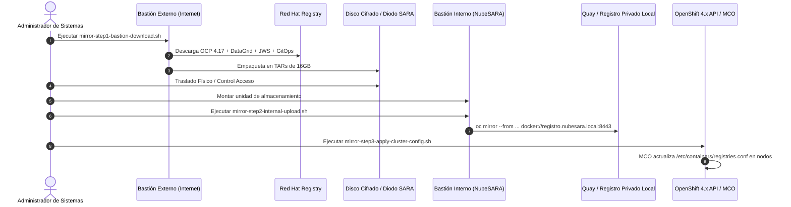

# 🔒 Módulo Air-Gapped: Espejado de Imágenes con oc-mirror v2 (NubeSARA)

Este directorio contiene la arquitectura y los scripts de automatización necesarios para proveer imágenes y catálogos de operadores en el entorno estrictamente desconectado (**Air-Gapped**) de la **Red SARA / NubeSARA**.

## 📌 Reto Técnico y Solución

En un entorno aislado perimetralmente, Kubernetes y OpenShift no pueden resolver dominios públicos (`registry.redhat.io`, `quay.io`, `docker.io`). Históricamente se utilizaban directivas manuales `ImageContentSourcePolicy` (ICSP). 

En OpenShift 4.14 - 4.17, el estándar de la industria es **`oc-mirror v2`**, que aporta:
1. **Determinismo criptográfico:** Generación de recursos nativos `ImageDigestMirrorSet` (IDMS) e `ImageTagMirrorSet` (ITMS).
2. **Transferencia fragmentada en bloques:** Mediante `archiveSize: 16`, el conjunto de imágenes se particiona en volúmenes de 16 GB adecuados para diodos de datos o discos cifrados extraíbles.
3. **Caché diferencial:** Permite actualizar imágenes subsecuentes sin volver a descargar las capas ya espejadas.

## 🚀 Procedimiento Operativo en 3 Pasos



### Paso 1: Descarga en Bastión Externo
```bash
chmod +x mirror-step1-bastion-download.sh
./mirror-step1-bastion-download.sh /mnt/usb-drive/oc-mirror-workspace imageset-config.yaml
```

### Paso 2: Carga en Registro Interno NubeSARA
```bash
chmod +x mirror-step2-internal-upload.sh
./mirror-step2-internal-upload.sh /mnt/usb-drive/oc-mirror-workspace docker://registro.nubesara.local:8443/maec-scsp
```

### Paso 3: Aplicar Políticas de Reescritura al Clúster
```bash
chmod +x mirror-step3-apply-cluster-config.sh
./mirror-step3-apply-cluster-config.sh /mnt/usb-drive/oc-mirror-workspace/cluster-resources
```
