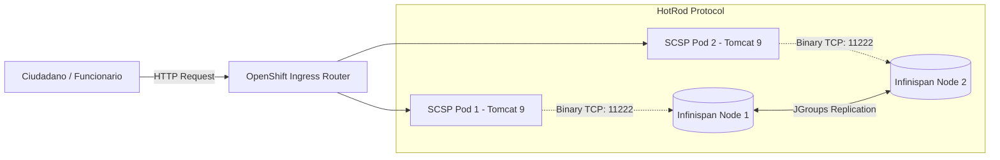

# 🔄 Gestión Distribuida de Sesiones con Red Hat Data Grid (Infinispan)

---

<p align="center">
  <b>Página Anterior:</b> <a href="03-espejado-airgapped-oc-mirror.md"><b>⬅️ 03. Espejado Air-Gapped</b></a> &nbsp;|&nbsp;
  <b><a href="../README.md">🏠 <b>Home / README</b></a></b> &nbsp;|&nbsp;
  <b>Página Siguiente:</b> <a href="05-seguridad-red-y-bd-externa.md"><b>05. Seguridad Red y BD Externa ➡️</b></a>
</p>

---

> [!WARNING]
> **Aviso:** Documentación generada con **Gemini 3.8 Flash** como blueprint didáctico conceptual.

---

## 1. El Antipatrón "Sticky Sessions" en Kubernetes

En servidores físicos o máquinas virtuales tradicionales, el tráfico web se distribuía mediante balanceadores de carga con "afinidad de sesión" (Sticky Sessions por cookie `JSESSIONID`). Todas las peticiones de un funcionario se enviaban al mismo servidor físico donde su `HttpSession` residía en memoria RAM.

### ¿Por qué fracasa este enfoque en OpenShift?
- Si un nodo sufre un fallo de hardware, todos los usuarios conectados a ese pod pierden su sesión (*Session Eviction*).
- Los despliegues continuos (*Rolling Updates*) destruyen pods viejos mientras se crean los nuevos, cortando los trámites administrativos en curso.
- El auto-escalado horizontal de pods (HPA) es ineficiente si el tráfico se mantiene "pegado" a unas pocas instancias.

---

## 2. La Solución: Externalización a Malla de Datos en Memoria

Para convertir al Cliente Ligero SCSP en una carga de trabajo verdaderamente desacoplada e inmutable, el estado conversacional se externaliza hacia un clúster dedicado de **Red Hat Data Grid (Infinispan 8.4.x)**:



---

## 3. Integración Transparente sin Alterar Código Java

No es necesario modificar ni una sola línea de código fuente en la aplicación de legado. Tomcat 9 en JBoss Web Server proporciona integración nativa a través del gestor de sesiones HotRod:

En `context.xml`:
```xml
<Manager className="org.wildfly.clustering.tomcat.hotrod.HotRodManager"
         configurationName="scsp-session-cache"
         hotRodPropertiesFile="/opt/jws-5.4/tomcat/conf/hotrod-client.properties" />
```

En `hotrod-client.properties`:
```properties
infinispan.client.hotrod.server_list=scsp-session-cache.maec-scsp-prod.svc.cluster.local:11222
infinispan.client.hotrod.marshaller=org.infinispan.commons.marshall.JavaSerializationMarshaller
```

### Mecanismo de Funcionamiento:
1. Cuando un servlet de SCSP ejecuta `request.getSession().setAttribute("tramite", datos)`, la clase `HotRodManager` intercepta la mutación.
2. Los objetos se serializan mediante `JavaSerializationMarshaller` y se transmiten por TCP binario ultrarrápido al puerto `11222` del clúster de Data Grid.
3. Si el pod donde se inició la tramitación se destruye en ese preciso instante, el balanceador redirige la siguiente petición a otro pod. Este consulta a Infinispan con el identificador de sesión y recupera el contexto íntegro en milisegundos.

---

<p align="center">
  <b>Página Anterior:</b> <a href="03-espejado-airgapped-oc-mirror.md"><b>⬅️ 03. Espejado Air-Gapped</b></a> &nbsp;|&nbsp;
  <b><a href="../README.md">🏠 <b>Home / README</b></a></b> &nbsp;|&nbsp;
  <b>Página Siguiente:</b> <a href="05-seguridad-red-y-bd-externa.md"><b>05. Seguridad Red y BD Externa ➡️</b></a>
</p>

---
