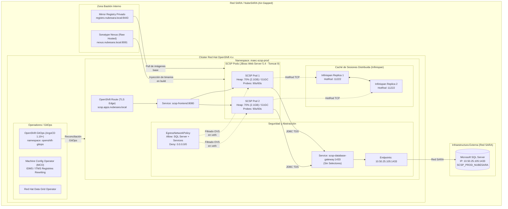
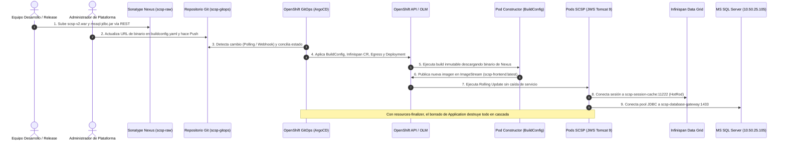
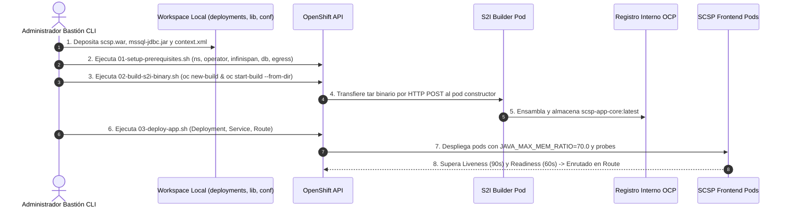

# 📊 Galería de Diagramas de Arquitectura (Mermaid)

---

  <b><a href="../../README.md">🏠 Home / README</a></b> &nbsp;|&nbsp;
  <b><a href="../02-comparativa-soluciones.md">⚖️ 02. Comparativa de Soluciones</a></b>

---

Este directorio aloja los ficheros fuente `.mermaid` originales utilizados en la documentación técnica del repositorio. A continuación se presentan renderizados interactivamente mediante bloques desplegables para su visualización directa en GitHub.

---

## 1. 🏛️ Arquitectura Global del Sistema (`architecture-overview.mermaid`)

Topología general del despliegue en **Red SARA / NubeSARA Air-Gapped**, integrando el clúster Red Hat OpenShift 4.x, zona de servicios compartidos (Quay, Nexus), caché distribuida (Infinispan), seguridad perimetral (Egress) y conexión a Microsoft SQL Server externo.

<b>🏛️ Ver Diagrama Global de la Arquitectura (NubeSARA Air-Gapped)</b> (clic para desplegar)

---

## 2. ☸️ Flujo de Secuencia: Solución A - GitOps (`solution-a-gitops-flow.mermaid`)

Diagrama de secuencia del ciclo de despliegue declarativo automatizado con **OpenShift GitOps (ArgoCD 1.19+)** y **Sonatype Nexus**, demostrando la inmutabilidad de la construcción, reconciliación continua y borrado en cascada con finalizadores.

<b>☸️ Ver Diagrama de Secuencia: Despliegue Declarativo GitOps (ArgoCD + Nexus)</b> (clic para desplegar)

---

## 3. 🚀 Flujo de Secuencia: Solución B - S2I Binario CLI (`solution-b-s2i-flow.mermaid`)

Diagrama de secuencia del ciclo de despliegue pragmático e imperativo mediante **Source-to-Image (S2I)** en modo binario directo por CLI (`oc start-build --from-dir`) y scripts de ciclo de vida.

<b>🚀 Ver Diagrama de Secuencia: Despliegue Imperativo S2I Binario CLI</b> (clic para desplegar)

---

  <b><a href="../../README.md">🏠 Volver al README Principal</a></b>

