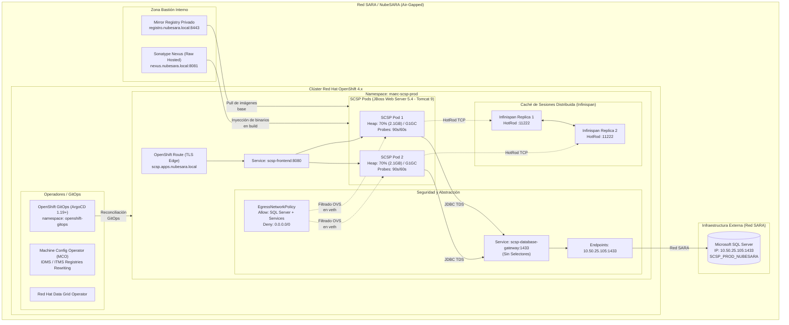
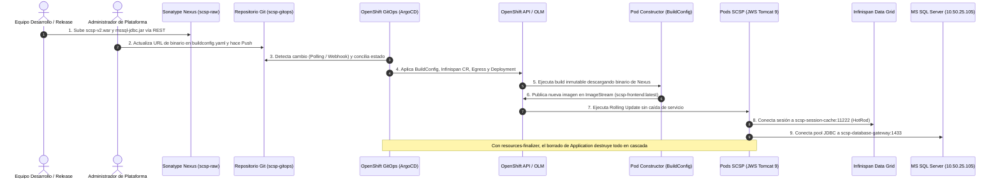
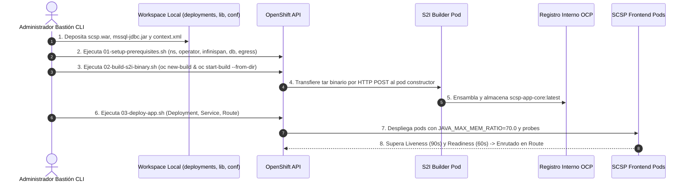
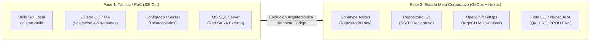
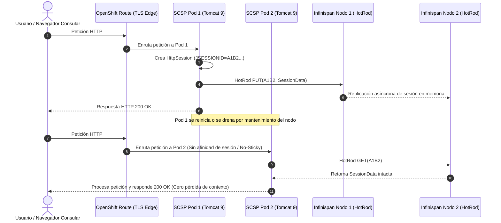

# 📊 Manual Técnico y Galería de Diagramas de Arquitectura (Mermaid)

---

<p align="center">
  <b><a href="../../README.md">🏠 Home / README</a></b> &nbsp;|&nbsp;
  <b><a href="../02-comparativa-soluciones.md">⚖️ 02. Comparativa de Soluciones</a></b> &nbsp;|&nbsp;
  <b><a href="../04-gestion-sesiones-infinispan.md">04. Gestión de Sesiones (Infinispan) ➡️</a></b>
</p>

---

Este documento constituye la **guía técnica integral de referencia visual y de flujos de ingeniería** del repositorio. Reúne los diagramas de arquitectura en **Mermaid** y diagramas ASCII con su **análisis pormenorizado paso a paso**, desglose de componentes, trazas de red y la matriz de puertos y protocolos de seguridad.

---

## 📑 Índice del Manual de Diagramas

1. [🏛️ Diagrama 1: Arquitectura Global del Sistema en NubeSARA Air-Gapped (`architecture-overview.mermaid`)](#diagrama-1)
2. [☸️ Diagrama 2: Flujo de Despliegue Declarativo GitOps - Solución A (`solution-a-gitops-flow.mermaid`)](#diagrama-2)
3. [🚀 Diagrama 3: Flujo de Despliegue Imperativo S2I Binario CLI - Solución B (`solution-b-s2i-flow.mermaid`)](#diagrama-3)
4. [🔄 Diagramas Especializados Complementarios](#diagramas-complementarios)
   - [4.1. Transición de Fase: PoC Táctica S2I a Estado Meta GitOps](#diagrama-fases)
   - [4.2. Espejado Desconectado con `oc-mirror v2`](#diagrama-mirror)
   - [4.3. Persistencia de Sesión Distribuida con Infinispan](#diagrama-infinispan)
5. [📊 Matriz Resumen de Puertos, Protocolos y Seguridad Perimetral](#matriz-puertos)

---

<a id="diagrama-1"></a>
## 1. 🏛️ Arquitectura Global del Sistema en NubeSARA Air-Gapped
> **Fichero fuente:** [`architecture-overview.mermaid`](architecture-overview.mermaid)  
> **Ubicación en GitHub:** [`README.md` (Sección 3)](../../README.md#diagrama-arquitectura)

Representa la **topología integral de producción en alta disponibilidad** dentro del perímetro ministerial aislado (**Red SARA / NubeSARA Air-Gapped**, sin conexión a Internet).

<details>
<summary><b>🏛️ Ver Diagrama Global de la Arquitectura (NubeSARA Air-Gapped)</b> (clic para desplegar)</summary>



</details>

### 📐 Esquema Conceptual de la Topología

```text
                        [ Usuario / Consulado en el Exterior ]
                                        │ (HTTPS / TLS Edge)
                                        ▼
                               [ OpenShift Route ]
                                        │ (:8080)
                                        ▼
                                [ Service Frontend ]
                                   │           │
                    ┌──────────────┘           └──────────────┐
                    ▼                                         ▼
            [ SCSP Pod 1 ]                             [ SCSP Pod 2 ]
             JWS 5.4 / Java 8                           JWS 5.4 / Java 8
             Heap: 70% (2.1 GB)                         Heap: 70% (2.1 GB)
             Probes: 90s / 60s                          Probes: 90s / 60s
              │          │                               │          │
 (HotRod TCP) │          │ (JDBC TDS)        (HotRod TCP)│          │ (JDBC TDS)
              ▼          │                               ▼          │
     [ Infinispan Pod 1 ]│                      [ Infinispan Pod 2 ]│
              ▲          │                               ▲          │
              └──────────┼──────── P2P Sync ─────────────┘          │
                         │                                          │
                         └───────────────────┬──────────────────────┘
                                             ▼
                                 [ Service DB Gateway ] (:1433)
                                             │
                                             ▼
                                  [ Endpoints Headless ]
                                             │ (Red SARA Privada)
                                             ▼
                               [ Microsoft SQL Server Corporativo ]
                                     (10.50.25.105:1433)
```

### 🧩 Desglose de Componentes

| Zona / Capa | Componente | Función y Misión Técnica |
| :--- | :--- | :--- |
| **Zona Bastión (Servicios Compartidos)** | **Quay (`registro.nubesara.local:8443`)** | *Registry* privado desconectado donde residen las imágenes oficiales de Red Hat tras ser espejadas con `oc-mirror v2`. |
| | **Sonatype Nexus (`nexus.nubesara.local:8081`)** | Repositorio *raw-hosted* que custodia los binarios inmutables: el `.war` entregado por el fabricante y el driver JDBC `mssql-jdbc-8.4.1.jre8.jar`. |
| **Plano de Control & Operadores** | **OpenShift GitOps (`ArgoCD 1.19+`)** | Único agente con permisos para sincronizar recursos contra la API de Kubernetes; reconcilia continuamente el estado declarado en Git. |
| | **Machine Config Operator (`MCO`)** | Inyecta en `/etc/containers/registries.conf` las directivas `ImageDigestMirrorSet` (IDMS) para redirigir peticiones de imágenes hacia Quay sin alterar manifiestos. |
| | **Red Hat Data Grid Operator (`8.4.x`)** | Gestiona el ciclo de vida del clúster de memoria distribuida Infinispan para las sesiones web. |
| **Capa de Cómputo (`maec-scsp-prod`)** | **Route OpenShift (`TLS Edge`)** | Termina la sesión cifrada HTTPS en el balanceador perimetral de OpenShift y reenvía tráfico plano HTTP al puerto `8080` del Service. |
| | **SCSP Pods (`JWS 5.4 - Tomcat 9`)** | 2 réplicas mínimas ejecutando OpenJDK 1.8 sobre RHEL 8 con tuning porcentual de memoria en cgroups (`JAVA_MAX_MEM_RATIO=70.0`) y sondas calibradas (90s / 60s). |
| | **Caché Distribuida (Infinispan)** | Malla de memoria HotRod (`:11222`) entre Pod 1 y Pod 2. Erradica las *sticky sessions* permitiendo que cualquier pod atienda cualquier petición sin perder el estado consular. |
| **Seguridad y Abstracción de Red** | **`EgressNetworkPolicy`** | Cortafuegos SDN en OVN-Kubernetes: política de *Zero-Trust* que bloquea todo el tráfico saliente (`Deny 0.0.0.0/0`), autorizando únicamente la IP del SQL Server ministerial. |
| | **Service + Endpoints Gateway** | Abstracción desacoplada: el pod apunta al alias DNS interno `scsp-database-gateway:1433`, el cual enruta directamente a la IP física `10.50.25.105` en Red SARA sin acoplar IPs en el código. |
| **Infraestructura Externa** | **Microsoft SQL Server** | Instancia de base de datos corporativa ministerial alojada fuera del clúster (`10.50.25.105:1433`) para la persistencia transaccional y auditoría de intermediaciones. |

### 🔍 Claves de Ingeniería que Resuelve este Diagrama
- **Aislamiento Perimetral Total:** Ni un solo componente tiene salida a Internet; todas las imágenes y binarios provienen de Quay y Nexus en el bastión interno.
- **Inmutabilidad y Garantía del Fabricante:** El binario `.war` suministrado por el proveedor se ejecuta intacto; no se recompila. La configuración ambiental se inyecta desde fuera vía *ConfigMaps* y *Secrets*.
- **Resiliencia Operativa:** La caída imprevista de un nodo o pod SCSP no desconecta al funcionario consular ni destruye su trámite, ya que la sesión está replicada en tiempo real en la malla de Data Grid.

---

<a id="diagrama-2"></a>
## 2. ☸️ Flujo de Despliegue Declarativo GitOps - Solución A
> **Fichero fuente:** [`solution-a-gitops-flow.mermaid`](solution-a-gitops-flow.mermaid)  
> **Ubicaciones en GitHub:** [`README.md` (Sección 4)](../../README.md#comparativa-soluciones), [`docs/02-comparativa-soluciones.md`](../02-comparativa-soluciones.md) y [`solution-a-gitops/README.md`](../../solution-a-gitops/README.md)

Ilustra el **ciclo de vida automatizado y continuo** de un cambio de versión o actualización de infraestructura mediante el paradigma **GitOps puro**.

<details>
<summary><b>☸️ Ver Diagrama de Secuencia: Despliegue Declarativo GitOps (ArgoCD + Nexus)</b> (clic para desplegar)</summary>



</details>

### 🔁 Traza Paso a Paso (Del Paso 1 al 9)

```text
[Release]   [Admin]    [Nexus]     [Git]     [ArgoCD]     [OCP API]    [Build Pod]   [SCSP Pods]   [Infinispan]    [SQL Server]
   │           │          │          │          │             │             │             │              │              │
   │ 1. Upload │          │          │          │             │             │             │              │              │
   ├───────────┼─────────>│          │          │             │             │             │              │              │
   │           │          │          │          │             │             │             │              │              │
   │           │ 2. Push  │          │          │             │             │             │              │              │
   │           ├──────────┼─────────>│          │             │             │             │              │              │
   │           │          │          │          │             │             │             │              │              │
   │           │          │          │ 3. Poll  │             │             │             │              │              │
   │           │          │          │<─────────┤             │             │             │              │              │
   │           │          │          │          │             │             │             │              │              │
   │           │          │          │          │ 4. Sync CRs │             │             │              │              │
   │           │          │          │          ├────────────>│             │             │              │              │
   │           │          │          │          │             │             │             │              │              │
   │           │          │          │          │             │ 5. Trigger  │             │              │              │
   │           │          │          │          │             ├────────────>│             │              │              │
   │           │          │ 5. Pull  │          │             │             │             │              │              │
   │           │          │<─────────┼──────────┼─────────────┼─────────────┤             │              │              │
   │           │          │          │          │             │             │             │              │              │
   │           │          │          │          │             │ 6. Push Img │             │              │              │
   │           │          │          │          │             │<────────────┤             │              │              │
   │           │          │          │          │             │             │             │              │              │
   │           │          │          │          │             │ 7. Rolling Update         │              │              │
   │           │          │          │          │             ├──────────────────────────>│              │              │
   │           │          │          │          │             │             │             │              │              │
   │           │          │          │          │             │             │             │ 8. HotRod    │              │
   │           │          │          │          │             │             │             ├─────────────>│              │
   │           │          │          │          │             │             │             │              │              │
   │           │          │          │          │             │             │             │ 9. JDBC TDS  │              │
   │           │          │          │          │             │             │             ├──────────────┼─────────────>│
```

- **Paso 1 (Publicación de Binario):** El equipo de desarrollo/entrega sube mediante llamada REST el archivo `scsp-v2.war` y las librerías dependientes al repositorio seguro *raw-hosted* de **Sonatype Nexus**.
- **Paso 2 (Actualización Declarativa en Git):** El administrador de plataforma actualiza en el fichero `buildconfig.yaml` la URL y el hash SHA-256 del nuevo binario, enviando el commit mediante Pull Request a la rama `main` del repositorio Git.
- **Paso 3 (Detección de Cambio):** **ArgoCD** detecta el cambio en Git (mediante polling programado o webhook interno) y marca la aplicación en estado `OutOfSync`.
- **Paso 4 (Reconciliación Declarativa):** ArgoCD aplica los manifiestos reconciliados contra la API de OpenShift: inyecta el nuevo `BuildConfig`, comprueba la salud de Infinispan, verifica la política `Egress` y aplica el `Deployment`.
- **Paso 5 (Construcción Inmutable):** El controlador de OpenShift levanta un pod constructor efímero (`Build Pod`) que descarga el binario directamente de Nexus mediante HTTP interno seguro y lo introduce en el directorio `/deployments` de la imagen oficial de JBoss Web Server (Tomcat 9).
- **Paso 6 (Publicación OCI en ImageStream):** El pod constructor publica la nueva imagen resultante en el *ImageStream* interno de OpenShift (`scsp-frontend:latest`).
- **Paso 7 (Actualización Progresiva sin Caída):** OpenShift detecta la nueva imagen y lanza una estrategia de despliegue progresivo (*Rolling Update*). Levanta los nuevos pods y espera a que superen sus sondas de resiliencia antes de desviarles tráfico.
- **Pasos 8 y 9 (Conexión Operativa):** Los nuevos pods se conectan automáticamente a la caché Infinispan vía protocolo binario HotRod (`:11222`) para compartir sesiones y abren su pool JDBC contra el alias `scsp-database-gateway:1433` hacia SQL Server en Red SARA.

> [!TIP]
> **Eliminación Segura (Clean Decommissioning):** El diagrama incluye la anotación de gobernanza sobre el uso de `resources-finalizer.argocd.argoproj.io`. Si se elimina la aplicación en ArgoCD, Kubernetes destruye en cascada ordenada todos los recursos asociados (pods, CRDs, políticas, volúmenes), impidiendo que queden recursos huérfanos consumiendo memoria en NubeSARA.

---

<a id="diagrama-3"></a>
## 3. 🚀 Flujo de Despliegue Imperativo S2I Binario CLI - Solución B
> **Fichero fuente:** [`solution-b-s2i-flow.mermaid`](solution-b-s2i-flow.mermaid)  
> **Ubicaciones en GitHub:** [`README.md` (Sección 4)](../../README.md#comparativa-soluciones), [`docs/02-comparativa-soluciones.md`](../02-comparativa-soluciones.md) y [`solution-b-s2i-binary/README.md`](../../solution-b-s2i-binary/README.md)

Ilustra el **enfoque táctico y pragmático de migración rápida**, utilizado en la **Fase 1** para validar la viabilidad del Cliente Ligero SCSP en OpenShift en apenas 4–5 semanas, prescindiendo de servidores de artefactos intermedios o tuberías GitOps complejas.

<details>
<summary><b>🚀 Ver Diagrama de Secuencia: Despliegue Imperativo S2I Binario CLI</b> (clic para desplegar)</summary>



</details>

### 🔁 Traza Paso a Paso (Del Paso 1 al 8)

```text
[Admin Bastión CLI]     [Workspace Local]     [OpenShift API]     [S2I Builder Pod]     [Registry Interno]     [SCSP Pods]
        │                       │                    │                    │                     │                   │
        │ 1. Copia binarios/cfg │                    │                    │                     │                   │
        ├──────────────────────>│                    │                    │                     │                   │
        │                       │                    │                    │                     │                   │
        │ 2. bash 01-setup.sh   │                    │                    │                     │                   │
        ├───────────────────────────────────────────>│                    │                     │                   │
        │                       │                    │                    │                     │                   │
        │ 3. bash 02-build.sh   │                    │                    │                     │                   │
        ├───────────────────────┼───────────────────>│                    │                     │                   │
        │                       │ 4. HTTP POST TAR   │                    │                     │                   │
        │                       └───────────────────>├───────────────────>│                     │                   │
        │                       │                    │                    │ 5. Ensambla y Push  │                   │
        │                       │                    │                    ├────────────────────>│                   │
        │                       │                    │                    │                     │                   │
        │ 6. bash 03-deploy.sh  │                    │                    │                     │                   │
        ├───────────────────────────────────────────>│                    │                     │                   │
        │                       │                    │ 7. Despliegue con cgroups y probes       │                   │
        │                       │                    ├─────────────────────────────────────────────────────────────>│
        │                       │                    │                                          │                   │
        │                       │                    │ 8. Liveness (90s) & Readiness (60s) OK   │                   │
        │                       │                    │<─────────────────────────────────────────────────────────────┤
        │                       │                    │ (Enrutamiento en OpenShift Route activo) │                   │
```

- **Paso 1 (Preparación del Workspace):** El administrador deposita manualmente en el directorio local de trabajo (`workspace-template/`):
  - El binario `scsp.war` dentro de `deployments/`.
  - El driver JDBC `mssql-jdbc-8.4.1.jre8.jar` en `lib/`.
  - Los ficheros `context.xml` y `hotrod-client.properties` en `configuration/`.
- **Paso 2 (Infraestructura Base):** Ejecuta `01-setup-prerequisites.sh`, aprovisionando el namespace, el operador Data Grid, el clúster Infinispan, el Service/Endpoints de la BD y la política de red Egress.
- **Paso 3 y 4 (Disparo S2I Binario):** Ejecuta `02-build-s2i-binary.sh`. El cliente `oc` empaqueta el contenido local en un archivo `.tar` en memoria y lo transmite mediante una petición `HTTP POST` directa sobre TLS hacia el pod constructor de OpenShift (`oc start-build --from-dir`).
- **Paso 5 (Inyección y Almacenamiento):** El pod constructor S2I toma la imagen base certificada de JBoss Web Server (Tomcat 9), inyecta los ficheros en sus ubicaciones finales del contenedor y sube la imagen empaquetada `scsp-app-core:latest` al registro interno integrado de OpenShift.
- **Paso 6 y 7 (Despliegue de Aplicación):** Ejecuta `03-deploy-app.sh`, creando el `Deployment`, el `Service` y la `Route`. OpenShift programa los pods configurados con la variable `JAVA_MAX_MEM_RATIO=70.0` para su cálculo porcentual de memoria JVM.
- **Paso 8 (Calibración y Enrutamiento):** Los pods superan las sondas Liveness (espera inicial de 90s) y Readiness (60s). Una vez el endpoint HTTP responde con éxito, OpenShift Route comienza a enviarle tráfico real.

---

<a id="diagramas-complementarios"></a>
## 4. 🔄 Diagramas Especializados Complementarios

<a id="diagrama-fases"></a>
### 4.1. Transición de Fases: De la Validación Táctica (Fase 1) al Estado Meta (Fase 2)
> **Ubicación en GitHub:** [`README.md` (Sección 1.4)](../../README.md#hoja-de-ruta-transicion)

<details>
<summary><b>🔄 Ver Diagrama de Transición de Fase (Fase 1 S2I a Fase 2 GitOps)</b> (clic para desplegar)</summary>



</details>

Muestra la evolución lógica entre las dos soluciones:
- **Fase 1 (S2I CLI):** Validación rápida en 4–5 semanas en el clúster de QA, desacoplando configuración y base de datos sin tocar el código fuente Java.
- **Fase 2 (GitOps + Nexus):** Estado meta para producción con segregación de funciones, inmutabilidad de artefactos en Nexus y orquestación multi-clúster con ArgoCD bajo el Esquema Nacional de Seguridad.

---

<a id="diagrama-mirror"></a>
### 4.2. Flujo de Espejado Desconectado con `oc-mirror v2`
> **Ubicación en GitHub:** [`air-gapped/README.md`](../../air-gapped/README.md)

<details>
<summary><b>📦 Ver Diagrama de Secuencia: Espejado Desconectado oc-mirror v2</b> (clic para desplegar)</summary>

```mermaid
sequenceDiagram
    autonumber
    actor Admin as Administrador Bastión
    participant RedHat as Red Hat Registry (registry.redhat.io)
    participant BastionExt as Bastión Externo (Conectado a Internet)
    participant Removable as Disco Extraíble Cifrado / Diodo
    participant BastionInt as Bastión Interno (Red SARA)
    participant Quay as Mirror Registry Privado (Quay)
    participant OCP as Clúster OpenShift 4.x

    Admin->>BastionExt: 1. Ejecuta mirror-step1-bastion-download.sh
    BastionExt->>RedHat: Descarga imágenes y operadores según imageset-config.yaml
    BastionExt->>Removable: Genera archivos TAR particionados (archiveSize: 16 GB)
    Admin->>Removable: 2. Custodia y transferencia física / diodo de seguridad
    Removable->>BastionInt: Copia de bloques TAR al entorno desconectado
    Admin->>BastionInt: 3. Ejecuta mirror-step2-internal-upload.sh
    BastionInt->>Quay: Carga y desempaca imágenes en registro.nubesara.local:8443
    Admin->>BastionInt: 4. Ejecuta mirror-step3-apply-cluster-config.sh
    BastionInt->>OCP: Aplica IDMS, ITMS y CatalogSource generados
    OCP->>OCP: Machine Config Operator actualiza /etc/containers/registries.conf
    Note over OCP: Reinicio secuencial de nodos; pods resuelven imágenes desde Quay
```

</details>

Ilustra el protocolo de 3 pasos para alimentar NubeSARA Air-Gapped: descarga externa con particionado de 16 GB, custodia y transferencia física, inyección en Quay privado y reconfiguración de registries mediante el Machine Config Operator.

---

<a id="diagrama-infinispan"></a>
### 4.3. Persistencia de Sesión Distribuida con Infinispan
> **Ubicación en GitHub:** [`docs/04-gestion-sesiones-infinispan.md`](../04-gestion-sesiones-infinispan.md)

<details>
<summary><b>⚡ Ver Diagrama de Secuencia: Failover de Sesión sin Sticky Sessions</b> (clic para desplegar)</summary>



</details>

Demuestra la eliminación de las *sticky sessions*: si el Pod 1 cae, la siguiente petición va al Pod 2 sin pérdida de datos, leyendo la sesión en caliente desde la malla distribuida HotRod.

---

<a id="matriz-puertos"></a>
## 5. 📊 Matriz Resumen de Puertos, Protocolos y Seguridad Perimetral

| Origen | Destino | Protocolo | Puerto | Función Técnica | Justificación ENS / Seguridad |
| :--- | :--- | :--- | :--- | :--- | :--- |
| **Usuario / Exterior** | **Route OpenShift** | HTTPS / TLS 1.3 | `443/TCP` | Acceso a la interfaz web de SCSP | Cifrado perimetral terminado en borde (*Edge TLS*). |
| **Route OpenShift** | **Service Frontend** | HTTP | `8080/TCP` | Tráfico balanceado interno al pod | Aislamiento en red interna del clúster (OVN). |
| **SCSP Pods** | **Infinispan Cluster** | HotRod (Binario TCP) | `11222/TCP` | Lectura y escritura de sesiones HTTP | Tráfico East-West confinado al namespace. |
| **Infinispan Pod 1** | **Infinispan Pod 2** | JGroups Discovery/Sync | `7800/TCP` | Replicación peer-to-peer de la memoria | Malla de alta disponibilidad entre réplicas de caché. |
| **SCSP Pods** | **Service DB Gateway** | TDS (Tabular Data Stream) | `1433/TCP` | Consultas y persistencia JDBC SQL Server | Único tráfico saliente autorizado por la `EgressNetworkPolicy`. |
| **OpenShift Worker** | **Mirror Quay** | HTTPS / TLS | `8443/TCP` | Pull de imágenes base de RHEL 8 / Tomcat 9 | Acceso a registro privado sin salida a Internet. |
| **BuildConfig Pod** | **Sonatype Nexus** | HTTP / REST | `8081/TCP` | Descarga de `scsp.war` y drivers JDBC | Ingesta de binarios verificados por hash SHA-256. |

---

<p align="center">
  <b><a href="../../README.md">🏠 Volver al README Principal</a></b>
</p>
