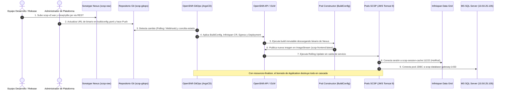

# ☸️ Solución A: Arquitectura Avanzada Basada en GitOps (ArgoCD + Sonatype Nexus)

> [!TIP]
> **ESTRATEGIA RECOMENDADA:** Esta es la arquitectura óptima para entornos de producción en la Administración Pública y grandes organizaciones empresariales, garantizando máxima auditoría (ENS), inmutabilidad, trazabilidad criptográfica y eliminación absoluta del drift de configuración (ClickOps).

## 🏛️ Principios Fundamentales del Diseño

1. **Separación Estricta de Binarios y Código (SSOT en Git):**
   - Los artefactos pesados compilados de legado (`scsp.war`, `mssql-jdbc-8.4.1.jre8.jar`) residen en **Sonatype Nexus**, jamás dentro del repositorio Git.
   - Git almacena exclusivamente texto plano declarativo (manifiestos Kustomize, configuraciones, políticas).
2. **Reconciliación Continua y Self-Healing:**
   - **Red Hat OpenShift GitOps (ArgoCD 1.19+)** es el único controlador con privilegios de escritura en el clúster.
   - Cualquier modificación manual efectuada en la consola web de OpenShift o por CLI es detectada como *drift* y revertida de forma inmediata y automática (`selfHeal: true`).
3. **Topología Multi-Clúster por Entorno (QA, PRE, PRO) e Inexistencia de DEV Local:**
   - En NubeSARA / MAEC no existía un clúster de desarrollo propio: el entorno DEV pertenecía a la consultora saliente (Minsait), quien lo mantenía alojado en Microsoft Azure para este proyecto (y otros), si bien recomendaba formalmente al MAEC desplegar su propio OCP DEV interno.
   - Los entornos ministeriales en NubeSARA residen en **clústeres OpenShift físicamente segregados**:
     - **Clúster QA:** Entorno de pruebas técnicas y funcionales (asumía las funciones iniciales al no existir clúster DEV en NubeSARA).
     - **Clúster PRE:** Entorno de preproducción para pruebas de carga, integración con SCSP de pruebas en Red SARA y validación técnica.
     - **Clúster PRO:** Entorno de producción con alta disponibilidad, confinamiento Egress y auditoría ENS Alta.
   - Variaciones gestionadas mediante Kustomize en `kustomize/overlays/qa/`, `kustomize/overlays/pre/` y `kustomize/overlays/prod/`.
4. **Ciclo de Vida Limpio (Decommissioning en Cascada):**
   - El recurso maestro `Application` incluye el finalizador `resources-finalizer.argocd.argoproj.io`.
   - Cuando se retira la aplicación, ArgoCD orquesta un borrado en cascada en primer plano (*Foreground Cascading Deletion*), eliminando el clúster de Infinispan, despliegues, rutas, secretos y servicios sin dejar recursos zombis en el cómputo de NubeSARA.
5. **Gobernanza Progresiva con OpenShift ACM (RHACM):**
   - Aunque en el proyecto real el clúster central de **Red Hat Advanced Cluster Management (ACM)** no estaba plenamente integrado en todos los despliegues de aplicaciones, se proveen los manifiestos de enlace (`acm/`): `Placement`, `GitOpsCluster` y `Policy` para auditar el cumplimiento del ENS Nivel Alto y habilitar la transición gradual hacia el gobierno unificado de la flota.

## 🔄 Diagrama de Secuencia del Flujo GitOps

<details>
<summary><b>☸️ Ver Diagrama de Secuencia: Despliegue Declarativo GitOps (ArgoCD + Nexus)</b> (clic para desplegar)</summary>



</details>

## 📁 Estructura del Módulo

```text
solution-a-gitops/
├── acm/                                  # Gobernanza y enlace con OpenShift ACM (RHACM)
│   ├── README.md                         # Guía de integración progresiva de flota
│   ├── managed-clusters-placement.yaml   # Placement dinámico por etiquetas (qa, pre, prod)
│   ├── gitopscluster-binding.yaml        # Binding entre ArgoCD y OpenShift ACM
│   └── policy-ens-egress.yaml            # ACM Policy para auditar Egress ENS Nivel Alto
├── argocd/
│   ├── gitops-operator-subscription.yaml # Suscripción OLM a OpenShift GitOps
│   ├── scsp-application.yaml             # Manifiesto maestro ArgoCD (PRO) con finalizer
│   ├── scsp-application-qa.yaml          # Manifiesto ArgoCD dirigido al clúster OCP QA
│   ├── scsp-application-pre.yaml         # Manifiesto ArgoCD dirigido al clúster OCP PRE
│   └── applicationset-multicluster.yaml  # ApplicationSet para orquestación multi-clúster
├── nexus/
│   ├── setup-nexus-repo.sh               # Provisioning de repositorio raw en Nexus
│   └── upload-artifacts.sh               # Subida CLI del WAR y driver JDBC
├── kustomize/
│   ├── base/                             # Recursos declarativos maestros
│   └── overlays/
│       ├── qa/                           # Patch para clúster OCP QA (1 réplica, pruebas)
│       ├── pre/                          # Patch para clúster OCP PRE (2 réplicas, staging)
│       └── prod/                         # Patch para clúster OCP PRO (cuotas de producción)
└── scripts/
    ├── deploy-solution-a.sh              # Despliegue de un solo paso
    ├── update-version.sh                 # Flujo de actualización Día 2
    └── teardown-solution-a.sh            # Borrado en cascada
```

## 🚀 Despliegue Rápido

```bash
# 1. Configurar Nexus y subir binarios
chmod +x nexus/*.sh scripts/*.sh
./nexus/setup-nexus-repo.sh
./nexus/upload-artifacts.sh ./scsp.war ./mssql-jdbc-8.4.1.jre8.jar

# 2. Desplegar mediante GitOps
./scripts/deploy-solution-a.sh
```
