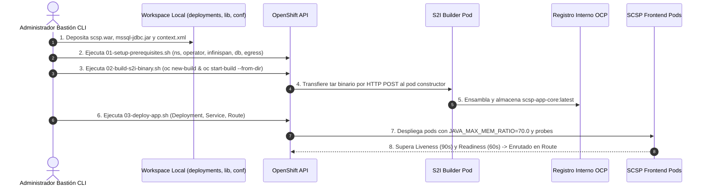

# 🛠️ Solución B: Enfoque Pragmático S2I Binario Directo por CLI

> [!NOTE]
> **CASO DE APLICACIÓN TÁCTICA:** Esta solución está orientada a equipos u organizaciones que necesitan realizar una migración rápida ("Lift-and-Shift") sin depender inicialmente de un servidor Nexus, ni de tuberías complejas de CI/CD, ni de un operador GitOps ya establecido. Permite llevar el monolito J2EE a OpenShift manteniendo el rigor de inmutabilidad en las capas de infraestructura (Infinispan, DB externa, Egress, Tuning JVM).

## 🧩 Características del Enfoque

1. **Source-to-Image (S2I) en Modo Binario:**
   - La construcción inyecta directamente el binario compilado (`scsp.war`), los drivers JDBC de terceros (`mssql-jdbc-8.4.1.jre8.jar`) y la configuración (`context.xml`, `hotrod-client.properties`) en la imagen certificada de JBoss Web Server (JWS 5.4 - Tomcat 9 - Java 8).
   - El comando `oc start-build scsp-app-core --from-dir=./workspace-template` comprime el directorio en local y lo transmite directamente al pod constructor de OpenShift mediante una petición HTTP POST segura sobre TLS.
2. **Infraestructura Idéntica a Producción:**
   - Comparte las mismas garantías de persistencia que la Solución A: Data Grid / Infinispan Operator para evitar sticky sessions, Service + Endpoints sin selector para SQL Server externo en Red SARA, y `EgressNetworkPolicy` para aislamiento perimetral.
3. **Control Total por Scripts de Ciclo de Vida:**
   - Toda la operativa está encapsulada en scripts Bash deterministas numerados del `01` al `05`.

## 🔄 Diagrama de Secuencia del Flujo S2I Binario Directo

<details>
<summary><b>🚀 Ver Diagrama de Secuencia: Despliegue Imperativo S2I Binario CLI</b> (clic para desplegar)</summary>



</details>

## 📁 Estructura del Módulo

```text
solution-b-s2i-binary/
├── manifests/                    # Manifiestos OpenShift declarativos
│   ├── 00-namespace.yaml
│   ├── 01-datagrid-operator.yaml
│   ├── 02-datagrid-infinispan.yaml
│   ├── 03-external-db.yaml
│   ├── 04-egress-firewall.yaml
│   ├── 05-secrets.yaml.example
│   ├── 06-deployment.yaml
│   ├── 07-service.yaml
│   └── 08-route.yaml
├── workspace-template/           # Estructura obligatoria S2I JWS
│   ├── deployments/              # scsp.war
│   ├── lib/                      # mssql-jdbc-8.4.1.jre8.jar
│   └── configuration/            # context.xml, hotrod-client.properties
└── scripts/                      # Scripts CLI de ciclo de vida
    ├── 01-setup-prerequisites.sh
    ├── 02-build-s2i-binary.sh
    ├── 03-deploy-app.sh
    ├── 04-update-app.sh
    └── 05-teardown-solution-b.sh
```

## 🚀 Guía de Ejecución

```bash
cd solution-b-s2i-binary/scripts
chmod +x *.sh

# 1. Desplegar namespace, operadores, BD externa, egress y secretos
./01-setup-prerequisites.sh

# 2. Ensamblar imagen mediante S2I binario
./02-build-s2i-binary.sh

# 3. Desplegar aplicación y exponer ruta
./03-deploy-app.sh
```
